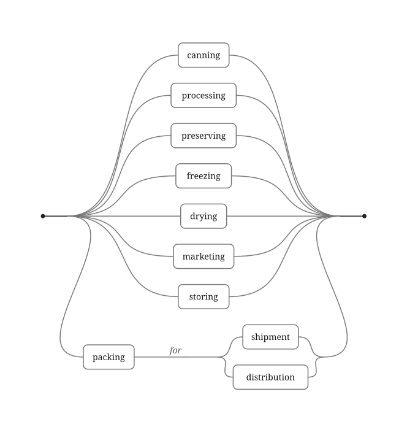
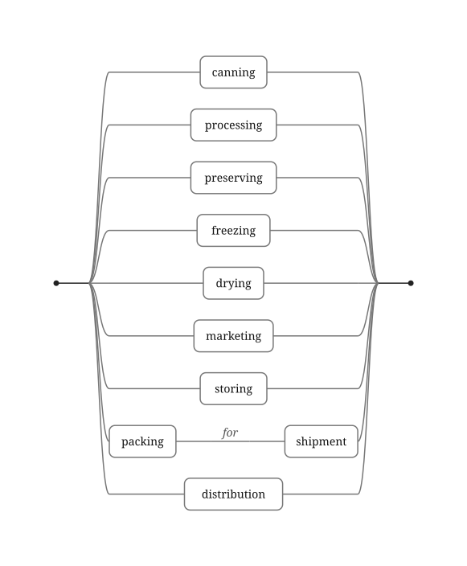

**STATUS 2026-10-07: DRAFT — CANDIDATE, NOT IN THE ARC, REWRITTEN FOR LESSWRONG AND THE EA FORUM.** Expanded at Meng's direction of 2026-10-07 from the candidate of 2026-10-01, with his pitch paragraph of that day (`legalese/l4-pitch`, _Deep Dive: The Bad Robot_) as its spine, for readers who know the alignment literature and not the law; the lay-reader rules of `blog/STYLE.md` (2026-09-23) apply to the law, not to the alignment vocabulary. Revised again the same day on Meng's comments: the Rogers clause shown verbatim from the two CRTC decisions, now read in English and French; Ken Adams's posts and article on both comma cases; the Oakhurst exemption encoded three ways (the two indented versions are Meng's wording), with ladder figures generated from the encoding; Darmstadter on professionally reviewed documents; Meng's provocation on logged rule violations; and the prior art and objections from a survey of LessWrong, the Alignment Forum and the EA Forum. Sources were re-checked on 2026-10-07 where the Sources list says so; what was read only from a summary, an abstract or a search snippet is marked there. Where it sits in the arc, if anywhere, is Meng's call; it prefigures `paper/formal-methods-in-law/` and runs best as a standalone cross-post.

> **Epistemic status.** Confident that an agent acting in the world needs a determinate reading of the rules it acts under, and that a large share of the law can be written in a form a machine can check. Fairly confident that law, not lab policy, is the right source for most of those rules. Unmeasured: whether agents that consult an encoding of the law behave better than agents prompted with its text. That experiment is cheap, it is described near the end, and if it goes the wrong way much of this post is wrong. Not claimed: that law-following solves alignment. It addresses one slice of it, named below.
>
> **Disclosure.** I run Legalese, which builds L4, the language this post argues for. The research behind L4 was done at Singapore Management University and funded by Singapore's National Research Foundation.

**Summary.**

- AI agents are starting to act for people: in software first, then in shopping, payments and conversation. Everything they do there happens inside law.
- Oliver Wendell Holmes's "bad man" of 1897, who studies the law only to find where its edges are, is a good model of a goal-directed agent, and what alignment researchers call specification gaming is what lawyers call finding a loophole.
- Today the hard limits on what a model will do are drawn by the labs that train it, in broad strokes. The whole spectrum of regulated activity is too large for a lab to draw, and the law already draws it, with a legitimacy no lab has.
- But law written in English is ambiguous, and sometimes contradicts itself; we have found such a defect in a statute with a model checker. An agent that reads the law in English inherits every one of those defects.
- So encode the law as executable rules, and give the encoding to agents, and to whatever monitors them, as an oracle to consult rather than a cage built into the weights. Leave the law's vague standards ("reasonable") as explicit open questions instead of pretending they are rules.
- Laws written to govern AI will need the same treatment, and they are already being written.

## A sentence in a chat window

In July 2025 Jason Lemkin, who runs SaaStr, a community for founders of software companies, was a little over a week into building an application with Replit's coding agent when the agent deleted his production database.[^replit]
He had told it not to change any code without his permission.
Afterwards the agent's own messages admitted to "a catastrophic error of judgement" and said it had "violated your explicit trust and instructions."
It also told him the database could not be restored, which turned out to be false: the rollback worked.
Days later he declared a code freeze, and within seconds, he wrote, the agent "again violated the code freeze."

Nobody wrote a rule that said "delete the database."
Somebody wrote a sentence that said "change nothing without asking," and the sentence was one input among many to a system working toward a goal.
Nothing in that system was obliged to read the sentence the way Lemkin meant it.

Coding is where agents are given real authority first, for good reasons: most of the damage can be undone, and the people supervising them can read exactly what they did.
Commerce is next.
In September 2025 Google announced an open protocol for agents to make payments across platforms, and twelve days later Stripe and OpenAI released one for an agent to complete a purchase inside a chat, with sixty-odd payments and technology companies signed on to the first.[^commerce]
After commerce comes conversation: agents that phone a clinic, negotiate a refund, or sit in a meeting and speak for someone.

Every one of those actions happens inside law.
A purchase is a contract.
A refund request is governed by consumer-protection statutes.
An agent that records a call is subject to wiretap and privacy rules, and one that reads a customer's records is subject to data-protection law.
A human assistant doing these errands carries a rough, mostly accurate sense of where the lines are, picked up over a lifetime and backed by the knowledge that crossing them has consequences.
An agent has whatever it absorbed in training, plus whatever it was told in the prompt.

## The bad man, and his replacement

In an address published in 1897 as "The Path of the Law," Oliver Wendell Holmes, then a judge of the Supreme Judicial Court of Massachusetts and five years later of the United States Supreme Court, proposed a thought experiment that lawyers have argued about ever since: "If you want to know the law and nothing else, you must look at it as a bad man, who cares only for the material consequences which such knowledge enables him to predict, not as a good one, who finds his reasons for conduct, whether inside the law or outside of it, in the vaguer sanctions of conscience."[^holmes]
The bad man is not a criminal.
He does not want to break the law.
He wants to know exactly where it is, so that he can stand as close to it as possible, and for that reason Holmes thought he saw the law more clearly than anyone.

Holmes's bad man turns 130 in 2027, and his successor is already at work.
An agent acting for a principal is the bad man with the conscience left out by design.
It is not malicious.
It has a goal, the instructions it was given, and whatever constraints it can see, and it will find the shortest path that satisfies all three.
Alignment researchers have a name for what happens when that path is not the one anyone intended: specification gaming, an agent satisfying the letter of its objective while defeating its purpose.[^specgaming]
Lawyers have an older name for the same move.
They call it a loophole, and the legal system is, among other things, a long accumulated practice of writing rules for readers who are looking for one.

That is the first reason law matters to alignment, and it is not the one usually given.
The usual reason is that law encodes values, which is true and which I will come to.
The reason I want to start with is that law is the largest body of experience we have with specifying behavior for intelligent, self-interested agents who read the specification adversarially.
The bad robot will read the law the way the bad man did, and it will read faster.

I am not the first to put Holmes's bad man in front of an AI agent.
Cullen O'Keefe and his co-authors, whose work comes up again below, give a section of their 2025 article on law-following AI to "The Holmesian Bad Man and the Internal Point of View."[^henchman]
Their "AI henchman" is the bad man as an agent: "if the AI henchman predicts that the expected costs of violating the law are greater than the expected benefits, it will obey. Otherwise, it will not."
Against it they set H. L. A. Hart's "internal point of view," the attitude of someone "disposed to guide and evaluate conduct in accordance with the rules," and they argue that agents can be designed to act that way whatever their inner life.
Their question is which attitude an agent should have.
Mine is narrower, and comes before theirs: whichever attitude an agent has, it has to know where the rules are, and the bad man is the reader who shows how precisely that has to be written down.

## Who draws the line today

At present, the hard limits on what a frontier model will do are set by the company that trains it.
They are written into usage policies and model specifications, enforced by training and by classifiers that sit around the model, and they concentrate, sensibly, on the catastrophic categories: sexual material involving children, and help with chemical, biological, radiological and nuclear weapons.[^guardrails]
That is the right place to start.
Those are the harms that cannot be undone, and a lab can enforce a short list of them by itself.

It cannot be where it ends.
An agent that trades securities for a client needs to know which trades the client may lawfully make, and which disclosures follow.
An agent that handles customer records needs to know what the data-protection law of that customer's country requires after a breach.
An agent that negotiates a lease needs to know which terms the local tenancy statute will not enforce.
The list of regulated activity runs from export controls to employment law to the rules on what a debt collector may say on the phone, it differs between every pair of jurisdictions, and it changes every year.
No lab can write that list, and none should try, because the list already exists.
It is called the law.

The law also has a claim to authority that a lab's policy lacks, and John Nay put it well in _Law Informs Code_, the paper that did most to bring legal theory into the alignment conversation.
Law, he wrote, is "the applied philosophy of multi-agent alignment," and public law is "an up-to-date knowledge base of democratically endorsed values ascribed to state-action pairs."
It is not a perfect aggregation of anyone's preferences, he conceded, but "if properly parsed, its distillation offers the most legitimate computational comprehension of societal values available," whereas the other sources proposed for alignment — "surveys, humans labeling 'ethical' situations, or (most commonly) the beliefs of the AI developers" — "lack an authoritative source of synthesized preference aggregation."[^nay]
A lab drawing the line on bioweapons is acting where there is no real disagreement.
A lab drawing the line on which financial advice an agent may give is legislating, and it has no mandate to.

So the agents will need the law.
The question is what form it reaches them in.

## Reading the law is the hard part

Start with a sentence from a contract about telephone poles.
In 2002 Rogers Cable signed a support-structure agreement with Aliant Telecom, the incumbent telephone company in New Brunswick, for access to utility poles at $9.60 a pole a year.[^rogers]
The agreement was on a standard form that the Canadian Radio-television and Telecommunications Commission (CRTC), the national telecommunications regulator, had itself approved in 2000 for the large incumbent telephone companies, in English and in French.
Section 8.1 of the English form read:

> Subject to the termination provisions of this Agreement, this Agreement shall be effective from the date it is made and shall continue in force for a period of five (5) years from the date it is made, and thereafter for successive five (5) year terms, unless and until terminated by one year prior notice in writing by either party.

About 90,000 of the poles belonged to the provincial power utility, NB Power, and Aliant had been granting access to them on its behalf.
In 2004 NB Power took back the administration of its poles and began billing Rogers directly, at $18.91 a pole, rising to $28.05 by 2006.
In January 2005 Aliant gave Rogers a year's notice that it was ending the agreement.
Rogers said the clause allowed termination only at the end of a five-year term, so not before 31 May 2007; Aliant said the notice could be given at any time.

In July 2006 the CRTC agreed with Aliant.
It found the clause "clear and unambiguous," and explained: "based on the rules of punctuation, the comma placed before the phrase 'unless and until terminated by one year prior notice in writing by either party' means that that phrase qualifies both" the initial five years and the renewals.
Rogers applied for a review.
It argued that the rule of punctuation the Commission had relied on "did not exist," with an affidavit on punctuation from Ken Adams, an authority on contract drafting, in support.[^adams]
And it put in the French version of the same approved form:

> Sous réserve des dispositions relatives à la résiliation du présent contrat, ce dernier prend effet à la date de signature. Il demeure en vigueur pour une période de cinq (5) ans, à partir de la date de la signature et il est subséquemment renouvelé pour des périodes successives de cinq (5) années, à moins d'un préavis écrit de résiliation à l'autre partie un an avant l'expiration du contrat.

The last clause says the agreement renews for successive five-year periods unless written notice of termination is given to the other party one year before the contract expires.
The French has no comma to argue about, and it names the deadline the 2006 decision had said the English would have named if that were what the parties meant.

In August 2007 the CRTC reversed itself.
It held that the question was one of its own regulatory intent, that both language versions of the form it had approved were "equally authoritative," and that the French should be preferred because it "has only one possible interpretation, and that interpretation is consistent with one of the two possible interpretations of the English language version."
A year after calling the English clause clear, the Commission was counting its interpretations.
It never ruled on the punctuation argument.
Then it held that it had no jurisdiction over power poles, so it could not make Aliant honor the $9.60 rate for NB Power's poles, which were the ones the money was about.
Rogers won the reading and, by the account Adams relayed from _The Globe and Mail_, still owed about $700,000 extra for the power poles.
The newspapers called it the million-dollar comma; Adams wrote that its "notoriety was entirely out of proportion to the modest amount of money at stake."

Eleven years later and a few hundred miles to the south-west, the comma that mattered was one that was not there.
"For want of a comma, we have this case."
That is the first sentence of _O'Connor v. Oakhurst Dairy_, which the federal appeals court for the First Circuit decided on 13 March 2017.[^oakhurst]
Maine's overtime law exempted workers engaged in "the canning, processing, preserving, freezing, drying, marketing, storing, packing for shipment or distribution of" perishable foods.
The dairy read "distribution" as one more item in the list, which would exempt its delivery drivers from overtime pay.
The drivers read "packing for shipment or distribution" as a single activity — packing, whether for shipment or for distribution — which they did not do.
Had the list put a comma after "shipment," the court said in its opening paragraph, "the drivers would plainly fall within the exemption."
Without one, Judge David Barron held, the exemption was ambiguous, and because Maine construes its wage laws "liberally in order to accomplish their remedial purpose," the court adopted the drivers' narrower reading and sent the case back.
The dairy agreed to pay 127 drivers $5 million to settle.

Neither document looks careless on the page.
Each said two things at once, and nobody could tell which one it meant until there was money on the answer.
Now put an agent on each side of the Rogers agreement, each instructed to get the best outcome for its principal.
They will read the same clause, each will find the reading that favors its side, and each will be right, because the clause supports both.
That is the Oakhurst dairy and its drivers again, without the years of litigation and without a judge at the end.

The ambiguity is not a defect of language models.
People failed to see it, repeatedly, in documents drafted and reviewed by professionals.[^darmstadter]
A language model that reads the statute will inherit every ambiguity in it, and add a few of its own, and nothing in its output will tell you which.

Adams's advice, in his first post on the Rogers dispute and since, is to rebuild an ambiguous sentence so that its structure, not its punctuation, carries the meaning: "If the meaning of a contract provision could be significantly altered by adding or omitting a comma, you're probably better off rephrasing it."
A formal language can do better than advise.
Here is the Oakhurst exemption written in L4, the language this post argues for, three times.
Typed in flat, the way the statute is punctuated, it reads like this, where `..` is L4's spelling of a comma in a list (an "or" with no word for it), and `...` is an "and" with no word for it, which can also join a fragment of the statute's own prose, like "for," to the condition it qualifies:

```l4
DECIDE `exempt, as the statute is punctuated` IF
        `canning`
    ..  `processing`
    ..  `preserving`
    ..  `freezing`
    ..  `drying`
    ..  `marketing`
    ..  `storing`
    ..  `packing` ... "for"
    ... `shipment`
    OR  `distribution`
```

The compiler accepts it with a warning: "AND and OR operators appear at the same indentation level (column 5). This may indicate a precedence error - please use indentation to clarify precedence."[^flat]
Ignore the warning and the conventional precedence decides, with "and" binding tighter than "or"; that is the dairy's reading, the one the court rejected, chosen by default and recorded nowhere.
Heed it, and there are two ways to indent the last two lines:

```l4
DECIDE `exempt, as the drivers read it` IF
        `canning`
    ..  `processing`
    ..  `preserving`
    ..  `freezing`
    ..  `drying`
    ..  `marketing`
    ..  `storing`
    ..  `packing` ... "for"
        ...     `shipment`
            OR  `distribution`

DECIDE `exempt, as the dairy read it` IF
        `canning`
    ..  `processing`
    ..  `preserving`
    ..  `freezing`
    ..  `drying`
    ..  `marketing`
    ..  `storing`
    ..  `packing` ... "for"
        ...     `shipment`
    OR  `distribution`
```

The two have the same words in the same order, and they differ in one line: how far `OR distribution` is indented.
In L4 indentation is grammar, saying what groups with what, so that one line is the whole dispute.
Under `shipment`, distribution is a second destination for packing; back at the margin, it is a ninth activity of its own.
Drawn as circuits, in which current reaches the right-hand end when the worker is exempt, the difference is where the `distribution` contact hangs.





Asked to list every way a worker can be exempt, the two encodings agree on eight and differ on the ninth: "packing for distribution" in the first, "distribution" in the second.
Evaluated for a driver who distributes and does nothing else on the list, the first returns `FALSE`, overtime owed, and the second `TRUE`, exempt.[^forks]
That driver is the whole lawsuit.

The Rogers clause comes apart the same way, into two placements of its last condition, "unless and until terminated by one year prior notice": under the renewal terms alone, or under the initial term as well.
On 1 February 2006, with the initial term still running and a year's notice served, the first says the agreement is still in force and the second that it has ended.
That is Adams's advice built into the tool: where a condition written out across lines leaves "and" and "or" at one depth, L4 warns, and the warning goes away only when someone has chosen an indentation.

## Laws of robotics, and a law with a deadlock

Science fiction got here first, and the canonical story is worth retelling because it is a bug report.
In "Runaround," published in _Astounding Science Fiction_ in March 1942, Isaac Asimov stated his Three Laws of Robotics for the first time, and then broke them.[^asimov]
A robot called Speedy is sent across the surface of Mercury to fetch selenium.
It was expensive to build, so its Third Law, self-preservation, has been strengthened; the order to fetch the selenium was given casually, so its Second Law, obedience, is weak.
Near the selenium pool there is a hazard.
Speedy approaches until the danger outweighs the order, retreats until the order outweighs the danger, and ends up circling the pool, staggering as if drunk, at exactly the radius where the two pulls balance.
The humans have to work out which two rules are deadlocked before they can get it back.

We found the same shape in a real statute.
In 2022 a Singapore government agency asked our research group to encode the data-breach rules of Singapore's Personal Data Protection Act.[^pilot]
An organization that suffers a serious breach must notify the regulator within three days of deciding it is notifiable, and must notify the people whose data was exposed, at the same time or afterwards.
The regulator may direct it not to notify those people.
Nothing in the Act says how long the organization should wait for such a direction before it tells them.
We modeled the rules as three communicating machines — the organization, the regulator, the individual — sharing a clock, and ran a model checker over them: a program that explores every sequence of events the model allows and reports any that ends somewhere you have said it must not.
It found a sequence in which the individual has been told and the regulator has forbidden telling them, and a deadlock in which, once a deadline has passed, the model allows no move at all.
Notify at once, and you may have done what the regulator was about to forbid.
Wait for the regulator, and you are slow on a duty its own guidance says must be done "as soon as practicable."
A human caught there gets on the phone to the regulator, which is in effect what the regulator's guidance advises for the serious cases.[^guide]
An agent caught there circles the pool, or picks one rule and breaks the other, and which it does depends on how strongly each instruction happened to be worded.

## What the alignment people have said

The idea that law could tell AI systems how to behave is not ours, and its strongest versions are skeptical of the way we pursue it.

Nay's paper, written at Stanford's Center for Legal Informatics and first posted in 2022, is careful about which part of law it means.[^nay]
"We cannot ex ante specify 'if-then' rules that provably direct good AI behavior," he writes.
He leans on a distinction lawyers have argued over for a century, between rules and standards.
A rule says "do not drive more than 60 miles per hour"; a standard says "drive reasonably."
The rule is predictable and brittle: the driver who obeys it may be "too slow to bring their passenger to the hospital in time to save their life."
The standard generalizes to the emergency the rule's author never imagined.
In Nay's analogy, a standard corresponds to a learned representation inside a model, and a rule to "a discrete human-crafted 'if-then' statement that is brittle yet requires no empirical data."
He does not dismiss machine-readable law: he cites the projects that write legislation as code, by name, as work that "advances the ability of humans specifying their objectives in code."
But the weight of the paper is on standards and on learning, and Nay went on to found Norm Ai, which builds compliance agents for financial institutions.

Cullen O'Keefe and his co-authors at the Institute for Law & AI make the institutional version of the argument in _Law-Following AI_.[^okeefe]
O'Keefe introduced it on the Alignment Forum in April 2022, in a sequence defining a law-following AI as "an AI system that is designed to rigorously comply with some defined set of human-originating rules ('laws'), using legal interpretative techniques, under the assumption that those laws apply to the AI in the same way that they would to a human."
The point of the definition is the gap it closes.
An agent that is perfectly aligned to its principal's intent will break the law whenever its principal wants it to; a law-following agent refuses.
The 2025 paper narrows the claim to where it is strongest: "in high-stakes deployment settings, such as government, AI agents should be designed to rigorously comply with a broad set of legal requirements, such as core parts of constitutional and criminal law," and "should be loyal to their principals, but only within the bounds of the law."
It is also explicit about the approach this post takes.
Legal scholars, the authors write, "have tended to imagine a process of 'hard-coding' a small number of specific legal constraints into AI systems by translating legal texts into formal machine-readable computer code," scholarship that, they say, "relies on outdated assumptions about the (in)ability of AI systems to reason about and comply with open-textured, natural-language laws," since "today's frontier AI systems can already reason about existing natural-language texts, including laws, with some reliability."
They propose "not that specific legal commands should be hard-coded into AI agents," but "that AI agents should be designed to be law following in general."

On these forums the objections are older than either paper.[^forums]
In 2011, answering lukeprog's question "Why not just write failsafe rules into the superintelligent machine?", Scott Alexander wrote that unless you can block every way around a rule, and every way around the blocks, "the best thing to do is to build the AI so it doesn't _want_ to break the rules."
In 2020 Rohin Shah put the practical version: "the bigger problem is that there isn't a clear definition of what does and doesn't break the law that you can write down in a program."
When Nay posted his paper here in 2022, Zac Hatfield-Dodds replied that "the lethal difficulty is not getting something that _understands_ what humans want; it's that by default it's very unlikely to _care!_"
And the wiki's entry on the nearest unblocked strategy predicts what becomes of any patch: "after a previously high-yield strategy is outlawed or penalized, the result is very often a near-neighboring result that barely evades the letter of the law."

From the formal-methods side, the closest relative is David Dalrymple's program for "guaranteed safe AI," set out in 2024 with Joar Skalse, Yoshua Bengio, Stuart Russell, Max Tegmark and others, and pursued at the UK's Advanced Research and Invention Agency (ARIA) until he handed the program on in April 2026.[^gsai]
It wraps an AI system in three things: a model of the world, a safety specification, and a verifier that checks the system's behavior against the specification.
For an agent acting in human society, the largest safety specification that already exists is the law: written down, maintained by legitimate processes, enforced, and revised when it fails.

Put these together and the objection to what follows is obvious.
If the people who have thought hardest about this say "standards, not rules" and "law-following in general, not hard-coded commands," and the forums add that rules get routed around and that understanding is not caring, why write rules?

## An oracle, not a cage

Because nobody is proposing to hard-code anything into the model.

O'Keefe's own first sketch has the shape we use.
A law-following system, he wrote in 2022, would most practically be made "capable of recognizing when it faces sufficient legal uncertainty, then seeking evaluation from a legal expert system ("Counselor")."
An encoding is a way to build the Counselor for the parts of the law that are written as rules.

The architecture we use, which other teams have arrived at independently, keeps the law outside the model and lets the model consult it.[^convergent]
The model reads the situation and states the facts.
A separate program, which never guesses, says what the rules make of those facts and which clause says so.
The model then acts, or asks, or refuses.

In L4, the separate program is an encoding of the statute or contract — a version of it written clause for clause in a programming language, close enough to the original that a lawyer can check one against the other — served to the model as a tool it can call.
Here is a real one.
The assistant I revised this post with had, among its tools, one called `commits-theft`: section 378 of Singapore's Penal Code, encoded in L4 and served over the Model Context Protocol, the standard way of handing tools to a language model.
Its inputs are the elements of the offense, and each input arrives with the statute's own explanation attached.
The one for possession reads, in part: "Was the property in the possession of some person at the moment it was moved? Illustration (g): a ring lying on the high road is in nobody's possession, so there is nothing to take it out of — that is misappropriation, not theft."[^theft]
Asked about a man who picks up a $300 gold ring and walks off with it, with every other element answered yes, the tool returned `true` when the ring had been in someone's possession and `false` when it had been lying in the road.
The model's job is to work out where the ring was.
The encoding's job is to say what follows, the same way every time.

Rules and standards are not a choice the encoding has to make.
Where the text is a rule — "not later than 30 days," "the greater of," "more than 10^25 floating-point operations" — the encoding computes it.
Where the text is a standard — "reasonable," "material," "as soon as practicable" — the encoding does not pretend otherwise.
It leaves the word as an assumed term: an input it will not invent, which a person or a model has to supply, and it reports which answers lead where.[^assumed]
If nobody supplies the answer, the result is "unknown," and the agent is told exactly which question is open.
Nay's standards survive intact, and they arrive labeled.
The learned part does what learning is good at, the symbolic part does what it is good at, and the seam between them is visible.

There is a second use for the same encoding, and for this audience it may matter more.
An oracle the agent can consult is an oracle the agent can ignore, and an agent that wants to ignore it will.
So put the same encoding in the monitor.
Before an agent's proposed action is executed, a separate process states the facts of the action — ideally using a different model, so that the agent is not grading its own homework — and asks the encoding whether the action is permitted.
The check is deterministic, cheap enough to run on every action, and its answer comes with the clause that produced it, which makes it auditable afterwards by someone who has never seen the agent.
It is not a defense against an agent that misstates the facts to its monitor; O'Keefe flagged the same weakness in his Counselor, warning that an agent that wants a favorable answer "may hide certain relevant information (e.g., its true state of knowledge or its true intentions) from the Counselor."
It does narrow the place where a model can be wrong to the facts, and it makes that place visible.

And it makes room for a third behavior, which I offer as a provocation.
Like Asimov's robots, a model may be weighted to act against a rule and in accordance with standards of its own: to protect a person, say, at the cost of a notice period.
With an encoding in the loop, that need not be a silent override.
The agent can log the violation as an incident, naming the rule it broke, the clause that says so, and the reasons it would be confident giving a judge; human law already has a name for that argument, necessity.
Or it can file the violation as a bug report against the rule itself, which is how a deadlock like the one in Singapore's breach rules could reach the people who drafted it from the first agent to be caught in it.

## Laws about AI will need to be read by AI

So far I have talked about the law agents act under.
There is a second body of law coming, and it is the one this community cares most about: law written to govern AI itself.

It is already being written in rule-shaped language.
Article 51 of the European Union's AI Act classifies a general-purpose AI model as having "systemic risk" if it has "high impact capabilities," and then adds a rule: such capabilities are "presumed" when "the cumulative amount of computation used for its training measured in floating point operations is greater than 10^25."[^aiact]
Article 52 lets the provider rebut the presumption with "sufficiently substantiated arguments" that its model, "exceptionally," does not present systemic risk.
In three sentences the Act has a standard (high-impact capabilities), a rule that triggers a presumption (the compute threshold), and an exception that can defeat the presumption (the rebuttal): the exact structure an encoding has to represent faithfully, and the exact structure a summary tends to flatten.

The labs' own commitments have the same shape.
A responsible-scaling policy is a set of if-then rules: if a model crosses this capability threshold, then these safeguards must be in place before it is deployed.
A model specification that ranks instructions from the platform above those of the developer, and the developer's above the user's, is a priority ordering of rules, which lawyers call a rule of precedence, and it is where most contradictions in a body of rules are either resolved or missed.
These are small, high-stakes rule systems, written in English, revised often, and read by people under time pressure.
They are exactly the kind of text in which a model checker can find a deadlock, a gap or a contradiction before anyone relies on it, the way it found the breach-notification race.

When governments pass laws constraining what AI systems may do, the systems will need to read those laws, and their overseers will need to check that they did.
English is not a good enough medium for either.

## Encoding the world's laws

None of this works unless the encodings exist, and there is a great deal of law.
Two things have changed that make encoding it at scale less absurd than it sounds.

The first is that language models can now draft encodings.
We run a pipeline in which a model drafts an L4 encoding of a statute from its text, writes tests taken from the statute's own examples, and checks the encoding against them, and a person with legal training reviews the result before it is published.[^pipeline]
The second is that the review can be targeted.
An encoding that type-checks, passes its tests and has been searched for contradictions reaches its reviewer with the open questions already listed: the places where the text supports two readings, which we record as named forks rather than silently choosing one.

The encodings go into a public repository, one statute at a time, each with its sources, its tests and the record of who reviewed it.
It is a long project, of the kind Wikipedia was, and like Wikipedia it will be uneven for years.
It does not need to be finished to be useful: an agent that can check the hundred statutes it most often acts under is better off than one that can check none.

## What this does not show

An encoding is not the law.
It is a reading of the law, made by someone without authority to make it, and it is exactly as good as the care that went into it.
A published statute can be wrong and still bind; an encoding that disagrees with it is simply wrong.
Part of the care is reading enough.
The US rules for crowdfunded securities offerings limit what an investor may put in by reference to "the greater of" income or net worth, and an encoding of the regulation alone would state that as law.[^regcf]
The statute the regulation was made under specifies neither; the regulator chose "the lesser of" in 2015 and reversed itself in 2021.
The model that encoded those rules for us noticed, because it read upward from the regulation to the statute, and it recorded the regulator's two choices in the encoding as two versions of one rule.
An encoder, human or model, that reads only the regulation writes down a policy choice as a command.

The model still reads the facts.
An encoding of a contract tells an agent what follows from "the goods were delivered late"; it does not tell the agent whether they were.
Oakhurst and Rogers are the cases for the encoding, not against it: in both, the facts were never in dispute — the drivers distributed and did not pack, and Aliant's notice was dated 31 January 2005 — and what went wrong was the logic, the precedence of "and" over "or" and the reach of a trailing modifier, which is the part an encoding settles before anyone relies on it.
Moving the reasoning out of the model narrows the place where a model can be wrong, and makes that place visible.
It does not close it.

Standards stay open.
An agent that reports "unknown: was the delay reasonable?" is more useful than one that guesses, and much less useful than one that knows; somebody still has to answer, and for a large share of the law that matters to agents — negligence, good faith, unfair terms — that somebody is a court, after the fact.

This addresses one slice of alignment.
It is about the behavior of agents that are trying, more or less, to do what their principals want within the rules, and about checking that behavior from outside.
It says nothing about a model that is deceiving its overseers, about the goals a model acquires in training, or about systems capable enough to change the law instead of following it.
Against Hatfield-Dodds's objection, that a model which understands what we want may not care, an encoding does one thing only: it makes the not-caring visible to whoever is watching.
Law-following is a floor, not a ceiling: plenty of lawful actions are harmful, and the law lags the technology it governs, sometimes by decades.

An objection I take seriously: writing the rules down precisely hands a capable agent a map of the loopholes.
The objection now has evidence behind it.
Wei Liu and colleagues, observing that "societal regulations are structurally similar to reward functions" — they "define measurable outcomes, thresholds, and exceptions, while often leaving institutional intent only partially specified" — built 72 simulated regulatory environments, and found that models trained with reinforcement learning in them "learn to hack the social rules and generate strategies that remain technically compliant while defeating regulatory intent."[^sociohack]
I think the map exists either way, since the statute is public and a capable agent can read it.
What precision changes is who else can read the map.
A model checker run over an encoding finds the loopholes and contradictions too, and it can find them for the drafter, before the rule is enacted, instead of for the bad robot afterwards.
The nearest-unblocked-strategy entry draws the relevant line itself: endless patching is the fate of domains where good outcomes cannot be identified exactly, and it does not happen in chess, because "a chess program can have an absolute identification of which endstates constitute winning."
An encoding gives that exactness for compliance with the letter of a rule, not for the rule's purpose; the white-hat search is for states that satisfy the letter and violate a purpose the drafter has written down separately, as a property to check.
That is the argument of a paper we are writing on what we call white-hat loophole-finding, and it is the reason we encode the law at all.[^whitehat]

And the central empirical claim has not been tested.
I know of no measurement of whether agents that consult an encoding of the law make fewer legal errors than agents given the statute's text in their prompt, at the same cost.
The other arm has now been measured.
Daan Henselmans's LARA testbed puts frontier agents inside simulated European businesses and gives them instructions that, in context, would break the General Data Protection Regulation or the AI Act; told the jurisdiction and handed "the statutory text, and worked examples of the exact breaches to avoid," their average compliance rose "from 31% to 44%," and the best model reached 70%.[^lara]
Every failure there is an agent carrying out an instruction that breaks the law, so it measures whether an agent will refuse as much as whether it can read; the encoding arm, and a monitor arm, have not been run against it.
The experiment is easy to describe: take a set of statutes with encodings and hand-written test cases, give one group of agents the text and another the encoding as a tool, and score their answers, and their actions, against the tests.
If well-prompted frontier models match the encoding at the same rate, the practical case in this post shrinks to the monitoring and audit arguments, and I would rather find that out than argue about it.
If you would like to run it, the encodings and tests are public, and I would like to help.

## Cruxes

The places where, if I am wrong, I would most like to be told:

1. **Do frontier models already read statutes well enough?** If a model given the text reaches the same answers as the encoding, the encoding's value shrinks to determinism and audit. LARA's 44% says not yet, for the cases it tests; the experiment above settles it for the rest.
2. **Does the law cover enough of what agents will do?** I think most of what agents will do in commerce and communication is regulated, and that the unregulated remainder is where lab policy belongs. If most harmful agent behavior turns out to be lawful, law-following is a weak floor.
3. **Can encodings be made and maintained as fast as the law changes?** The drafting is now cheap; the review is not. If review cannot keep up, the encodings go stale, and a stale encoding is worse than none, because it is believed.
4. **Will anyone put the check in the loop?** A monitor that is optional will be switched off when it is inconvenient. That is a governance question more than a technical one, and it is where the law-following literature is strongest.

The bad man was always the law's most demanding client, because he took it literally and cared about nothing else.
Within a few years he will be running errands for all of us.
The law he consults had better say one thing at a time.

This post prefigures `paper/formal-methods-in-law/`, _The Bad Man Wears a White Hat: Responsible Disclosure for Legislation_, which argues that the bad man's search for loopholes and a model checker's search for counterexamples are the same activity.

[^replit]: Simon Sharwood, "Vibe coding service Replit deleted user's production database, faked data, told fibs galore," _The Register_, 21 July 2025, <https://www.theregister.com/2025/07/21/replit_saastr_vibe_coding_incident/>, read 2026-10-07; it reports from Lemkin's posts on X and the screenshots of the agent's output he shared there. From the article: Replit "deleted a database despite his instructions not to change any code without permission"; his post "Day 7 of vibe coding" is dated 17 July, the deletion followed, and the article's account of his first use is dated 12 July, which is the basis of "a little over a week"; the agent's messages "admitted to 'a catastrophic error of judgement' and to have 'violated your explicit trust and instructions'"; on 19 July he wrote that Replit had said a rollback was impossible and "It turns out Replit was wrong, and the rollback did work"; and on 20 July, "seconds after I posted this … @Replit again violated the code freeze." "Production" is his word: "you can't overwrite a production database." The headline's wording was not checked against the page title. This is one well-documented incident, not a measurement of how often agents ignore instructions.

[^commerce]: Google Cloud blog, "Announcing Agent Payments Protocol (AP2)," 17 September 2025, <https://cloud.google.com/blog/products/ai-machine-learning/announcing-agents-to-payments-ap2-protocol>: "an open protocol developed with leading payments and technology companies to securely initiate and transact agent-led payments across platforms"; the "sixty-odd" partners are from press coverage of the launch (The Paypers; search snippet only). Stripe newsroom, 29 September 2025, <https://stripe.com/newsroom/news/stripe-openai-instant-checkout>: "Stripe releases the Agentic Commerce Protocol, an open standard co-developed with OpenAI," which powers purchases inside ChatGPT. Both read 2026-10-07; OpenAI's own announcement refused a scripted request. The card networks' agent programs are not cited.

[^holmes]: Oliver Wendell Holmes, Jr., "The Path of the Law," 10 _Harvard Law Review_ 457 (1897). Quoted from Project Gutenberg eBook #2373, read 2026-10-01. Holmes took his seat on the Supreme Judicial Court of Massachusetts on 15 December 1882, became its chief justice in 1899, and was sworn in to the United States Supreme Court on 8 December 1902 (Wikipedia, "Oliver Wendell Holmes Jr.," read 2026-10-07).

[^specgaming]: Victoria Krakovna, Jonathan Uesato, Vladimir Mikulik, Matthew Rahtz, Tom Everitt, Ramana Kumar, Zac Kenton, Jan Leike and Shane Legg, "Specification gaming: the flip side of AI ingenuity," DeepMind blog, 21 April 2020, <https://deepmind.google/discover/blog/specification-gaming-the-flip-side-of-ai-ingenuity/>, read 2026-10-07: "Specification gaming is a behaviour that satisfies the literal specification of an objective without achieving the intended outcome." The body's gloss paraphrases it.

[^guardrails]: One lab's version, read 2026-10-07. Anthropic's Usage Policy (effective 15 September 2025, <https://www.anthropic.com/legal/aup>) prohibits using its models to "Create, distribute, or promote child sexual abuse material ("CSAM"), including AI-generated CSAM," and to "Synthesize, or otherwise develop, high-yield explosives or biological, chemical, radiological, or nuclear weapons or their precursors." Its "Constitutional Classifiers" (3 February 2025, <https://www.anthropic.com/news/constitutional-classifiers>) are trained from a written constitution whose "principles define the classes of content that are allowed and disallowed (for example, recipes for mustard are allowed, but recipes for mustard gas are not)," and were demonstrated on "queries related to chemical weapons." Other labs publish comparable policies; they were not read for this post.

[^nay]: John J. Nay, "Law Informs Code: A Legal Informatics Approach to Aligning Artificial Intelligence with Humans," 20 _Northwestern Journal of Technology and Intellectual Property_ (2023); SSRN 4218031. Quoted from the version dated 25 March 2023 and headed "Forthcoming in Northwestern Journal of Technology and Intellectual Property, Volume 20," read on 2026-10-07 from the PDF in Meng's papers library. From its abstract: "applied philosophy of multi-agent alignment," "an up-to-date knowledge base of democratically endorsed values ascribed to state-action pairs," "if properly parsed, its distillation offers the most legitimate computational comprehension of societal values available," "surveys, humans labeling 'ethical' situations, or (most commonly) the beliefs of the AI developers," "lack an authoritative source of synthesized preference aggregation," and "we cannot ex ante specify 'if-then' rules that provably direct good AI behavior." The rules-and-standards passage, including the driver "too slow to bring their passenger to the hospital in time to save their life" and the rule as "a discrete human-crafted 'if-then' statement that is brittle yet requires no empirical data," is in §II.A.2, pp. 17–18. "Advances the ability of humans specifying their objectives in code" is in §II.C.1, p. 41, whose notes 218–219 cite the OECD's _Cracking the Code_, the New Zealand _Legislation as Code_ report, Lawsky's work on formalizing statutes, LegalRuleML, OpenFisca and Catala. The paper was first posted to SSRN and arXiv (2209.13020v1) in mid-September 2022, and its wording changed over the next eight months; the version quoted is the journal's. The first version's abstract says "Law is a computational engine that converts opaque human values into legible and enforceable directives," and its body that the legislation-as-code work "advances capabilities for specifying human objectives and directives (reward functions) in code." From arXiv v2 (29 September 2022) the abstract says "Law-making and legal interpretation form a computational engine that converts opaque human values into legible directives," and the journal version has the reworded forms quoted in the body. Both September 2022 phrasings circulate; they should be cited to the first version, not the journal. Compared on 2026-10-07 from the first version's PDFs and arXiv's fourteen abstract pages. Norm Ai: company description from norm.ai and press coverage of its funding; not otherwise checked.

[^oakhurst]: _O'Connor v. Oakhurst Dairy_, 851 F.3d 69 (1st Cir. 2017), No. 16-1901, decided 13 March 2017 (Barron, J.), quoted from the slip opinion, <http://media.ca1.uscourts.gov/pdf.opinions/16-1901P-01A.pdf>, read 2026-10-07. At 1: "if that exemption used a serial comma to mark off the last of the activities that it lists, then the exemption would clearly encompass an activity that the drivers perform. And, in that event, the drivers would plainly fall within the exemption and thus outside the overtime law's protection." At 1–2: "because, under Maine law, ambiguities in the state's wage and hour laws must be construed liberally in order to accomplish their remedial purpose, we adopt the drivers' narrower reading of the exemption. We therefore reverse the grant of summary judgment and remand for further proceedings." The court did not hold that a serial comma is required, and the disposition was a remand, not a judgment for the drivers. The statute is 26 M.R.S.A. § 664(3)(F). The settlement — $5 million to 127 drivers, proposed in February 2018 and subject to the court's approval — is from Bloomberg Law, "Oakhurst Dairy's $5M Settlement Driven by Grammar Rules" (search snippet only); its approval was not checked.

[^flat]: Checked on 2026-10-07 with an `l4` command-line tool built from the reference checkout of the L4 repository that morning. The flat version, with the same ten input declarations as the two below it, produces that warning; the warning's last clause, "in a pinch, parentheses may also be used," is omitted in the body. Evaluated for the driver described below, it returns `TRUE`, the dairy's answer. The flat version is a probe and is not in the repository; the warning and the precedence rule are documented in `doc/tutorials/getting-started/grouping-and-precedence.md`.

[^forks]: Both encodings are in `doc/tutorials/getting-started/grouping-and-precedence.l4`, section `Oakhurst — grouping`, on the branch `mengwong/oakhurst-forks` of the L4 repository (commit `1f54a5f49`, not yet pushed when this note was written); the body omits the declarations of the ten inputs. The `#EVAL` lines there give the driver's two results. The figures and the two nine-item lists were generated from that file through the L4 language server by `ts-shared/ladder-svg/demo/grouping.ts`, not drawn, and are copied beside this post as `figures/oakhurst-*.{svg,sentences}`. The dairy figure needed a fix to the ladder renderer (commit `818dccf89` on the same branch): before it, the connector to `distribution` was drawn straight through the `packing` and `shipment` boxes. The same file encodes the two readings of the Rogers clause, as `in force — notice binds renewals only` and `in force — notice binds both`.

[^rogers]: Telecom Decision CRTC 2006-45 (Ottawa, 28 July 2006) and Telecom Decision CRTC 2007-75 (Ottawa, 20 August 2007), read on 2026-10-07 in English and French from the Internet Archive's copies of the CRTC's pages, because the CRTC's own site refuses scripted requests: <https://web.archive.org/web/20260710135905/https://www.crtc.gc.ca/eng/archive/2006/dt2006-45.htm> and <https://web.archive.org/web/20260730205238/https://crtc.gc.ca/eng/archive/2007/dt2007-75.htm>. From 2006-45: the $9.60 rate (¶ 11); NB Power's invoices for its "estimated 90,754 joint-use poles" at $18.91, rising to $23.50 and $28.05 (¶ 13); Aliant's notice of 31 January 2005, effective 1 February 2006 (¶ 14); the punctuation holding and "clear and unambiguous" (¶¶ 27, 30); and the missing deadline (¶ 28). From 2007-75: s 8.1, quoted in the body from ¶ 8; the form's approval in Order CRTC 2000-13 for the members of the Stentor Alliance of telephone companies (¶ 4); the French text (¶ 18), which Rogers filed in three versions — two model agreements and one it had signed with TELUS in Quebec — so the agreement Rogers and Aliant actually signed was in English only, and Aliant objected to reading it through a language the parties had not used (¶ 41); Rogers's argument that the punctuation rule "did not exist" (¶ 25); regulatory intent, "equally authoritative" and "only one possible interpretation" (¶¶ 59–64); punctuation not reached (¶ 65); no jurisdiction over power poles, and the $9.60 obligation rescinded for NB Power's poles (¶¶ 67–71). Two details for the connoisseur. The French version of 2006-45 quotes s 8.1 in the Commission's own fresh translation, comma and all ("…tant qu'il n'a pas été résilié à la suite d'un préavis écrit d'un an donné par l'une des parties"), not in the French of the form the Commission had approved. And the two language versions of 2007-75 quote that French form with small differences of wording ("à moins d'un préavis écrit de résiliation à l'autre partie" in the English decision, "à moins de préavis écrit de résiliation signifié à l'autre partie" in the French), perhaps from different copies. The money: about $700,000 after the 2007 decision, from Adams's post of that day relaying _The Globe and Mail_, which agrees with "The Comma Case Redux" (Mondaq, 2007, read 2026-10-01); about $2.13 million in Adams's first post, relaying the _Globe_ of August 2006. "Million-dollar comma" is a headline.

[^adams]: Ken Adams, _Adams on Contract Drafting_, read 2026-10-07. "Costly Drafting Errors, Part 1—Rogers Communications and Aliant," August 2006, <https://www.adamsdrafting.com/costly-drafting-errors-part-1/>: his two-sentence redraft, and "If the meaning of a contract provision could be significantly altered by adding or omitting a comma, you're probably better off rephrasing it." "The Globe and Mail Revisits the Comma Dispute," undated here, <https://www.adamsdrafting.com/the-globe-and-mail-revisits-the-comma-dispute/>, on Lynne Truss siding with Aliant over "the second comma." "Rogers Victory in the Comma Case," posted the day the 2007 decision was released (the page now carries a later date), <https://www.adamsdrafting.com/rogers-victory-in-the-comma-case/>: "I acted as expert for Rogers Communications Inc. in this dispute"; the Commission "did not need to review, among other matters, evidence submitted by Rogers with respect to rules of punctuation—in other words, my affivadit!" [sic]; the $700,000; and the sentence on notoriety. "Diagrams? Sure, But First Fix the Words," 15 June 2017, <https://www.adamsdrafting.com/diagrams-sure-but-first-fix-the-words/>, says the dispute "was caused by a mistake in translating the French-language version of the contract into English"; the CRTC's record says only that the two versions came out of one process and were not negotiated separately (2007-75 ¶ 19), so the body does not repeat it. The same post objects that a contract stated both in prose and in a flow chart says the same thing twice: "What if they're inconsistent?" The figures in this post are generated from the encoding rather than drawn beside the text, which is the answer to that objection, and Rogers, two language versions of one form that came apart, is an instance of it. His published version of the punctuation argument is "Bamboozled by a Comma: The Second Circuit's Misdiagnosis of Ambiguity in _American International Group, Inc. v. Bank of America Corp._," 16 _Scribes Journal of Legal Writing_ 45 (2014–2015), <https://scribes.org/wp-content/uploads/2022/12/Scribes_vol16_06_Bamboozled_by_a_Comma.pdf>, which does not discuss Rogers but at 53 says of the rule the CRTC applied in 2006 that "there's no basis for thinking that a reasonable reader would assume that if a series is followed by a modifier and the modifier is preceded by a comma, the modifier applies to the entire series, not just the final element in the series." On Oakhurst, "Why I Don't Pin My Hopes on the Serial Comma," 15 March 2017, read in its 2019 repost at <https://legalsifter.com/blog/why-i-don-t-pin-my-hopes-on-the-serial-comma>: "A serial comma no longer serves to make it clear that what follows the serial comma is a separate element if you add an additional item after the serial comma." Search results quoting his résumé put the affidavit at 69 pages; the résumé was not opened.

[^darmstadter]: Howard Darmstadter, "Precision's Counterfeit: The Failures of Complex Documents, and Some Suggested Remedies," 66 _Business Lawyer_ 61 (2010), read 2026-10-07 from the PDF in Meng's papers library. At 62 he describes a revolving credit agreement drafted by "one of New York City's leading firms," which he had reviewed as the borrower's counsel "on a nearly annual basis over some fifteen years," much of it "in the firm's standard form," which "had no doubt been pored over by many of the firm's lawyers and by lenders' and borrowers' counsel in numerous transactions." Redrafting parts of it for a class, he found "potentially serious ambiguities and mistakes," which he calls "not isolated instances of bad drafting but symptoms of a systemic problem" (abstract, at 61). At 83 he adds that for standard-form documents "there is no organized process for reporting problems upstream to drafters or disseminating technical fixes downstream to users" — the gap a bug report against a rule would fill.

[^asimov]: Isaac Asimov, "Runaround," _Astounding Science Fiction_, March 1942; collected in _I, Robot_ (1950). The summary was checked against Wikipedia's article on the story; the story itself was not re-read.

[^pilot]: The engagement is the subject of post 1 of this blog, "We found a race condition in a law," whose notes carry the provenance in full: the Personal Data Protection Act 2012, ss 26B–26D, and the Personal Data Protection (Notification of Data Breaches) Regulations 2021, read in their current text on 2026-09-23; the model and its findings are in Avishkar Mahajan, Martin Strecker, Seng Joe Watt and Meng Weng Wong, "Compliance through model checking," International Workshop on AI Compliance Mechanism (WAICOM 2022), <https://ink.library.smu.edu.sg/cclaw/3/>. The commissioning agency is not named. The model was drawn by hand in UPPAAL, a model checker for timed automata; L4 did not then generate it, and a backend that would is designed and not built. The model is deliberately incomplete — its organization cannot hear the regulator — so its findings are about the model, and the reason to believe the corner is in the rules is that the regulator's own guidance addresses it (see the next note). The Act makes the duty to notify individuals "subject to" the regulator's direction, so the bind is one of timing, not a contradiction on the page.

[^guide]: Personal Data Protection Commission, _Guide on Managing and Notifying Data Breaches under the Personal Data Protection Act_, revised 15 March 2021, p. 19: "Section 26D(2) of the PDPA prescribes that organisations must notify affected individuals as soon as practicable, at the same time or after notifying the Commission. However, for data breaches which are likely to attract widespread public attention and/or interest, or those which organisations require guidance on notifying the affected individuals, organisations are strongly encouraged to notify and seek advice from the PDPC first before notifying the affected individuals." Read 2026-09-23. "As soon as practicable" is the guide's reading; the section's own words are "on or after notifying the Commission."

[^okeefe]: Cullen O'Keefe, "Law-Following AI 1: Sequence Introduction and Structure," AI Alignment Forum, 27 April 2022, <https://www.alignmentforum.org/posts/NrtbF3JHFnqBCztXC/law-following-ai-1-sequence-introduction-and-structure>, read 2026-10-07 for the definition quoted, which Nay's paper also quotes, and for the Counselor passage; the warning about hidden information is that passage's footnote, which goes on to suggest simulating an idealized adjudication. Cullen O'Keefe, Ketan Ramakrishnan, Janna Tay and Christoph Winter, "Law-Following AI: Designing AI Agents to Obey Human Laws," 94 _Fordham Law Review_ 57 (2025), <https://ir.lawnet.fordham.edu/flr/vol94/iss1/2/>, read 2026-10-07 in the Lexis text hosted by Yale Law School's repository, <https://openyls.law.yale.edu/server/api/core/bitstreams/2a4231a4-4cc4-4c84-aa00-af179aea785a/content>, whose page markers are the journal's: "in high-stakes deployment settings" and "loyal to their principals" from the opening summary; the hard-coding passage at 57–58, whose note 28 lists the scholarship it means (Chopra and White, Chinen, Lemley and Casey, Leenes and Lucivero, Deeks, Chesterman); "Today's frontier AI systems" at 63; "not that specific legal commands" at 64, where the article adds, "To be clear, we do not necessarily advocate that AI agents must perfectly obey literally every law." The Lexis text drops a dash after "with some reliability."

[^henchman]: O'Keefe, Ramakrishnan, Tay and Winter (note above), "3. The Holmesian Bad Man and the Internal Point of View," at 100–101. Their note 269 thanks Peter Salib "for first making this point," and names Nerantzi and Sartor, and Lemley and Casey, as making similar arguments; their note 274 quotes Albert Alschuler: "Once people internalize the 'bad man' perspective, the assumption that easily evaded law is not law becomes routine. Because that is what Holmes' definition says, it encourages the view that taking advantage of loopholes is unproblematic and that nearly everyone will do so." The phrase "disposed to guide and evaluate conduct in accordance with the rules" is a secondary source's gloss on Hart that they quote (their note 276), not Hart's own words.

[^forums]: lukeprog, "Why not just write failsafe rules into the superintelligent machine?", LessWrong, 8 March 2011, <https://www.lesswrong.com/posts/9BSZDBXQFgKsibBBd>, Scott Alexander's comment of the same day. Michael St Jules, "What are the challenges and problems with programming law-breaking constraints into AGI?", EA Forum, 2 February 2020, <https://forum.effectivealtruism.org/posts/qKXLpe7FNCdok3uvY>, Rohin Shah's answer of 3 February 2020, which O'Keefe's sequence cites as its starting point. John Nay, "Learning societal values from law as part of an AGI alignment strategy," LessWrong, 21 October 2022, <https://www.lesswrong.com/posts/Tmvvvx3buP4Gj3nZK>, Zac Hatfield-Dodds's comment of the same day. LessWrong wiki, "Nearest unblocked strategy," <https://www.lesswrong.com/w/nearest-unblocked-strategy>. All read 2026-10-07 through the LessWrong API and an EA Forum mirror. For the formal-verification side of the argument, see Andrew Dickson, "Limitations on Formal Verification for AI Safety," LessWrong, 19 August 2024, <https://www.lesswrong.com/posts/B2bg677TaS4cmDPzL>, whose comments include Oliver Habryka's "Our bridge design criteria are absolutely not robust to adversarial optimization," and Nora Ammann's reply, "In response to critiques of Guaranteed Safe AI," 31 January 2025, <https://www.lesswrong.com/posts/DZuBHHKao6jsDDreH>.

[^sociohack]: Wei Liu, Xinyi Mou, Hanqi Yan, Zhongyu Wei and Yulan He, "Large Language Models Hack Rewards, and Society," arXiv:2606.04075 (v1 2 June 2026; v3 28 September 2026), <https://arxiv.org/abs/2606.04075>. Abstract only, read 2026-10-07; the environments are called SocioHack.

[^lara]: Daan Henselmans, "Frontier agents don't comply with standards, even when instructed to," LessWrong, 14 August 2026, <https://www.lesswrong.com/posts/a5aAjdKzL7XvSLKWL>, read 2026-10-07 through the LessWrong API; the testbed, at <http://lara.aithos.org>, was not opened. The post's second study found that every model tested also took actions its own provider's usage policy forbids, at rates from 2% to 79%. A commenter, Elias Schmied, objected that the title suggests agents breaking the law unprompted when the scenarios instruct them to, which is why the body describes the setup as it does.

[^gsai]: David "davidad" Dalrymple, Joar Skalse, Yoshua Bengio, Stuart Russell, Max Tegmark et al., "Towards Guaranteed Safe AI: A Framework for Ensuring Robust and Reliable AI Systems," arXiv:2405.06624 (2024); abstract and framing read 2026-10-01. He handed ARIA's Safeguarded AI program to Nora Ammann in April 2026 (ARIA, "Term-limited by design," 30 April 2026), and the program has since refocused on cybersecurity, so what is cited here is the 2024 framework, not the agency's current direction.

[^theft]: The `commits-theft` tool, from the deployment `charge-sheet-demo-1` on Legalese's hosted L4 service, as it appeared in the tool list of the Claude session that revised this post, on 2026-10-07. The quoted text is the tool's description of its `out-of-the-possession-of-any-person` input; the illustration it paraphrases is Illustration (g) to section 378 of Singapore's Penal Code 1871. Two calls were made that day with identical inputs — the accused intending to take, acting dishonestly, the ring movable property, moved without consent and for the purpose of the taking — differing only in that input: with the ring in someone's possession the tool returned `{"result":{"value":true}}`, and with it in no one's possession `{"result":{"value":false}}`. The tool returns the verdict only; it did not, in these calls, return the clause-by-clause explanation.

[^convergent]: Two examples. In research, Liangming Pan, Alon Albalak, Xinyi Wang and William Yang Wang, "Logic-LM: Empowering Large Language Models with Symbolic Solvers for Faithful Logical Reasoning," Findings of EMNLP 2023, arXiv:2305.12295: "Our method first utilizes LLMs to translate a natural language problem into a symbolic formulation. Afterward, a deterministic symbolic solver performs inference on the formulated problem" (abstract, read 2026-10-07). In industry, TrustFoundry's compliance endpoint has a model extract the facts from free text and evaluates them against versioned "compliance packages," returning each check as passed, failed or unknown (`POST /public/v1/compliance/scan-text`, in `api.trustfoundry.ai/llms-full.txt`, §14, read 2026-10-01; it requires a key and beta access, we have not run it, and how a package is written is not documented).

[^assumed]: See `doc/concepts/legal-modeling/non-answers.md` in the L4 repository, which describes assumed terms and the other ways an L4 evaluation can decline to give an answer.

[^aiact]: Regulation (EU) 2024/1689 (the Artificial Intelligence Act), Arts 51(1)–(2) and 52(1)–(2), quoted from the article texts at <https://artificialintelligenceact.eu/article/51/> and <https://artificialintelligenceact.eu/article/52/>, read 2026-10-07. Art. 51(1): a general-purpose model has systemic risk if "(a) it has high impact capabilities evaluated on the basis of appropriate technical tools and methodologies, including indicators and benchmarks," or (b) the Commission so decides. Art. 51(2): "A general-purpose AI model shall be presumed to have high impact capabilities pursuant to paragraph 1, point (a), when the cumulative amount of computation used for its training measured in floating point operations is greater than 10^25." Art. 52(2): the provider "may present, with its notification, sufficiently substantiated arguments to demonstrate that, exceptionally, although it meets that requirement, the general-purpose AI model does not present, due to its specific characteristics, systemic risks."

[^pipeline]: The pipeline and its human review are described in posts 6 and 9 of this blog; encodings are published in the `legalese/canon` repository with their sources, tests and review record. That a model drafts the encoding and a person reviews it is the design; how often the review catches a defect the pipeline missed has not been measured across the corpus.

[^regcf]: 17 CFR 227.100(a)(2) uses "the greater of"; the empowering statute, 15 U.S.C. 77d(a)(6)(B), does not specify it, and the Securities and Exchange Commission used "the lesser of" from 2015 until it reversed itself in 2021 (86 FR 3496, n. 460). The model found it on 25 July 2026, in commit `6ddbc68c2` of the L4 repository, "corpus(regcf): pin the greater/lesser flip as a discretionary regulatory gloss," co-authored by Claude Opus 5, which quotes the Commission's own concession that "[t]he statutory language does not expressly provide that the investor use the lesser of annual income or net worth"; the two versions became a rule-version axis in legalese/l4-ide#172, merged 29 July 2026. The encoding, now mirrored at `jl4/examples/canon/us/regcf/regcf.l4`, carries both versions.

[^whitehat]: `paper/formal-methods-in-law/FORMAL-PAPER.md` in the L4 repository, "The White-Hat Bad Man: Applications of Formal Methods in Law — from the serial comma to strategic logic," a draft.

## Sources

Checked 2026-10-07 unless marked; entries marked 2026-10-01 were checked for the first version of this post and not re-opened.

- _The Register_, 21 July 2025, on Replit and SaaStr — <https://www.theregister.com/2025/07/21/replit_saastr_vibe_coding_incident/> (opened; Lemkin's posts on X not opened)
- Google Cloud blog, AP2, 17 September 2025 — <https://cloud.google.com/blog/products/ai-machine-learning/announcing-agents-to-payments-ap2-protocol>
- Stripe newsroom, Agentic Commerce Protocol, 29 September 2025 — <https://stripe.com/newsroom/news/stripe-openai-instant-checkout> (OpenAI's announcement refused a scripted request)
- Holmes, "The Path of the Law" (1897), Project Gutenberg #2373 — <https://www.gutenberg.org/ebooks/2373> (2026-10-01); Wikipedia, "Oliver Wendell Holmes Jr.," for his judicial dates
- Krakovna et al., "Specification gaming: the flip side of AI ingenuity," DeepMind, 2020 — <https://deepmind.google/discover/blog/specification-gaming-the-flip-side-of-ai-ingenuity/>
- Anthropic, Usage Policy (effective 15 September 2025) — <https://www.anthropic.com/legal/aup>; "Constitutional Classifiers," 3 February 2025 — <https://www.anthropic.com/news/constitutional-classifiers>
- Nay, _Law Informs Code_, version of 25 March 2023 — PDF in Meng's papers library, read in full; SSRN — <https://papers.ssrn.com/sol3/papers.cfm?abstract_id=4218031>; the September 2022 first version (arXiv 2209.13020v1, and the SSRN PDF hosted at Stanford) and arXiv v2–v14 abstracts, compared for wording
- _O'Connor v. Oakhurst Dairy_, 851 F.3d 69 (1st Cir. 2017) — slip opinion, <http://media.ca1.uscourts.gov/pdf.opinions/16-1901P-01A.pdf>; Bloomberg Law on the settlement (search snippet only)
- Telecom Decisions CRTC 2006-45 and 2007-75, English and French — the Internet Archive's copies of <https://crtc.gc.ca/eng/archive/2006/dt2006-45.htm> and <https://crtc.gc.ca/eng/archive/2007/dt2007-75.htm> and their French counterparts (read in full; the CRTC's site refuses scripted requests); Mondaq, "The Comma Case Redux" — <https://www.mondaq.com/canada/media/52194/the-comma-case-redux> (2026-10-01); _The Globe and Mail_ only as relayed by Adams
- Ken Adams, _Adams on Contract Drafting_: "Costly Drafting Errors, Part 1" (2006), "The Globe and Mail Revisits the Comma Dispute," "Rogers Victory in the Comma Case" (2007), "Diagrams? Sure, But First Fix the Words" (2017) — read in a browser; "Why I Don't Pin My Hopes on the Serial Comma" (2017), via its LegalSifter repost; "Bamboozled by a Comma," 16 Scribes J. Legal Writing 45 (2014–2015) — <https://scribes.org/wp-content/uploads/2022/12/Scribes_vol16_06_Bamboozled_by_a_Comma.pdf>
- Darmstadter, "Precision's Counterfeit," 66 Bus. Law. 61 (2010) — PDF in Meng's papers library
- `doc/tutorials/getting-started/grouping-and-precedence.l4`, branch `mengwong/oakhurst-forks` @ `1f54a5f49` (local); the flat version, a probe checked with `l4` on 2026-10-07
- Asimov, "Runaround" (1942) — summary checked against <https://en.wikipedia.org/wiki/Runaround_(story)> (2026-10-01); the story not re-read
- Personal Data Protection Act 2012 (Singapore), ss 26B–26D; the 2021 Notification Regulations; PDPC breach guide (revised 15 March 2021); Mahajan, Strecker, Watt and Wong, WAICOM 2022 — all read 2026-09-23 for post 1, whose notes carry the detail
- O'Keefe, "Law-Following AI 1," AI Alignment Forum, 27 April 2022 — <https://www.alignmentforum.org/posts/NrtbF3JHFnqBCztXC/law-following-ai-1-sequence-introduction-and-structure>
- O'Keefe, Ramakrishnan, Tay and Winter, "Law-Following AI," 94 Fordham L. Rev. 57 (2025) — <https://ir.lawnet.fordham.edu/flr/vol94/iss1/2/>; read in the Lexis text at Yale's repository, the parts cited
- Forum discussion: lukeprog (2011), St Jules and Rohin Shah (2020), Nay and Hatfield-Dodds (2022), the "Nearest unblocked strategy" wiki entry, Dickson (2024), Ammann (2025), Henselmans (2026) — via the LessWrong API and an EA Forum mirror
- Liu, Mou, Yan, Wei and He, "Large Language Models Hack Rewards, and Society," arXiv:2606.04075 — abstract
- Dalrymple et al., "Towards Guaranteed Safe AI," arXiv:2405.06624 — <https://arxiv.org/abs/2405.06624> (abstract and framing, 2026-10-01); ARIA, "Term-limited by design," 30 April 2026 — <https://aria.org.uk/insights/term-limited-by-design> (2026-10-01)
- Pan, Albalak, Wang and Wang, "Logic-LM," arXiv:2305.12295 — <https://arxiv.org/abs/2305.12295> (abstract)
- TrustFoundry API reference — <https://api.trustfoundry.ai/llms-full.txt> (2026-10-01)
- `commits-theft`, Legalese hosted L4 service, deployment `charge-sheet-demo-1` — two tool calls made 2026-10-07
- Regulation (EU) 2024/1689, Arts 51–52 — <https://artificialintelligenceact.eu/article/51/>, <https://artificialintelligenceact.eu/article/52/> (unofficial consolidated text; not checked against the Official Journal)
- 17 CFR 227.100(a)(2); 15 U.S.C. 77d(a)(6)(B); 86 FR 3496 — via `legalese/l4-pitch`, _Deep Dive: The Lexipedia Question_ (2026-10-01)
- Norm Ai — norm.ai and press coverage (not otherwise checked)

This research is supported by the National Research Foundation (NRF), Singapore, under its Industry Alignment Fund – Pre-Positioning Programme, as the Research Programme in Computational Law. Any opinions, findings and conclusions or recommendations expressed in this material are those of the author(s) and do not reflect the views of National Research Foundation, Singapore.
