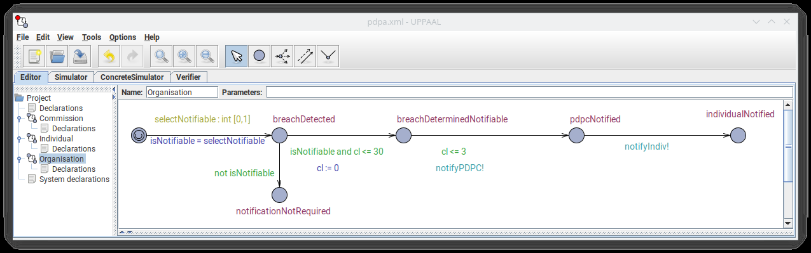
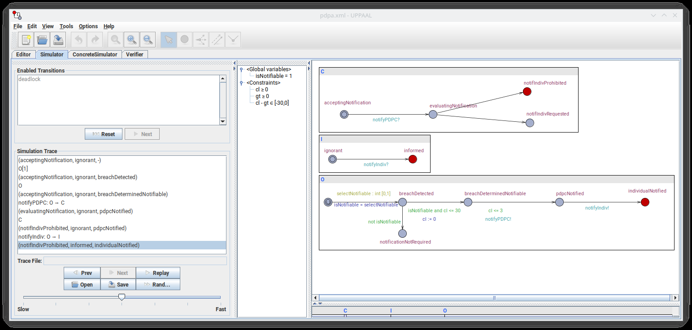

**STATUS 2026-09-14: DRAFT — machine-drafted, persona-reviewed, fact-checked and revised; not yet read by Meng in full. Citations checked live 2026-09-13 and 2026-09-14. Pilots as Meng described them on 2026-09-14 (`blog/README.md`): the data-breach pilot named and dated (Personal Data Protection Act, 2022), the insurer pilot dated 2023. WAICOM paper read in full, its Fig. 1(c) and Fig. 2 added 2026-09-14; the Berkman moment (Bradner, RFC 2119) added 2026-09-14 from Meng's answer to Q8; no NEEDS MENG markers remain. Note 3 flags the ICAIL draft's "secondary legislation."**

An organization finds that it has been breached, and the breach is assessed as the kind the Act calls notifiable. From that point the rule is plain: notify the people whose data was exposed, and notify the regulator, as soon as possible. The organization starts doing both. Some time later the regulator comes back with advice: do not tell the affected parties. The organization is now obliged by one clause to notify its users and instructed, under the same rules, not to. It got there without breaking anything. Whoever is holding the phone has to choose which one to break.

That is the data-breach notification obligation in Singapore's Personal Data Protection Act, as I recall the shape of it.[^3] Why the regulator would say such a thing, the Act does not explain. I can guess — a state actor behind the breach, some need for disaster management — but it is a guess, and nothing here turns on it.

In 2022 a government agency asked us to turn that obligation into software — one of L4's early pilots — and we encoded it in an early version of L4. Our group at Singapore Management University has been building the language for six years. From the encoding we generated a web wizard, which is still online: a member of the public answers questions about their situation and gets back what they have to do, each answer citing the clause it came from.[^1]

Once we understood the fragment we modeled it by hand in UPPAAL, the timed-automata model checker from Uppsala and Aalborg, which searches processes with clocks for a state you name. Three automata and one clock. The organization's: breach detected, determined notifiable within 30 days, clock reset, the Commission, the regulator, notified within 3 days of that, then the individual. The Commission, once notified, requests or prohibits that last step on its own.

_Fig. 1(c): the Organization automaton in UPPAAL — one clock, 30 days to determine, 3 to notify. Mahajan, Strecker, Watt and Wong, WAICOM 2022, CC BY-NC-ND 4.0._

The state we named: individual informed, Commission having prohibited it. UPPAAL found it and printed the run: the organization notifies the Commission; the Commission prohibits; the organization, which in the model cannot hear the Commission, notifies the individual. The paper's why: it "comes about because the organization has no clue at which point the commission's interdiction to inform the individual could intervene, and is therefore entitled to inform the individual as soon as a data breach is identified."

A second query found a deadlock past the 3-day deadline: no action is possible. The same finding, stated as a bind: the only way to comply with either duty is to violate the other, and the path that seems to satisfy both — notify the Commission, stall on the individual until a direction arrives — does so by breaching the immediacy requirement in the interim.

We wrote it up that December with Avishkar Mahajan, Martin Strecker and Seng Joe Watt for the International Workshop on AI Compliance Mechanism (WAICOM): one engagement, worked several ways, UPPAAL and then Maude, a rewriting-logic system.[^2] The trace's last line reads `(notifIndivProhibited, informed, individualNotified)`.

_Fig. 2: the failure trace in UPPAAL's simulator, last state (notifIndivProhibited, informed, individualNotified). Mahajan, Strecker, Watt and Wong, WAICOM 2022, CC BY-NC-ND 4.0._

A programmer would call that a race condition. Deontic logic, the branch that deals in obligation, permission and prohibition, has picked at conflicts of this shape since Chisholm's contrary-to-duty paradox; our ICAIL draft calls it a contradictory conflict.[^5] If "model checker" is new to you, James Somers's 2017 piece in The Atlantic on Leslie Lamport and TLA+ is the way in.[^7]

## An insurer's payout formula, and a rates rebate

The second finding was about money, and the one closest to anyone who has signed a policy unread. In 2023 a major insurer — millions of customers; it stays unnamed — had us formalize one of its policies, which means writing each clause precisely enough that a machine can compute a payout from it. The payout formula was not that precise. It had two readings, so two customers with the same claim could be paid different amounts depending on who read the sentence. The paper calls the gap material financial exposure; my own estimate at the time, from memory, ran to millions of dollars in claims on the more generous reading. And an ambiguity in a policy the insurer wrote is, by the usual rule of construction, read against the insurer. Singapore's Court of Appeal has said that rule "is particularly pertinent in insurance policies because these policies are invariably drafted and/or vetted by experts for the benefit of insurers so as to protect the latter's interest."[^8]

We reported it. The insurer reviewed its files and found it had been making the larger payout. That made the write-up delicate: the adjusters who had helped us through the policy were the people who could be penalized for overpaying, so the finding was presented as a defect in the wording. When it reached the executives, the conversation was about liability. Nobody said whether future claims would be paid on the stricter reading or the generous one. As I recall it — the slides are lost, the memory not sharp — our presentation put two cases in front of them as the class of risk an ambiguous term carries: _Tay Eng Chuan v Ace Insurance_, quoted above, and a 2023 judgment of the Court of Justice of the European Union, _Ocidental v LP_, on a limiting term in a group policy the insured never had the chance to read: transparency, the Court said, means a consumer can grasp a term's economic consequences before signing. Neither is about a formula. Both make one point: adjusters have discretion, and a policy still has to keep out of a class of unpredictability courts have refused to tolerate. The fix went into the wording of the term, where the defect was, not into the code computing the payout.[^9]

The third was earlier, informal, and about tests. In 2019 New Zealand's rates rebate — a discount on a homeowner's property rates that shrinks as income rises — had been written in OpenFisca, an open-source engine for tax-and-benefit rules that began in 2011 inside a French government policy unit.[^10] The rules were Python, and the rebate's own tests ran to thirteen cases in two files — "a handful," as I remembered it.[^11] Varun Patro wrote a parser for the Python, and we pulled the rules into a very early prototype of L4 — "an early implementation just using S-expressions in raw Haskell," as I remember it, "but that was enough to buy us QuickCheck," a Haskell library that generates test inputs.

The formula docks an eighth of the amount by which income exceeds an allowable figure, and the amount by which one number exceeds another is zero when it does not. The Python had a plain subtraction. Below the threshold the "excess" came out negative, docking a negative added it back, and a low-income ratepayer's rebate rose toward the $630 maximum. We charted the rebate over a grid — combined income $12,000 to $30,000 in $1,000 steps, rates from $100 up in $100 steps, no dependants — and looked at it; at $1,000 of rates and $12,000 of income the cell read $630. Reading the excess as `max(0, a − b)` inside the income term gives the corrected chart, two rows and five columns of it, rates down the side, income across:

| rates \ income | $12,000 | $25,000 | $26,000 | $28,000 | $30,000 |
| -------------- | ------- | ------- | ------- | ------- | ------- |
| $100           | 0       | 0       | 0       | 0       | 0       |
| $1,000         | 560     | 560     | 458     | 208     | 0       |

On 9 May 2019 — 10 May in New Zealand — a maintainer, Brenda Wallace, authored the fix, "Clip excess to minimum zero (excess can't be negative)": one line, `.clip(min=0)`, tests a minute behind; it reached the upstream repository on 12 May.[^11] Within a week of that, as near as the record dates it — the shell prompts in our deck read 14 May — we found the same defect another way. They found it by inspection and reasoning; we found it by charting an isomorphic encoding; neither prompted the other. The prototype is public, in `smucclaw/complaw` at `doc/ex-nz-rates-20200909/aotearoa-haskell/`, not in this repository.

None of the three was a one-off contract. Each was a rule that runs many times: a regulation every regulated business must comply with, a formula applied to every claim, a calculator applied to every claimant. Three findings are also three anecdotes. We have five engagements on the record; the other two — a payments company's fee tables served through a query API, a drafting office's look at the language — were not searches for defects, so the denominator is three of three, which is no denominator at all. Woodcock, Larsen, Bicarregui and Fitzgerald, in a 2009 survey of sixty-two industrial formal-methods projects, warned that people who saw no value in the method would be "under-represented among the responses." A formalization that finds nothing tends not to get written up either — our impression; they did not measure it. The Imperial group's experience below, fewer ambiguities than they expected, is probably the common case.[^12]

## Somebody has been here before

Layman Allen, in the Yale Law Journal in 1957: "A large amount of the litigation based on written instruments—whether statute, contract, will, conveyance or regulation—can be traced to the draftsman's failure to convey his meaning clearly."[^13] His remedy was symbolic logic, used as a drafting tool. Thirty-seven years later, with Charles Saxon, he narrowed the diagnosis: nearly all the ambiguity in legal writing is ambiguity in the language that expresses logical structure, and nearly all of it is inadvertent.[^14] The _and_, the _or_ and the _unless_ of a clause are where it goes wrong.

In the summer of 1983 a group at Imperial College London typed a large part of the British Nationality Act 1981 into Prolog; in January 1984 they showed it to Home Office officials who had been involved in drafting the act; in May 1986 they published it in Communications of the ACM.[^15] They expected more imprecision and ambiguity than they found — "fewer such examples than we originally expected" — and where it did exist "it was usually possible to identify the intended interpretation with little difficulty." What they did find was a bug, and it came from writing a rule down. Section 1(2) of the act says that a newborn found abandoned in the United Kingdom shall, unless the contrary is shown, be deemed to have been born there to a parent who was a British citizen or settled. Two negations sit in that clause: "unless the contrary is shown," and inside it "the contrary" — that the infant was _not_ born to such a parent. Prolog's _not_ means _cannot be proved_. Read both negations that way and the pair collapses into a requirement to prove that the parent qualifies, which an infant of unknown parents cannot meet, so the machine declines to make it a citizen — "exactly the opposite of what is intended by the act." The authors' fix was to read the inner _not_ as ordinary negation. No tool reported that. Formalizing forced a choice the English never had to make, and the obvious choice went the wrong way.

Their conclusion was Allen's: a logical representation "can also help to derive logical consequences of the rules and therefore test them before they are put into force." Philip Leith answered them in the Computer Journal the same year: the team had a mistaken picture of the legal process, and law is not only its text — there is the guidance, the practice, the tribunal, the discretion.[^16] The agency's guidance is Leith's point, made by a drafter instead of a critic.

The idea went into government anyway, under the name rules as code: a New Zealand team in 2018, three weeks in one room coding two acts, came out with the phrase "lawyers as modems" for what the current process makes of the profession once a law is enacted; the Organisation for Economic Co-operation and Development (OECD) wrote the movement up in 2020; Catala, from Inria and Microsoft Research in 2021, tried its language on French family benefits and found "a bug in the official implementation."[^17] The newer work is in the notes.[^18] The movement has its critics, whose objection is to code that replaces the instrument.[^19] A checker that shows a drafter where the instrument contradicts itself, guidance and all, is a different thing, and the thing on offer here.

Every name so far belongs to a logician or a computer scientist. Howard Darmstadter is a transactional lawyer — three decades of it, and a drafting course at the Benjamin N. Cardozo School of Law — and in November 2010 he published "Precision's Counterfeit" in _The Business Lawyer_, the American Bar Association's business-law quarterly. He had given his class a syndicated revolving credit agreement from one of New York City's leading firms, a document he had reviewed as borrower's counsel "on a nearly annual basis over some fifteen years" and believed bulletproof, and set out to simplify its prose. "I thought merely to skim off some of the surface algae. But when I did, and looked into the now crystalline waters of the pond, I saw . . . sharks." The first shark: the opening section makes each lender's duty to fund conditional on the loans staying proportional to the lenders' commitments; if one lender of three defaults, the proportion cannot hold, so the other two can argue they are released as well. The next section says a lender's failure "shall not in itself relieve any other Lender of its obligation to lend." Nothing in the agreement says which governs. Two clauses that cannot both be obeyed, in a state the rules let you reach, in a form that had "no doubt been pored over by many of the firm's lawyers and by lenders' and borrowers' counsel in numerous transactions." No tool found it. He did, by rewriting the sentence for a class.[^28]

## Three kinds of bug

One clause with two readings; code disagreeing with text; two clauses that cannot both be obeyed.

Then there is the failure case. Australia's Robodebt scheme ran from 2015 to 2019. It took a welfare recipient's annual income from the tax office, averaged it into fortnightly amounts, compared those to what the person had declared, and hundreds of thousands of people were told they owed money on the difference. The Federal Court, approving the class-action settlement in 2021, put the numbers this way: debts totaling at least $1.763 billion unlawfully asserted against about 433,000 people; about $751 million recovered from 381,000 of them; and $112 million paid on top in the settlement. The figure reported for "the settlement" varies with which of those a writer adds up. The Royal Commission that reported in July 2023 — three volumes, 990 pages, 57 recommendations — found that income averaging used that way "was in fact inconsistent with social security legislation" and called the scheme "a crude and cruel mechanism, neither fair nor legal." It found at least three suicides it could attribute to the scheme, and said it was "confident that these were not the only tragedies of the kind."[^20] That is the bug the rules-as-code programs mostly talk about. The check was made, by lawyers, before the scheme started — the social-services department was advised in November 2014 that the averaging "did not accord with legislation" — and the Commission found no evidence the advice reached the department running the system. The finding lived in a memo. The code ran for four years.

A Jersey legislative drafter named Waddington asked, in the OECD's paper, what a grant for children "aged four and a half to eighteen" means to a computer counting from the hour of birth: the clause with the double reading.[^17] Robodebt and Catala's family benefits are code that disagrees with its text. The breach-notification bug is neither of those: the duty to notify and the advice not to are each clear, each faithfully carried out, and cannot both be obeyed from a state the rules themselves let you reach. You find it by enumerating the states and looking for one in which an obligation and a prohibition coincide. That search has a literature going back to 1992, and it has been automated before, for contracts in 2009 and for business processes in 2013.[^21] What the pilot adds is that the duties ran against a clock, so the conflict arrived as a timing — a sequence of permitted steps with a late piece of advice in it — rather than as a clash in a static rule set.

A conflict a checker reports is only as real as the encoding's treatment of exceptions and priorities. Law is defeasible: a proviso carves a case out of a general duty, a clause that opens "subject to section 12" yields to section 12, a regulation cannot override the act it is made under — and an encoding that forgets any of that reports conflicts that are artifacts of the encoding.[^22] The obvious priority here is that the regulator's later word overrides the earlier duty; read that way, the organization stops notifying the moment the advice arrives, and a model that carries the priority goes quiet. But by then the organization has told the regulator, and perhaps some of its users, that a breach was found. Whatever the silence was meant to protect is already partly gone; the conflict the checker reports disappears and the thing the rules were for is still unmet. The checker alone would not persuade me that the conflict is in the text. The guidance does: someone reading the instrument without us saw the same corner and wrote a way out of it.

## The tooling gap

Programmers have languages, compilers, version control, test frameworks, model checkers, and a culture in which "we found a race condition" is a normal Tuesday. Graphic designers have Adobe: Illustrator, InDesign, Photoshop. Lawyers have Microsoft Word — and, in fairness, HotDocs, assembling documents since 1993; Oracle Policy Automation, generating eligibility interviews; and docassemble, doing the same free since 2015, which L4 compiles to.[^6] None tells you the instrument contradicts itself.

The work is not that different: lawyer and programmer both turn business goals into a text that must anticipate a complicated system with many moving parts and an adversary.[^23]

Darmstadter puts that harder than a technologist could get away with. The complex documents, he says, are already written in "the programming style" — extreme detail, no explanation of what any section is for — and they carry the two properties programs carry: they are "extraordinarily brittle," breaking when a drafting assumption turns out false, and they "tend to contain lots of mistakes (in computerese, 'bugs')." His remedies are an inventory of what the other trade already owns: comments, for which his example is the remark statement an early programming language let you leave for a later reader; worked examples; notation for the formulas the prose garbles; diagrams; and a spreadsheet you can push ranges of values through — "not a foolproof method, but it turns up mistakes surprisingly often."[^28]

One Thursday afternoon in my 2016–17 fellowship year at Harvard's Berkman Klein Center, I was presenting my plans for L4, and Scott Bradner was in the room. Bradner wrote Request for Comments (RFC) 2119, the 1997 document whose one sentence tells every engineer who has read an RFC how to read MUST, MUST NOT, SHOULD and MAY;[^27] I had co-written RFC 4408, the Sender Policy Framework, in 2006; we connected over formalizing normative specifications with deontic keywords. Technologists borrowed those terms from law decades ago and built the Internet with them; now it is time to return the debt with interest. Berkman was for the social implications of moving the rule of law onto a rules-as-code platform, and unauthorized practice of law in an AI world. CodeX, at Stanford, was for the programming-language theory of specification languages and a controlled natural language between law and code.

Stanford's CodeX TechIndex lists 5,761 legal technology companies, 389 of them in contract management and 898 in document management and automation.[^24] Contract-review tools built on large language models will flag a clause as possibly inconsistent with another: a guess a reader has to check, where a search over the states can say nothing was missed, within its model. The index has no category for the second.

`l4 verify`, in today's binary, reads each decision rule as its logical skeleton — ands, ors and nots over opaque atoms — and reports unsatisfiable rules, unreachable branches and guards that do nothing; it sees no numbers or dates, its findings are sound only for the encoding it is given, and its silence is not a consistency proof. `l4 state-graph` draws the obligations' state machine. Asking the pilot's question over that graph means lowering the L4 to a timed backend — cheap, but the lowering is designed, not built, and its spec lists the race condition as a fixture still to reproduce.[^25]

If you run a small company and signed a lease this year without reading it, there is nothing here for you yet; the checker is for people whose rules run many times. The academic version is a draft for ICAIL, the International Conference on Artificial Intelligence and Law: the double bind as a reachability query; a later post climbs from the serial comma to model checking.[^26]

## The guidance, and the offer

What our method found from the text alone, the guidance beside the Act had already found, and in practice handles. But a reader without the guidance is caught, and a note beside the instrument does not amend it, so the Act still carries the contradiction; found at drafting time, the fix could have gone into the text. The offer is to the drafters as much as to the reader, and one drafting office has already looked at L4 with that in mind.[^4]

The Home Office officials who saw the Imperial group's Prolog in January 1984 made the observation the authors matched to Allen's of 1957: this could help with drafting the rules in the first place. Forty-two years later that is still the offer: find the corner before anyone is holding the phone, and write the way out into the regulation rather than into the note beside it.

## Sources

### Notes

[^1]: The pilot accounts here are Meng Wong's, from the project's working record and, where the body says so, from memory; the pilots are described in deliberately general terms in the draft ICAIL paper, `paper/icail/l4-icail.tex`, §Experience and Open Questions ("With a government agency we encoded a piece of secondary legislation for regulatory compliance and generated a web wizard that lets members of the public enter their circumstances and see their obligations, each answer carrying citations to the source rules"). The agency and the insurer stay unnamed; the first pilot's instrument, its year and its public paper are in notes 2 and 3. "Six years" is Meng's figure, recorded in `blog/STYLE.md` §6 on 2026-09-13. "An early version of L4" is his phrase of 2026-09-14 (note 3).

[^2]: The paper: Avishkar Mahajan, Martin Strecker, Seng Joe Watt and Meng Weng Wong, "Compliance through model checking," International Workshop on AI Compliance Mechanism (WAICOM 2022), December 2022, SMU InK, <https://ink.library.smu.edu.sg/cclaw/3/> — record and abstract read 2026-09-14, and the paper read in full 2026-09-14 from the PDF Meng supplied (8 pages; the InK record's PDF is the accepted version). Its abstract: "we describe part of a case study about Singapore's Personal Data Protection Act, which we first presented informally, then formally as interacting Timed Automata." §2 (p. 3) gives the informal account: three actors — the organization, the Personal Data Protection Commission ("henceforth only called the commission") and the individual, "the multitude of affected individuals" abstracted to one "as there is no interaction among the individuals"; up to thirty days to assess whether a breach is notifiable; the commission and the individual to be informed within three days of that; and "the organization must not notify an affected individual if the commission so directs." §3.1 Formal Model (pp. 4–5) and Fig. 1 (p. 4): three interacting timed automata, (a) Commission, (b) Individual, (c) Organization; "there is one clock, `cl`," reset on the transition from `breachDetected` to `breachDeterminedNotifiable`; the Organization's guards are `isNotifiable and cl <= 30` then `cl <= 3` with `notifyPDPC!`, then `notifyIndiv!`; "we have here made the choice to sequentialize the notifications (the commission, then the individual)," since UPPAAL has no nested parallel automata; the Commission's choice after `notifyPDPC?` is non-deterministic, "modeling the fact that the commission's decision to prohibit or request the notification of the affected individual is autonomous and not influenced by external factors"; and the model is deliberately incomplete, so a run "can get stuck in an intermediate state." §3.2 Checking the Model (pp. 5–6) and Fig. 2 (p. 5): the queries are in CTL, the temporal logic the paper states them in ("requirements that are typically stated in a formal logic, here the temporal logic CTL"); `E<> I.informed and C.notifIndivRequested`, the good case, holds; `E<> I.informed and C.notifIndivProhibited` — "the individual is informed in spite of the commission having prohibited it" — "is also satisfied, and Uppaal produces a trace (Figure 2) leading to this error situation," the sentence on why quoted in the body; and `E<> O.breachDeterminedNotifiable and deadlock` holds: "in this state, no action is possible when the notification deadline of 3 days has been exceeded." §4.1 adds that "a precise interaction between the commission and the organization is not made explicit in the law text." The body's "which in the model cannot hear the Commission," and note 22's "takes no message from the Commission," are read off Fig. 1(c), whose Organization automaton has two send actions and no receive. Both figures are embedded as the paper's own images, extracted unaltered with `pdfimages` on 2026-09-14; provenance, licence and the two figures not shown in the body, Fig. 1(a) and 1(b), are in `blog/assets/waicom-2022/README.md`. The licence in the captions, CC BY-NC-ND 4.0, is as the InK record states it, read in a browser on 2026-09-14 and recorded there; the PDF's own cover sheet confirms the record URL ("Available at: https://ink.library.smu.edu.sg/cclaw/3") and carries no licence string, and the record refused a non-browser request again on 2026-09-14, so that one browser reading is the only check behind the licence. The paper's §2 refers to sections of the Act by number; none is repeated here. The Act's clauses are not quoted and no section is cited: Singapore Statutes Online refuses non-browser requests, and neither the Act nor any rules made under it were opened today. `paper/formal-methods-in-law/FORMAL-PAPER.md` §1 records the same case in its list of case studies as "race condition (timed automata / UPPAAL)." That file's §4.4 and §3 table list the "PDPA data-breach notification race condition (our UPPAAL study)" and "the government-agency race condition from our regulatory pilot" as two exhibits, the first described as "interacting clocks (assessment window vs notify-the-regulator window)." Meng, 2026-09-14, recorded in `blog/README.md`: "there was one engagement but we worked it several ways: Uppaal and then Maude. The double bind was both deontic and temporal: if the org notified the government then waited a while to notify the users they would potentially be able to comply with a non-notification notice that arrived in the interim. The only way to comply with a non-notification notice from the regulator is to violate the immediate notification requirement to the affected users. And vice versa." So the two exhibits are one engagement, and the body's bind sentence is his; the paper's own framing is the prohibited-yet-informed trace plus the deadlock past the 3-day deadline, and the body gives both. The Maude line, in which Watt, Goodenough and Wong later gave L4 an executable semantics: Seng Joe Watt, Oliver Goodenough and Meng Weng Wong, "Deontics and Time in Contracts: An Executable Semantics for the L4 DSL," _Legal Knowledge and Information Systems_ (JURIX 2023), Frontiers in Artificial Intelligence and Applications, IOS Press, 7 December 2023, DOI 10.3233/faia230954 — Crossref record confirmed 2026-09-14, not read; that it is the Maude line of the same work is `blog/README.md`'s gloss of Meng's "Uppaal and then Maude," and it is cited here for the executable semantics only, not as a PDPA result. The finding as the ICAIL draft states it: `paper/icail/l4-icail.tex`, §The Regulative Layer, "Why this matters": "In one of our public-sector deployments, exactly such a deontic-temporal double bind was discovered automatically in live regulation: under an unusual interleaving, a party was simultaneously obliged and prohibited from the same act." "Automatically" there is the model checker's search, not the construction of the model, which was by hand. Also recorded in `specs/proposals/VERIFICATION-BACKEND-LOWERING-SPEC.md` (case study 1) and in `doc/concepts/legal-modeling/residual.md`. The description of what UPPAAL is — a model checker for networks of timed automata, from Uppsala University and Aalborg University — is the tool's own, from <https://uppaal.org/>, read 2026-09-14: "an integrated tool environment for modeling, validation and verification of real-time systems modeled as networks of timed automata," "developed in collaboration between the Department of Information Technology at Uppsala University, Sweden and the Department of Computer Science at Aalborg University in Denmark"; the paper itself says only "the Uppaal [9] model checker," its reference 9 being Larsen, Pettersson and Yi, "Uppaal in a nutshell," STTT 1(1), 1997; the pilot's model is as Fig. 1 prints it. The model carries no exception or priority — the Organization automaton has no transition on a prohibition — and the paper says its model is incomplete; the body rests the finding's reality on the guidance for that reason. Status of the shipped tooling: `paper/formal-methods-in-law/FORMAL-PAPER.md` §4.4 ("the model-checking backend is designed, not built") and the spec's own header ("Phase 1 is ruled but not built … no prover exists in the tree as of" 2026-09-07).

[^3]: The instrument is Singapore's Personal Data Protection Act, its data-breach notification obligation — "PDPA DBNO" in the project's repositories — and the year is 2022, both given by Meng on 2026-09-14 and recorded in `blog/README.md`, "Framing constraints — Post 1", "The year, and the paper." The opening is the shape of the obligation as Meng described it on 2026-09-14, in the same README section: "in the event of a data breach which has been assessed as being a notifiable data breach, the organization must notify, as soon as possible, both the affected parties (users whose data was exposed) and the government regulator. The government regulator may some time later advise the organization to not advise the affected parties … That places the organization in a double bind: you must notify, and you must not notify." His speculation about the regulator's reasons ("presumably because major breaches call for disaster management in some way, or maybe the breach was tied to a state sponsored actor") is marked as speculation there and is reported as a guess in the body. The tool, in his words: "This analysis was done with an early version of our language and the UPPAAL encoding was performed manually once the fragment of the regulation was understood." The record is consistent with the year and does not fix it on its own, and the body gives 2022 as the year of the pilot proper: the repository activity runs wider than 2022 on both sides. In `smucclaw/dsl`, `caseStudies/PDPA/README.org` was created 2021-07-19 ("the future home of the L4 rules regarding the PDPA, at first just the notification obligation"), and the `pdpadbno-*` encodings and their parser tests carry commits from 2021-12-21 to 2023-06-18, those dated 2022 running from 6 January to 20 December. In `smucclaw/vue-pure-pdpa`, the web wizard at <https://smucclaw.github.io/mengwong/pdpa/>, the first commit is dated 2021-09-12 and 187 commits carry a 2022 commit date (160 excluding merges); by author date the figures are 185 and 158, and the 185 in `blog/README.md` is that author-date count. All read from `git log` in local checkouts of both repositories on 2026-09-14; commit counts move with the pathspec and with the date field, which is why the encodings are dated rather than counted. The wizard answered HTTP 200 on 2026-09-14. The case-study README lists, among the circumstances in which an organization need not notify an individual, that the regulator instructed it not to — whether or not the organization had asked — and that a law-enforcement agency did; the body describes the bind in those terms. One discrepancy to flag: `paper/icail/l4-icail.tex` §Experience calls the pilot's instrument "a piece of secondary legislation"; the Act is a statute, and which of the Act and any rules made under it the pilot's fragment was drawn from is not on record — the body says "the Act" and no more, and an earlier draft's gloss on secondary legislation is removed. Which agency commissioned the pilot stays unnamed. What may be disclosed about the engagement: the ICAIL paper's header still lists "confirm what may be disclosed about each pilot" as an open editorial item.

[^4]: Framing note recorded by Meng Wong in `blog/README.md`, "Framing constraints — Post 1", 2026-09-13: the race condition was documented in the guidance accompanying the regulation, which ameliorated it in practice; the method found it from the rule text alone; found at drafting time it could have been fixed in the regulation rather than in guidance that is, in his phrase, "effectively a practice direction." The body describes the guidance as a document that does not amend the instrument rather than borrowing that term, since a practice direction is properly a court's instrument. Nothing on record says what the drafters knew when the instrument was made, and the post does not say either. The drafting office: Meng's account, and `l4-icail.tex` §Experience ("A legislative drafting office has explored L4 for future drafting").

[^5]: Georg Henrik von Wright, "Deontic Logic," _Mind_ 60(237):1–15 (1951), DOI 10.1093/mind/LX.237.1; Roderick M. Chisholm, "Contrary-to-Duty Imperatives and Deontic Logic," _Analysis_ 24(2):33–36 (1963), DOI 10.1093/analys/24.2.33. Both are in `paper/icail/l4-icail.bib`; the bibliographic records were confirmed against Crossref on 2026-09-13, and neither paper was re-read today. "Contradictory conflict" is the ICAIL draft's phrase (§The Regulative Layer), not a term the field owns, and not the WAICOM paper's, which never uses the word: its §1 speaks of "problems of the current legislation that could be termed an internal inconsistency"; the nearer standard term is normative conflict, as in Sartor's title in note 21.

[^6]: Oracle Policy Automation (OPA), now Oracle Intelligent Advisor: Wikipedia, "Oracle Intelligent Advisor" (the article formerly titled "Oracle Policy Automation," which now redirects to it), read 2026-09-13 — "Oracle Corporation acquired OPA in December 2008 when it purchased the Australian software company RuleBurst Holdings, then trading as Haley"; the users named there include the UK's tax authority (an employment-status tool, dated 2006 there, under the product's pre-Oracle owner) and Australia's immigration department (visa eligibility, sourced there to a June 2009 press report), which is why the body says "for agencies" and leaves the named agencies here. HotDocs: Wikipedia, "HotDocs," read 2026-09-13 — "Version 1.0 of HotDocs was introduced in 1993." docassemble: <https://docassemble.org/> ("A free, open-source expert system for guided interviews and document assembly," Jonathan Pyle, MIT license) and the GitHub repository `jhpyle/docassemble`, created 18 April 2015, both read 2026-09-13. L4's docassemble backend: `jl4/app/Main.hs` line 116 and `doc/exports/docassemble.md`, read in the worktree 2026-09-13. Wikipedia is cited for dates a reader can check in a minute, not for anything contested.

[^7]: James Somers, "The Coming Software Apocalypse," _The Atlantic_, 26 September 2017, <https://www.theatlantic.com/technology/archive/2017/09/saving-the-world-from-code/540393/> (checked 2026-09-13; the page's own metadata dates it 2017-09-26). Cited as an on-ramp, not as evidence for any claim here.

[^8]: Meng's account: "an ambiguity in the payout formula that potentially meant that the insurer was leaking (that's the technical term) potentially millions of dollars in claims." `l4-icail.tex` §Experience puts it as "an ambiguity in a payout formula with material financial exposure"; the body uses the paper's phrase and attributes the larger figure to our own estimate. The body does not use "leaking": a reviewer objected that the industry's term "claims leakage" names losses in claims handling rather than in policy wording, and nothing turns on the word. Nothing more specific about the clause is on record. The rule of construction: _Tay Eng Chuan v Ace Insurance Ltd_ [2008] SGCA 26, Singapore Court of Appeal, CA 95/2007, decided 27 June 2008, read on eLitigation, <https://www.elitigation.sg/gd/s/2008_SGCA_26>, 2026-09-14: "The _contra proferentem_ rule is particularly pertinent in insurance policies because these policies are invariably drafted and/or vetted by experts for the benefit of insurers so as to protect the latter's interest," and "any ambiguity in the extent of insurance coverage provided by the Policy should be construed against the respondent" insurer. Cited for the rule, which is general; the case has nothing to do with our insurer.

[^9]: What followed is Meng's account of 2026-09-14, recorded in `blog/README.md`, "Framing constraints — Post 1", in two parts; the second corrects the first as to who raised the cases. First: "The insurer reviewed what it had been doing — it had been making the larger payout, not the smaller — and we had to finesse the explanation of the case to management because we were acutely aware that the team of insurance adjusters who had been kindly assisting us with the pilot project could potentially be penalized for overpaying. When we presented the findings at CxO level though the top management simply observed that the newly discovered ambiguity of the contract may have exposed them to a 'Ocidental – Companhia Portuguesa de Seguros de Vida v LP, C-263/22, CJEU, 20 April 2023' liability risk, and that clarifying the ambiguity would save them that liability; no mention was made of whether they would lean stricter or stay generous in future payouts. So the fix was at the right layer: at the abstract logic and not necessarily the particular algorithm." Later the same morning: "Let's put in both Ocidental and Tay Eng Chuan; IIRC it was our presentation to management at the insurer that highlighted these cases as risks, but the presentation is lost to time and I have only a vague memory that it was this class of suit that we mentioned as representative of 'yes, insurers have some discretion — that's what adjusters do — but policies need to avoid certain classes of unpredictability, and courts have agreed.'" The first account's "management simply observed … a liability risk" is withdrawn as to attribution; the body follows the second, hedged as he hedges it. The year: in the project's working repository the substantive insurance work runs from March to November 2023, including presentation material dated 25–26 July 2023; three later commits on the same paths, in February and July 2024, change a server URL and restructure a Haskell file, maintenance rather than pilot work (read 2026-09-14 and recorded in `blog/README.md`; whether that is the presentation Meng remembers as lost is for him to say). _Ocidental_ was decided 20 April 2023, before any of it, so the presentation could have cited it; had the pilot predated the judgment, the case could only have been the later authority for the same class. The case: _Ocidental – Companhia Portuguesa de Seguros de Vida SA v LP_, C-263/22, Judgment of the Court of Justice of the European Union (CJEU), Ninth Chamber, 20 April 2023, on a reference from Portugal's Supremo Tribunal de Justiça; EUR-Lex CELEX 62022CJ0263, with a summary at 62022CJ0263*SUM. Its headnote: Directive 93/13/EEC on unfair terms in consumer contracts, Articles 3 to 6; criteria for assessing the unfairness of a contractual term; the requirement of transparency; a group insurance contract; permanent invalidity of the consumer; the duty to provide information; non-disclosure of a term limiting or excluding cover against the insured risk. The judgment was read on 2026-09-14: first from EUR-Lex's HTML view of CELEX 62022CJ0263 in a browser session (EUR-Lex and CURIA serve a bot-check page to scripts), then in full from the EUR-Lex PDF saved from that browser, 57 numbered paragraphs plus the operative part, against whose extracted text every quotation below was matched verbatim. Paragraph 29: the transparency requirement "entails the obligation to provide the consumer, prior to the conclusion of the contract, with all the information necessary to enable the consumer to understand the economic consequences of those terms and to decide, in full knowledge of the facts, to be contractually bound," and so "necessarily presupposes that the consumer is able to become acquainted with all the terms of a contract before the conclusion thereof." Paragraph 26: transparency "must be construed broadly" and "cannot be reduced merely to those terms being formally and grammatically intelligible." Paragraph 41: a lack of transparency because the consumer could not become acquainted with the term at all "may, a fortiori," be an element in the unfairness assessment. Operative part: (1) Articles 4(2) and 5 of Directive 93/13, read with its 20th recital, mean "a consumer must always be afforded the opportunity, before the conclusion of a contract, to become acquainted with all the terms"; (2) where such an exclusion-or-limitation term is found unfair, the national court "is required to exclude the application of that term." The body's "economic consequences" is paragraph 29's phrase. A published note, Vadim Mantrov, "Consumer Being a Party to the Group Insurance Contract is Not Just a Silent Observer: The CJEU's Clarification in Ocidental," \_European Journal of Risk Regulation* (2024), read on Cambridge Core 2026-09-14, was the secondary source before the judgment was opened. It is a transparency-and-disclosure case about a limiting term, not a case about an ambiguous formula, which is why the body says neither case is about a formula and describes each as what it holds. "The fix was at the right layer" is Meng's; the body says where the fix went and no more.

[^10]: OpenFisca, "About", <https://openfisca.org/en/about/> (checked 2026-09-13): development began in May 2011 at the French government's strategic-analysis unit, since April 2013 called France Stratégie; in 2018 the product manager who had led its international work moved to New Zealand, "where the recently established Service Innovation Lab was finishing writing its Better Rules report"; the Rates Rebate app was "the first service in production outside of Europe"; later adoption in Australia, Polynesia and Canada. The scheme, the parser and the grid are from Meng Wong's deck "Multi-Way Isomorphism in L4: a humble universal converter for rules as code" (Google Slides, document id `1U4pQFXuVAocbwzF1nPtyhxH2SBza_7nEErLPE2lnAAw`; text export read 2026-09-14). The export carries no date for the deck itself; its two shell prompts are stamped `20190514`, which puts it no earlier than 14 May 2019, and "2019" in the body is inferred from that. The deck works through OpenFisca-Aotearoa's `rates_rebates` formula, credits the Python parser to Varun Patro of the National University of Singapore (NUS), names the prototype's S-expression operators (`SoMuchOf`, `Inxs` — which the surrounding slides use as the excess operator; the phrase "in excess of" does not occur in the export — and `IntDiv`), shows the evaluator printing an explanation in the Act's words ("560.00 — which is the lesser of …"), and carries those two prompts dated 2019-05-14. The deck's repository path, `legalese/complaw-deeptech`, `ontologies/rules/aotearoa-haskell`, returns 404 today. The prototype now lives in `smucclaw/complaw` (last pushed 2024-07-10), at `doc/ex-nz-rates-20200909/aotearoa-haskell/` — `app/Main.hs`, `l4/from-openfisca-rr.l4`, and beside them `l4/rr-br3nda-clip.l4` and `l4/rr-br3nda-noclip.l4` — confirmed against the GitHub tree API (`repos/smucclaw/complaw/git/trees/HEAD?recursive=1`, not truncated) on 2026-09-14; the three `.l4` files were read through the GitHub contents API the same day (see note 11), `app/Main.hs` was not opened. The one-clause description of the rebate in the body is the shape the OpenFisca formula gives it (see note 11), not a reading of the Rates Rebate Act, which was not opened.

[^11]: Meng's account of 2026-09-14, recorded in `blog/README.md`, "Framing constraints — Post 1": "We did the work in a very early prototype of the L4 system; an early implementation just using S-expressions in raw Haskell but that was enough to buy us QuickCheck." QuickCheck, the Haskell property-testing library, is his recollection of what the prototype made possible; the word does not occur in the deck's export, whose evidence is the grid — a chart of the rebate over combined income $12,000–$30,000 in $1,000 steps against rates of $100 to $2,000 in $100 steps, dependants 0, with the deck's own captions "this looks wrong," "That's better" and "This now reflects 'legislative intent'" — so the body reproduces a slice of the grid (two of its twenty rows, five of its nineteen columns, cells verbatim; the deck's tables print a hyphen where the body prints a minus sign) and attributes QuickCheck to him. His earlier account, in the project's working record: a "bug that the New Zealand government was facing with mis-calculating entitlement benefits"; the tools "only had a handful of tests"; "We wrote a Python parser and imported the whole thing into a Haskell environment, and then brought on some big guns – HSpec – to generate and run automated tests across the entire domain of possible scenarios." "Entire domain" is retired here: the domain was a grid, and the oracle was a person reading the chart. "A handful of tests" was measured on 2026-09-14 at the fix's parent commit, `faf5a1686e36`: `openfisca_aotearoa/tests/rates_rebates/rates_rebates_2018.yaml` holds nine test cases and `rates_rebates_2019.yaml` four, thirteen for the rebate; the repository as a whole carried thirty-six test YAML files. The bug, as the deck diagnoses it, is the semantics of "excess": "the amount by which a exceeds b" coded as `a − b` where the Act means `max(0, a − b)`. Where it bites: `allowable_income` is $25,180 with no dependants, so `combined_income − allowable_income` is negative only below that threshold; there the unclipped "excess" was subtracted from the rebate, which raised it, and the Python's final `clip(rebate, 0, maximum_allowable)` then held it at the $630 maximum. Above the threshold the excess is positive and the clip changes nothing. The deck's slide order separates two defects: its first S-expression, which has no outer clip, charts negative rebates past the threshold; its second wraps the outer subtraction in `Inxs`, and the chart — zeros in place of negatives — is still captioned "this looks wrong"; its third wraps `Inxs` around `combined_income − (income_threshold + …)` inside `excess_income`, the analogue of `.clip(min=0)`, and that chart is "That's better" and "This now reflects 'legislative intent'". The visible effect of the third change is below the threshold (rates $100, income $12,000: 100 to 0; rates $700 to $2,000: 630 to 360–630), which is why the body locates the defect in the left-hand block rather than in the negative cells, and says the negatives were our encoding's.The prototype's two `rr-br3nda-*.l4` encodings, read through the GitHub contents API the same day, take `SoMuchOf (Descr "rates_total") …` before the minimum against `maximum_allowable`, which caps the rebate at the rates paid and turns 1,608 into 100; `from-openfisca-rr.l4`, the direct translation, mirrors the Python and has no such cap. None of the three reproduces the deck's first table exactly, so the deck's slide sequence is not re-derived here; its corrected table is — every cell of it follows from the parameters at that commit. Correct in both is $0. The upstream fix: OpenFisca-Aotearoa commit `68d839ebbd73`, <https://github.com/BetterRules/openfisca-aotearoa/commit/68d839ebbd73bb5fedb1f274eb3c710c229c12dc>, "Clip excess to minimum zero (excess can't be negative)", author Brenda Wallace (GitHub `Br3nda`), one file (`openfisca_aotearoa/variables/acts/rates_rebates/rates_rebates.py`), one line: `excess_income = floor((… combined_income … - allowable_income) / 8)` gains `.clip(min=0)` at the end. Authored 2019-05-09T22:34:57Z, the morning of 10 May in New Zealand; committed 2019-05-12T18:59:57Z, the morning of 13 May in New Zealand. The tests commit, `3e637466a669`, "Tests for 2019, rates rebate: rebate, min and max," is its child, authored a minute later (2019-05-09T22:36:02Z) and carrying the identical committer date, so the two reached the repository in one push; the body's "a minute behind" is the author-date gap (all four dates re-read from the GitHub commits API on 2026-09-14). The commit page and the repository's commit list for 8–15 May 2019 were opened on 2026-09-14. The repository was then `ServiceInnovationLab/openfisca-aotearoa`; the old name redirects (HTTP 301, checked 2026-09-14) to what is now `BetterRules/openfisca-aotearoa`. The deck credits the fix by handle to `@Br3nda` and `@Verbman`. Against the deck's shell prompts of 14 May 2019, the fix is five days earlier by its author date and two days earlier by the date it reached the upstream repository; the body gives both dates and puts the fix before our chart, and says "within a week" rather than "the same week" because 9 and 14 May 2019 fall in different calendar weeks and the prompt date is only the nearest date the record gives, not the day of the chart. Who saw it first: Meng, 2026-09-14, recorded in `blog/README.md` — "the chart was not what prompted Br3nda's fix; they found it and we found it simultaneously; they found it by inspection and reasoning; we found it by lightweight formal methods." That is his recollection; nothing in the deck or the commit history says either side knew of the other, and the body claims only what he does. `paper/formal-methods-in-law/FORMAL-PAPER.md` §6 says the exercise "surfaced a miscalculation that affected real people's entitlements"; the body claims less, since whether any claimant was ever paid on the unclipped formula is not on record. The exercise predates the current L4 implementation; nothing in the present tree is that parser (the tree's OpenFisca code, `jl4-core/src/L4/OpenFisca/Emit.hs`, compiles L4 _to_ OpenFisca).

[^12]: The five engagements: the four in `l4-icail.tex` §Experience (government agency, insurer, drafting office, payments fintech) plus the New Zealand exercise of note 11. Jim Woodcock, Peter Gorm Larsen, Juan Bicarregui and John Fitzgerald, "Formal Methods: Practice and Experience," _ACM Computing Surveys_ 41(4), article 19 (October 2009), DOI 10.1145/1592434.1592436. The survey covered "62 industrial projects," data collected "between November 2007 and December 2008" and published in 2009; on bias: "This may have biased it towards those with whom we have the strongest contacts," and "due to the bias in selection described above, one would expect stakeholders that did not see value in the use of formal methods to be under-represented among the responses." Read in the authors' draft as hosted at <https://homepage.cs.uiowa.edu/~tinelli/classes/181/Fall14/Papers/Wood09.pdf> (checked 2026-09-13); the ACM copy returned 403 today, so page numbers in the published version are not given. "Probably the common case" is our impression, not theirs, and so is the sentence before it about formalizations that find nothing going unwritten; their survey measured response bias, not publication bias.

[^13]: Layman E. Allen, "Symbolic Logic: A Razor-Edged Tool for Drafting and Interpreting Legal Documents," _Yale Law Journal_ 66(6):833–879 (1957). Opening sentence as given on the University of Michigan Law School repository page, <https://repository.law.umich.edu/articles/1694/> (checked 2026-09-13).

[^14]: Layman E. Allen and Charles S. Saxon, "Controlling Inadvertent Ambiguity in the Logical Structure of Legal Drafting by means of the Prescribed Definitions of the A-Hohfeld Structural Language," _Theoria_ 9(21):135–172 (1994); abstract: "Virtually all of the ambiguity imprecision encountered in legal discourse is ambiguity in the language used to express logical structure, and virtually all of the imprecision resulting is inadvertent." <https://repository.law.umich.edu/facarticles/636/> (checked 2026-09-13).

[^15]: M. J. Sergot, F. Sadri, R. A. Kowalski, F. Kriwaczek, P. Hammond and H. T. Cory, "The British Nationality Act as a Logic Program," _Communications of the ACM_ 29(5):370–386 (May 1986). PDF read at <https://www.doc.ic.ac.uk/~rak/papers/British%20Nationality%20Act.pdf> (checked 2026-09-13). "Summer 1983", the January 1984 Home Office demonstration and the Allen 1957 attribution: pp. 370–371. The expectation sentence, p. 371, in full: "In addition to vagueness, legislation is generally thought to contain both imprecision and ambiguity … In fact, we found fewer such examples than we originally expected." Section 1(2), the two negations and "exactly the opposite of what is intended by the act": p. 380 — the rule's last two conditions each read _not [x was not …]_; the authors take the first _not_ in each as negation as failure and argue that the second "should be interpreted as ordinary, classical negation." "Test them before they are put into force": p. 371. The paper's last sentence, p. 385, runs the other way and is worth having: "the accumulated experience of managing complex systems of law may teach us something about the maintenance of large bodies of complex software."

[^16]: Philip Leith, "Fundamental Errors in Legal Logic Programming," _The Computer Journal_ 29(6):545–552 (1986), DOI 10.1093/comjnl/29.6.545. Only the abstract was readable today (Oxford Academic; the Queen's University Belfast repository page carries no PDF), so the body paraphrases the abstract's own summary of the argument — that the Imperial team "have a muddled view of the legal process and of the usefulness of logic programming in that field," and that Leith wished "to dispute the power of logical programming" — and quotes nothing from the body of the paper. Checked 2026-09-13.

[^17]: James Mohun and Alex Roberts, _Cracking the Code: Rulemaking for Humans and Machines_, OECD Working Papers on Public Governance No. 42 (OECD Publishing, 2020). PDF read at <https://www.oecd.org/content/dam/oecd/en/publications/reports/2020/10/dechiffrer-le-code_d56cab77/3afe6ba5-en.pdf> (checked 2026-09-13). The OECD is the Paris-based intergovernmental body of mostly rich countries. Its definition of Rules as Code, p. 6 (Executive Summary): "a machine-consumable version of some types of government rules, to exist alongside the existing natural language counterpart." Better Rules: Box 2.4, pp. 22–23, quoting the New Zealand discovery report (Digital.Govt.NZ, 2018) — the discovery ran "over three weeks in 2018," the team "contained business rules specialists, business analysts, legislative drafters, service designers, policy specialists and software developers," the two acts were the Rates Rebate Act and the Holidays Act, and the finding was that "it is difficult to produce machine-consumable rules if the policy and legislation has not been developed with this outcome in mind." "Lawyers as modems": p. 32, where it is attributed to Andrews in the OECD Observatory of Public Sector Innovation (OPSI) 2019 trends report, p. 106. The OECD's sentence on limits, p. 33: the point of rules as code "is not necessarily to eliminate this challenge or ambiguity, but instead to make it visible to both implementers and policy makers." The four-and-a-half-years example: Box 3.2, p. 33, quoting M. Waddington, Senior Legislative Drafter in the Government of Jersey, "Machine-consumable legislation: A legislative drafter's perspective," _The Loophole_ 2019(2). The New Zealand discovery report itself sits behind a bot wall today and was not opened; its words here are as the OECD quotes them. Catala: Denis Merigoux, Nicolas Chataing and Jonathan Protzenko, "Catala: A Programming Language for the Law," _Proceedings of the ACM on Programming Languages_ 5 (ICFP), 2021; arXiv:2103.03198 v2, 2 July 2021 (checked 2026-09-13). Affiliations from the byline: Merigoux, Inria; Chataing, Inria and the École Normale Supérieure (ENS), Paris; Protzenko, Microsoft Research. The quotation is the abstract's; the full sentence reads "in doing so, we uncover a bug in the official implementation of the French benefits." Inria's later page on Catala's work with the French tax administration was behind a bot wall today and is not relied on.

[^18]: Current work, named here and not in the body. The Georgetown experiment: Ariel Kennan, Alessandra Garcia Guevara and Jason Goodman, _AI-Powered Rules as Code: Experiments with Public Benefits Policy_, Beeck Center for Social Impact + Innovation and Massive Data Institute, Georgetown University, published 24 March 2025, <https://beeckcenter.georgetown.edu/report/ai-powered-rules-as-code-experiments-with-public-benefits-policy/> (checked 2026-09-13): the experiments ran June–September 2024 on Supplemental Nutrition Assistance Program (SNAP) and Medicaid eligibility rules, the analysis finished between October 2024 and February 2025, and the finding as the report page states it is that "LLMs are capable of supporting the process of generating code from policy, but still require external knowledge and human oversight within an iterative process for any policies containing complex logic." Only the report's web page was read, not the PDF. Elsewhere: Open Overheid, "Opleiding Wetsanalyse en wendbare wetsuitvoering," 26 February 2024, <https://www.open-overheid.nl/actueel/nieuws/2024/2/26/opleiding-wetsanalyse-en-wendbare-wetsuitvoering>: a course in the structured reading of legislation for implementation, _wetsanalyse_, run by the Open Universiteit with Universiteit Leiden for IT staff, lawyers, managers and other professionals involved in preparing or implementing legislation; its third edition began in May 2024. Labo Société Numérique, "OpenFisca: when a digital commons turns law into code," 12 December 2023, <https://labo.societenumerique.gouv.fr/en/articles/openfisca-quand-un-commun-numerique-transforme-la-loi-en-code/> ("From 2023 to 2025, the Netherlands and Greece will be experimenting with OpenFisca modeling"). Digdir, "Spesifikke anbefalinger for å lage automatiseringsvennlig regelverk," last updated 22 August 2025, <https://www.digdir.no/datadeling/spesifikke-anbefalinger-lage-automatiseringsvennlig-regelverk/2879>: "Regelverk som kode, eller Rules as Code (RaC), er en metode hvor regelverket skrives som maskinlesbar kode samtidig som det skrives i vanlig tekst." 2026 OpenFisca Conference, Canberra, 30–31 March 2026, University of Canberra, <https://openfisca.org/en/conference/2026/> — the program page was read; no proceedings or report of the event was consulted. All checked 2026-09-13.

[^19]: The critics. Mireille Hildebrandt, "Code-driven Law: Freezing the Future and Scaling the Past," in Christopher Markou and Simon Deakin (eds), _Is Law Computable? Critical Perspectives on Law and Artificial Intelligence_ (Hart, 2020), pp. 67–83, DOI 10.5040/9781509937097.ch-003; at p. 70: "What code-driven law does is to fold enactment, interpretation and application into one stroke, collapsing the distance between legislator, executive and court"; her definition at p. 67 ("legal norms or policies that have been articulated in computer code"). Read in the publisher's PDF, linked from the Vrije Universiteit Brussel (VUB) research portal, <https://researchportal.vub.be/en/publications/code-driven-law-freezing-the-future-and-scaling-the-past/>, and hosted at <https://www.cohubicol.com/assets/uploads/hildebrandt-freezing-the-future-and-scaling-the-past.pdf> (checked 2026-09-13). Tom Barraclough, Hamish Fraser and Curtis Barnes, _Legislation as Code for New Zealand: Opportunities, Risks, and Recommendations_ (Brainbox Institute, for the New Zealand Law Foundation, March 2021), [2021] NZLFRRp 3. The report itself is behind a bot wall at the New Zealand Legal Information Institute (NZLII) today and was not opened; the Law Foundation's release announcing it, "'Legislation should not be code, but law as code is the future': New research released," <https://lawfoundation.org.nz/?p=11610> (checked 2026-09-13), summarizes the finding in its own voice: "Enacting legislation in code undermines the separation of powers and the role of the Judiciary. It also confers too much power on Executive government." Those two sentences are the release's, not a quotation of the authors, and the report's own wording was not seen.

[^20]: Federal Court of Australia (FCA), summary accompanying _Prygodicz v Commonwealth of Australia (No 2)_ [2021] FCA 634 (Murphy J): the Commonwealth "unlawfully asserted such debts, totalling at least $1.763 billion against approximately 433,000 Australians," "recovered approximately $751 million from about 381,000 of them," and under the settlement "will pay $112 million inclusive of legal costs"; conduct the Commonwealth "belatedly admitted was unlawful." The summary says the only authoritative statement is the published reasons. Read in the copy hosted by the applicants' solicitors, <https://gordonlegal.com.au/app/uploads/2023/08/prygodicz-v-commonwealth-of-australia-no-2-2021-fca-634-summary.pdf> (checked 2026-09-13); the court's own site and AustLII refused the request today. Australian Broadcasting Corporation (ABC) News, "Robodebt royal commission findings revealed," 7 July 2023, <https://www.abc.net.au/news/2023-07-07/robodebt-royal-commission-findings-revealed/102531450> (three volumes, 990 pages, 57 recommendations; scheme ran 2015 to 2019; its "$1.8 billion settlement" is the headline package, not the class-action payment). Law Society Journal, "Crude, cruel and unlawful: Robodebt Royal Commission findings," read via the Wayback Machine at <https://web.archive.org/web/2024/https://lsj.com.au/articles/crude-cruel-and-unlawful-robodebt-royal-commission-findings/> because the live page returned 503 today: quoting the report, "Robodebt was a crude and cruel mechanism, neither fair nor legal" and "The use of income averaging, in the way it was proposed, was in fact inconsistent with social security legislation"; on the November 2014 advice that income averaging "did not accord with legislation" and the absence of evidence it was communicated to the delivery department. The Commission's own site timed out today. The suicides: BBC News, Frances Mao, "Robodebt: Illegal Australian welfare hunt drove people to despair," 7 July 2023, <https://www.bbc.com/news/world-australia-66130105> (fetched by curl 2026-09-14): "The inquiry found there were at least three known suicides as a result of Robodebt policy, and it was 'confident that these were not the only tragedies of the kind'"; it names two of the men, Rhys Cauzzo, 28, and Jarrad Madgwick, 22, whose mothers testified. The BBC gives the scheme's start as 2016; the body keeps ABC's 2015, the year the averaging began under its earlier name. The Commission is cited for its narrative findings, the 2014 advice and the deaths; the court's summary for the money and the unlawfulness.

[^21]: The body's "1992," "contracts in 2009" and "business processes in 2013" are, in order: Giovanni Sartor's paper on normative conflicts; Fenech, Pace and Schneider's contract analyzer (CLAN), which found obligation–prohibition conflicts in formal contracts; and Guido Governatori's Regorous, which checked business processes for compliance. An earlier draft named them in the body; they moved here to make room. Giovanni Sartor, "Normative conflicts in legal reasoning," _Artificial Intelligence and Law_ 1(2–3):209–235 (1992), DOI 10.1007/BF00114921. Gordon J. Pace, Cristian Prisacariu and Gerardo Schneider, "Model Checking Contracts — A Case Study," Automated Technology for Verification and Analysis (ATVA) 2007, Lecture Notes in Computer Science 4762:82–97, DOI 10.1007/978-3-540-75596-8*8. Fenech, Pace and Schneider, "Automatic Conflict Detection on Contracts," Theoretical Aspects of Computing (ICTAC) 2009, Lecture Notes in Computer Science, pp. 200–214, DOI 10.1007/978-3-642-03466-4_13, and "CLAN: A Tool for Contract Analysis and Conflict Discovery," ATVA 2009, pp. 90–96, DOI 10.1007/978-3-642-04761-9_8. Governatori and Shek, "Regorous: a business process compliance checker," Proceedings of the Fourteenth International Conference on Artificial Intelligence and Law (ICAIL 2013), pp. 245–246, DOI 10.1145/2514601.2514638. Sharifi, Parvizimosaed, Amyot, Logrippo and Mylopoulos, "Symboleo: Towards a Specification Language for Legal Contracts," 28th International Requirements Engineering Conference (2020), pp. 364–369, DOI 10.1109/RE48521.2020.00049. Harry Surden, "Computable Contracts," \_UC Davis Law Review* 46:629 (2012), first page read at <https://lawreview.law.ucdavis.edu/sites/g/files/dgvnsk15026/files/media/documents/46-2_Surden.pdf>. Every other record in this note was confirmed against Crossref on 2026-09-13 and not read in full today; they are named as prior work, and the body claims of each no more than its title says. Pace, Prisacariu and Schneider 2007, Symboleo and Surden are named in this note and not in the body. The earlier draft cited Governatori's 2005 RuleML paper here; it was replaced by Regorous on a reviewer's point that the 2005 paper is about representation, not conflict detection.

[^22]: `specs/proposals/VERIFICATION-BACKEND-LOWERING-SPEC.md`, "The Crux: Defeasibility": "a naive deontic encoding will report 'conflicts' that are artifacts of the encoding, not bugs in the law"; "The regulatory race condition above is real precisely _because_ it survives that discharge." That second sentence is our own assertion, not a method, which is why the body rests the point on the guidance instead. The examples of defeasibility in the body (a proviso, a "subject to" clause, a subordinate instrument yielding to its parent act) are general and not cited to any jurisdiction; the earlier draft's "a later clause overrides an earlier one" was removed on a reviewer's point that no such canon operates within a single instrument. The "later word overrides the earlier duty" reading in the body is Meng's, 2026-09-14 (`blog/README.md`): "Even if we read this with 'lex posterior' framing so that the organization stops notifying users the moment they hear from the regulator, as a whole the system has already leaked the fact that the breach was detected so somewhere some high level goal is going unmet." It is offered as a reading a lawyer would reach for, not as a canon of construction; the pilot's model did not carry it — its Organization automaton, Fig. 1(c) of the WAICOM paper (note 2), takes no message from the Commission.

[^23]: The Adobe/Word comparison and the lawyer-as-specifier observation are Meng's, from the project's working record, and open `paper/icail/l4-icail.tex` §Introduction: "Where the graphic designer has Adobe's suite and the programmer commands languages, compilers, version control, debuggers, and test frameworks, the lawyer has Microsoft Word."

[^24]: Stanford Center for Legal Informatics, CodeX TechIndex, <https://techindex.law.stanford.edu/>, front page as read 2026-09-13 (the body's count is as of that day): "5,761 legal tech companies"; Contract Management, 389 companies; Document Management and Automation, 898 companies; the twelve categories listed there include none for contract analysis or verification. An earlier count Meng has quoted — 246 in contract management and 561 in document management of 3,076 — is a previous snapshot of the same index.

[^25]: `l4 verify`: `jl4/app/Main.hs` line 130, with its bound printed from `jl4/app/L4/Cli/Verify.hs` (`propositionalBound`: "The analysis is PROPOSITIONAL"; findings are sound, not complete; "Silence is not a consistency proof"), and `doc/concepts/reviewing/reviewing-encoded-law.md`, "Two commands you will use directly." `l4 state-graph`: `jl4/app/Main.hs` line 98 and `doc/concepts/legal-modeling/regulative-rules.md`, "State Graphs." Model-checking backend status: `paper/formal-methods-in-law/FORMAL-PAPER.md` §4.4, "Status. Roadmap … the model-checking backend is designed, not built," and the status header of `specs/proposals/VERIFICATION-BACKEND-LOWERING-SPEC.md` (no prover in the tree as of 2026-09-07). All as read in the worktree on 2026-09-13. The reproduction sentence: the same spec, re-read 2026-09-14 — its header reads "Proposal. Phase 1 is ruled but not built," and its "Phase 3 — Timed backends (UPPAAL / TAPAAL)" carries the unchecked box "Reproduce the regulatory race condition as a regression fixture"; "cheap today" is `blog/README.md`'s framing of 2026-09-14 (write the L4, lower it to a timed backend per that spec), and the body says the lowering is unbuilt for that reason.

[^26]: `paper/icail/l4-icail.tex`, header comment ("ICAIL submission DRAFT"), abstract and §The Regulative Layer: "'Is there a state in which one clause obliges an act that another forbids?' is a reachability query over the product of the parties' processes—a race condition or, in deontic terms, a contradictory conflict." Its frame, moved here from the body on 2026-09-14: constitutive rules as typed total functions, regulative rules as timed concurrent processes. The paper is a draft; its own header says the pilots' disclosable detail is still to be confirmed. The later post: `blog/README.md` lists post 5 under the working title "The white-hat Bad Man," facet `formal-methods-in-law/`, and its status line reads "PLANNED. No post drafted." `paper/formal-methods-in-law/FORMAL-PAPER.md` is subtitled "from the serial comma to strategic logic," which is why the body says "up through model checking" rather than ending there.

[^27]: RFC 2119, "Key words for use in RFCs to Indicate Requirement Levels," S. Bradner, Harvard University, March 1997, BCP 14, <https://www.rfc-editor.org/rfc/rfc2119>; updated by RFC 8174, B. Leiba, May 2017, also BCP 14. The one sentence, which RFC 2119 (p. 1) says authors following its guidelines should incorporate near the beginning of their document: 'The key words "MUST", "MUST NOT", "REQUIRED", "SHALL", "SHALL NOT", "SHOULD", "SHOULD NOT", "RECOMMENDED", "MAY", and "OPTIONAL" in this document are to be interpreted as described in RFC 2119.' RFC 4408, "Sender Policy Framework (SPF) for Authorizing Use of Domains in E-Mail, Version 1," M. Wong and W. Schlitt, April 2006. All three read at the RFC Editor 2026-09-14. Meng's fellowship year: the Center's announced 2016–2017 community, <https://hls.harvard.edu/today/berkman-klein-center-announces-2016-2017-community/> ("Meng Weng Wong is a serial entrepreneur, angel investor, and computer scientist currently working on Legalese.com…"), read 2026-09-14. Bradner joined the Center as an affiliate the same year (same announcement: 'New affiliates in 2016-2017 include: Gameli Adzaho, Scott Bradner, …'); his Center page is now an alum page, <https://cyber.harvard.edu/people/sob>. No page opened that day dates the CodeX year, so the body leaves it undated. The Thursday, the presentation, the conversation, the line about the borrowed terms and returning the debt and the two fellowships' subjects are Meng's recollection, in his words, recorded in `blog/README.md`, "Framing constraints — Post 1", Q8, on 2026-09-14.

[^28]: Howard Darmstadter, "Precision's Counterfeit: The Failures of Complex Documents, and Some Suggested Remedies," _The Business Lawyer_, vol. 66, November 2010, pp. 61–83 — read in full 2026-09-15 from the PDF in Meng's papers library (23 pages; text extracted with `pdftotext -layout`), and every phrase quoted here matched against that extraction, each occurring in it exactly once. Page numbers are from the article's own running heads. That _The Business Lawyer_ is the American Bar Association Business Law Section's quarterly is the Section's own statement of it, <https://www.americanbar.org/groups/business_law/resources/business-lawyer/submission-guidelines/>, read 2026-09-15; the article's running head gives only "The Business Lawyer; Vol. 66, November 2010." The author line (p. 61): "Currently consults on documentation issues and teaches drafting as an adjunct professor at the Benjamin N. Cardozo School of Law"; his own book is _Hereof, Thereof, and Everywhereof: A Contrarian Guide to Legal Drafting_ (2d ed. 2008), cited at p. 73 n.22. The abstract states the thesis the title compresses: "Contracts and other transaction documents are frequently said to be complex and difficult to read in order to avoid ambiguity and mistakes. I argue that such complexity has not solved these problems, and may have exacerbated them." His verdict on the securitization documents he had spent years with, p. 61: "almost comically incomprehensible, frequently ambiguous, and occasionally produced the wrong numbers" — a result he says surprised him, since "Like most lawyers, I had originally assumed that there was a trade-off between simplicity and accuracy" (p. 62). The revolver runs pp. 62–65: the algae-and-sharks sentence and the assignment to his class at p. 62; clause (ii), which he names the proportionality condition, quoted at p. 63; the three-lender example (A committed at $50 million, B and C at $25 million each), the arithmetic of C's default (A's share rising from 50 percent to 66.67 percent), the following section's "shall not in itself relieve" proviso, and "there is no express statement in the agreement as to which provision is to control" all at p. 64. His own caveat, kept in the body's "can argue": the ambiguity will "generally not cause any problems," because "Borrowers and lenders are generally honest people" and "Experienced hands will know that it is the first statement of the proportionality condition that is at fault"; the exposure is the judge, who "is unlikely to be an experienced hand" (p. 65). He offers it as diagnosis rather than survey — "Two examples from one agreement do not constitute a survey" (p. 70) — and did not pick the document to demonstrate flaws but because he thought it bulletproof. "The Programming Style" is his section heading at p. 71, where the brittleness and bugs sentences also sit; "hopelessly backward" and his name for current practice, eyeball testing, at p. 72; the remark statement, which he illustrates from the BASIC programming language ('Programs written in BASIC, for example, contain "REM" (for "remark") statements'), under "Explanations," at p. 73; the spreadsheet proposal and the quoted sentence about plugging in ranges of numbers at pp. 78–79; his maxim "Never say anything more than once at the same level" at p. 80; and the Methodological Postscript at pp. 82–83. Two limits on what he is cited for. He is not writing about rules as code, does not mention it, and stops his remedies at explanations, notation, diagrams and spreadsheets — he rejects handing the calculation over outright: "So can we just yield all power to the computer? No" (p. 80), his reason being that programmers make mistakes too, and his recommendation being a document at multiple levels of description, reconciled "through a process of triangulation." And his brittleness charge cuts at an L4 encoding exactly as it cuts at a revolver: his own example of a false drafting assumption is that eurocurrency reserves would never bear interest, which the Fed's 2008 change falsified (pp. 69, 71), and his point is that nothing in a programming-style document lets a reader tell a bug from a feature. He is cited here for the diagnosis, not the prescription.

### Checked live, 2026-09-13 (entries added 2026-09-14 are marked)

- Sergot, Sadri, Kowalski, Kriwaczek, Hammond, Cory, "The British Nationality Act as a Logic Program," CACM 29(5):370–386, 1986 — PDF opened and paginated, checked 2026-09-13.
- Leith, "Fundamental Errors in Legal Logic Programming," The Computer Journal 29(6):545–552, 1986 — abstract only; body paywalled, checked 2026-09-13.
- Allen, "Symbolic Logic: A Razor-Edged Tool …," Yale Law Journal 66(6), 1957 — repository page opened, checked 2026-09-13.
- Allen & Saxon, "Controlling Inadvertent Ambiguity …," Theoria 9(21), 1994 — repository page opened, checked 2026-09-13.
- von Wright 1951; Chisholm 1963 — Crossref records confirmed, checked 2026-09-13; not re-read.
- Woodcock, Larsen, Bicarregui & Fitzgerald, "Formal Methods: Practice and Experience," ACM Computing Surveys 41(4), 2009 — authors' draft PDF opened (ACM copy 403), checked 2026-09-13.
- Mohun & Roberts, Cracking the Code, OECD Working Papers on Public Governance No. 42, 2020 — PDF opened, checked 2026-09-13; the definition is on p. 6 (Executive Summary), corrected 2026-09-14 from an earlier "p. 20".
- Merigoux, Chataing, Protzenko, "Catala: A Programming Language for the Law," ICFP 2021, arXiv:2103.03198 — abstract and byline opened, checked 2026-09-13.
- Hildebrandt, "Code-driven Law," in Is Law Computable? (Hart, 2020) — publisher's PDF opened (linked from the VUB research portal, hosted at cohubicol.com), checked 2026-09-13.
- Barraclough, Fraser & Barnes, Legislation as Code for New Zealand (Brainbox Institute for the NZ Law Foundation, 2021) — Law Foundation release opened; report itself bot-walled at NZLII, checked 2026-09-13.
- Federal Court of Australia, summary of Prygodicz v Commonwealth (No 2) [2021] FCA 634 — solicitors' hosted copy opened; court site and AustLII 403, checked 2026-09-13.
- ABC News, 7 July 2023, and Law Society Journal (Wayback capture; live page 503) on the Robodebt Royal Commission — opened, checked 2026-09-13. Royal Commission site itself: not reachable today. BBC News, 7 July 2023 (Mao), on the suicides — fetched by curl, checked 2026-09-14.
- Sartor 1992; Fenech, Pace & Schneider 2009 (both papers); Governatori & Shek 2013; Sharifi et al. 2020; Pace, Prisacariu & Schneider 2007 — Crossref records confirmed, checked 2026-09-13; not read in full. Surden 2012 — first page of the law review PDF opened, checked 2026-09-13.
- OpenFisca "About" page; Labo Société Numérique article of 12 Dec 2023; 2026 OpenFisca Conference page — opened, checked 2026-09-13.
- Kennan, Garcia Guevara & Goodman, AI-Powered Rules as Code (Beeck Center, Georgetown, published 24 March 2025) — report web page opened, PDF not read, checked 2026-09-13.
- Open Overheid, Wetsanalyse course announcement, 26 Feb 2024 — opened, checked 2026-09-13.
- Digdir, automation-friendly regulation guidance, updated 22 Aug 2025 — opened, checked 2026-09-13.
- Wikipedia, "Oracle Intelligent Advisor" (reached via the "Oracle Policy Automation" redirect) and "HotDocs"; docassemble.org and the `jhpyle/docassemble` GitHub record — opened, checked 2026-09-13.
- Stanford CodeX TechIndex front page — opened, checked 2026-09-13.
- Somers, "The Coming Software Apocalypse," The Atlantic, 26 Sep 2017 — opened, checked 2026-09-13.
- RFC Editor: RFC 2119 (Bradner, March 1997, BCP 14), RFC 8174 (Leiba, May 2017, updates 2119) and RFC 4408 (Wong & Schlitt, April 2006) — plain-text copies opened, headers and the RFC 2119 boilerplate sentence confirmed, checked 2026-09-14 (added that day).
- Harvard Law Today, "Berkman Klein Center announces 2016–2017 community" — opened, Meng's entry and Bradner's name under 'New affiliates in 2016-2017' confirmed; Bradner's Berkman Klein page (now an alum page) at cyber.harvard.edu/people/sob answered HTTP 200 — checked 2026-09-14 (added that day).
- _Tay Eng Chuan v Ace Insurance Ltd_ [2008] SGCA 26 — eLitigation page opened, both quotations verified, checked 2026-09-14 (added that day).
- _Ocidental v LP_, C-263/22, CJEU, 20 April 2023 — read in full 2026-09-14 from the EUR-Lex PDF (CELEX 62022CJ0263, saved from a browser session, scripts being refused), 57 paragraphs plus the operative part; the quotations in note 9 matched against the PDF's extracted text. Mantrov's 2024 note in the European Journal of Risk Regulation (Cambridge Core) read the same day as secondary.
- Meng Wong, "Multi-Way Isomorphism in L4: a humble universal converter for rules as code," Google Slides deck (id `1U4pQFXuVAocbwzF1nPtyhxH2SBza_7nEErLPE2lnAAw`), undated in the export; its shell prompts are dated 14 May 2019 — text export read, checked 2026-09-14 (added that day). Its `legalese/complaw-deeptech` path is 404.
- OpenFisca-Aotearoa commit `68d839ebbd73` (BetterRules, formerly ServiceInnovationLab; Brenda Wallace; authored 9 May 2019 UTC, committed 12 May 2019 UTC) — commit page opened, message and the `.clip(min=0)` diff line confirmed; commit list for 8–15 May 2019 read from the GitHub API (the tests commit `3e637466a669` is authored one minute later and shares the committer date); the parent commit's tree read from the API, its two `rates_rebates` test files opened (9 + 4 cases) and its `rates_rebates.py` opened for the recomputation in note 11; the ServiceInnovationLab redirect confirmed (301); `smucclaw/complaw` path `doc/ex-nz-rates-20200909/aotearoa-haskell/` confirmed against the GitHub tree API, its three `l4/*.l4` files read through the contents API, `app/Main.hs` not opened — checked 2026-09-14 (added that day).
- Mahajan, Strecker, Watt & Wong, "Compliance through model checking," WAICOM 2022, SMU InK record cclaw/3 — record and abstract opened, and the paper read in full 2026-09-14 from the PDF Meng supplied (8 pages: §2 p. 3; §3.1 and Fig. 1 pp. 4–5; §3.2 and Fig. 2 pp. 5–6); its four figure images extracted to `blog/assets/waicom-2022/` with a provenance README, checked 2026-09-14 (added that day).
- Watt, Goodenough & Wong, "Deontics and Time in Contracts: An Executable Semantics for the L4 DSL," JURIX 2023, DOI 10.3233/faia230954 — Crossref record confirmed, not read, checked 2026-09-14 (added that day).
- `smucclaw/dsl` (`caseStudies/PDPA/README.org`, the `pdpadbno-*` files) and `smucclaw/vue-pure-pdpa` — `git log` read in local checkouts, dates as given in note 3; the wizard at smucclaw.github.io/mengwong/pdpa/ answered HTTP 200 — checked 2026-09-14 (added that day).
- Tree sources, read in the worktree 2026-09-13: `paper/icail/l4-icail.tex`, `paper/icail/l4-icail.bib`, `paper/formal-methods-in-law/FORMAL-PAPER.md`, `specs/proposals/VERIFICATION-BACKEND-LOWERING-SPEC.md`, `doc/concepts/legal-modeling/residual.md`, `doc/concepts/reviewing/reviewing-encoded-law.md`, `doc/concepts/legal-modeling/regulative-rules.md`, `doc/exports/docassemble.md`, `doc/exports/openfisca.md`, `jl4/app/Main.hs`, `jl4/app/L4/Cli/Verify.hs`, `jl4-core/src/L4/Lexer.hs`, `blog/README.md`, `blog/STYLE.md`; Meng's pilot accounts from the project's working record, and his answers of 2026-09-14 on the double bind's shape, the UPPAAL model, the insurer's response and the New Zealand exercise, as recorded in `blog/README.md` and re-read there 2026-09-14.
- Darmstadter, "Precision's Counterfeit," The Business Lawyer 66:61–83, 2010 — PDF read in full and quotations matched against the extracted text, checked 2026-09-15 (added 2026-09-15).
- Not opened today, and therefore not relied on: the New Zealand Better Rules discovery report (bot wall; quoted via the OECD paper), Inria's Catala page (bot wall), the Royal Commission's report page (timeout), the Barraclough report at NZLII (bot wall; its finding given as the Law Foundation's release summarizes it), Leith's body text (paywall; paraphrased from the abstract), the ACM copy of Woodcock et al. (403; read in the authors' draft), the Federal Court's own copy of the Prygodicz summary (403; read in the solicitors' copy), the text of the _Ocidental_ judgment (EUR-Lex bot wall; described from its headnote and a published case note), and the Personal Data Protection Act itself (Singapore Statutes Online refuses non-browser requests; no section is cited).

This post is licensed CC BY-NC 4.0.

This research is supported by the National Research Foundation (NRF), Singapore, under its Industry Alignment Fund – Pre-Positioning Programme, as the Research Programme in Computational Law. Any opinions, findings and conclusions or recommendations expressed in this material are those of the author(s) and do not reflect the views of National Research Foundation, Singapore.
