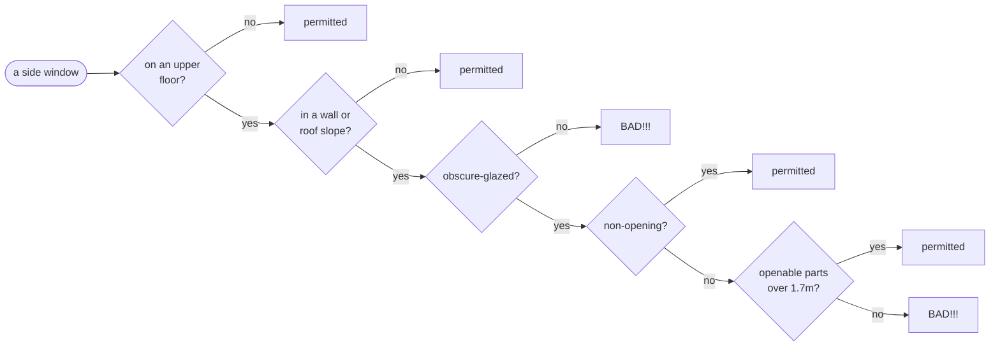
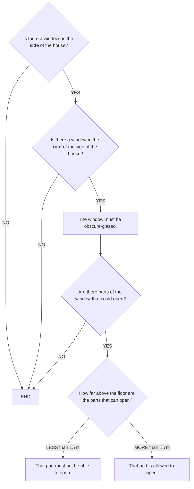
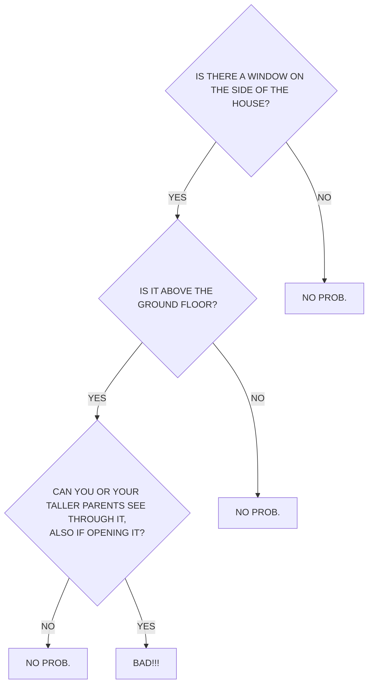

# Flowcharts, Decision Tables, and Real Logic

Why L4 is a _language_ — a specification language for **decision logic, data
modelling, and state transitions** — rather than a flowchart or decision-table
builder. And why the flowchart, the instinctive first choice, is usually the
_wrong picture_.

---

## Overview

In July 2021 [Open Systems Lab](https://twitter.com/opensystemslab/status/1410976074822004736),
a digital-planning team, posed a now-famous challenge:

> "Can you write this piece of legislation as a flowchart, in a way that can be
> understood by a 9 year old? If so, we'd like to give you a job."

The legislation was a UK planning rule about windows (below). People answered
with flowcharts — a hand-drawn one on a torn sheet of paper, a tidy
boxes-and-arrows one. We will come back to both, because they are wrong, and
because they are wrong in the two directions the notation pushes. The instinct is
universal: _turn the law into a flowchart._

With due respect, a flowchart is the wrong picture here — and not because it is
too simple. It is wrong because it commits a **category error**: it draws a
_timeless logical condition_ as if it were a _sequential process_. The law in
question is not a series of steps. It is a **material conditional** whose two
sides are **Boolean formulas**. Drawing it as flow _adds_ something the law does
not say (an order of operations) and _hides_ something the law does say (its
AND/OR structure).

That observation generalises into the design of L4. There are (at least) three
distinct concerns in computational law — **decision logic**, **data**, and
**state transitions** — each with its own appropriate formalism. A flowchart
smears the first and third together and serves neither well. L4 keeps them
distinct, gives each the right _semantics_, and _derives_ the right _view_ for
each.

> **Thesis:** a diagram is a good _view_ of legal logic and a bad _substrate_ for
> it. Pick the substrate (a language) for its semantics; pick the picture for the
> concern. Never let the picture cap the semantics.

---

## The worked example

The rule is Class A, paragraph A.3 of the General Permitted Development Order
(England) 2015:

> Development is permitted by Class A subject to the following conditions —
> any upper-floor window located in a wall or roof slope forming a side elevation
> of the dwellinghouse must be (i) obscure-glazed, and (ii) non-opening — unless
> the parts of the window which can be opened are more than 1.7 metres above the
> floor of the room in which the window is installed.

Strip the prose and the logical skeleton is a **material conditional**, `P → Q`,
where both `P` and `Q` are Boolean combinations:

```
P  =  onUpperFloor  AND  ( inWall  OR  inRoofSlope[sideElevation] )

Q  =  obscureGlazed  AND  ( nonOpening  OR  openableParts ≥ 1.7m )

rule:  P → Q          -- "every covered window must satisfy Q"
```

There is **no process** in here. Nothing happens first, then next. The order in
which you test `onUpperFloor` versus `inWall` is irrelevant to the meaning. It is
a static predicate that is simply _true or false_ of a given window.

In L4 that structure is expressed directly — and, crucially, **factored** into
named parts that can be reused and read back against the statute. Note that each
disjunction is spread over its own lines: the indentation is doing the work the
parentheses do, so the shape of the source is the shape of the logic.

```l4
GIVEN w IS A Window
`window complies with A.3` MEANS
    -- a material conditional: the requirement bites only for the windows it covers
    IF   `A.3 covers` w
    THEN `A.3 requirement met by` w
    ELSE TRUE

GIVEN w IS A Window
`A.3 covers` w MEANS
        w's `on an upper floor`
    AND (   w's `in a wall`
         OR w's `in a roof slope forming a side elevation`)

GIVEN w IS A Window
`A.3 requirement met by` w MEANS
        w's `obscure-glazed`
    AND (   w's `non-opening`
         OR w's `openable parts at least 1.7m above the floor`)
```

---

## The category error: logic is not flow

A **flowchart is a control-flow notation**. Its defining feature is _sequence_:
START, ordered steps, branches, END. It is the right tool when the thing you are
describing genuinely _is_ a process — a recipe, an algorithm, a workflow.

A **regulatory condition is a predicate**. Its defining feature is
_truth-functional composition_: facts combined with AND, OR, NOT and evaluated
all at once, order-independent. The window rule is a material conditional over
two AND/OR trees.

Rendering a predicate as a flowchart therefore does two damaging things:

- **It says _more_ than the law.** A flowchart must pick an order —
  "first ask if there's a side window, then ask if it's above ground…" — but the
  law imposes no such order. The diagram invents sequence that isn't there.
- **It says _less_ than the law.** Once the tree is linearised you can no longer
  see, at a glance, which conditions are conjunctive and which are disjunctive,
  or what the antecedent and consequent even are. The logical shape — the thing a
  lawyer must actually verify — is gone, and shared sub-conditions get duplicated
  across branches.

Crucially, **neither failure is a mistake anyone made.** They survive a flowchart
drawn perfectly. Here is A.3 as a flowchart with no bugs in it at all:



This chart is _correct_. It is also **six terminal boxes for a rule with two
outcomes**: `permitted` four times, `BAD!!!` twice. That duplication is not
sloppiness and cannot be tidied away — a tree cannot share a subtree, so every
distinct path to a conclusion must redraw it. The reader is given no way to see
that all four `permitted` boxes are _the same permitted_.

And the staircase is not decoration. Ask why `obscure-glazed?` is tested before
`non-opening?` and there is no answer in the law — only in the drawing. Permute the
two and you get a differently-shaped picture of the identical rule. There is no
canonical flowchart for A.3, and nothing in any of them tells you which lines are
the statute and which are the draughtsman's convenience.

So the flowchart is not merely _childish_ (the challenge's own worry); it is
_category-wrong_. It is a picture of a process, drawn over something that is not a
process. **This is the whole argument, and it does not depend on anyone having
blundered.**

### What happens in practice

Having said that: the challenge got two serious public answers, and it is
instructive that **both of them are wrong** — each in the direction the notation
pushes. This proves nothing that the previous section has not already established.
It is worth a look anyway, because the errors are so exactly the ones the structure
predicts.

[alby (@Alby)](https://twitter.com/opensystemslab/status/1410976074822004736)
replied with a clean, professional, carefully glossed flowchart — plain-English
explanations of "side" and "obscure-glazed", a shared `END`, the lot — and,
reasonably enough, _"When do I start?"_ Redrawn, its skeleton is:



The statute covers a window in a wall **or** a roof slope. This chart asks "is
there a window on the side?" — yes — and then "is there a window in the **roof** of
the side?" — and on _no_, exits to `END`. An ordinary **wall** window on a side
elevation, squarely covered by A.3, therefore acquires **no obligation at all**.
The disjunction has become a conjunction.

That is precisely the pressure the notation exerts. A chain of yes/no gates is
natively an **AND**; to say **OR** you must draw two arrows converging on one box,
which is awkward, and which is why the OR quietly did not get drawn. The flowchart
makes conjunction cheap and disjunction expensive — and the law does not care which
is cheap.

[Riccardo Fabrizio (@ArchRicFabrizio)](https://twitter.com/opensystemslab/status/1410976074822004736)
answered on a torn sheet of paper — _"I'm not sure whether it would be suitable for
a 9y.o."_ — and failed in the complementary direction:



Here the entire consequent — `obscure-glazed AND (non-opening OR openable parts
above 1.7m)` — is **fused into one question**. Three atoms and two connectives
collapse into a single unanswerable compound, and the 1.7-metre threshold is
reconstituted as _your taller parents_. `NO PROB.` is written out three times, by
hand, because a tree cannot share a leaf even when you are the one holding the pen.

Neither author was careless. Both were doing exactly what the picture asked of
them.

_(Both diagrams above are our own redrawings, for the purpose of criticism; the
originals are in the [thread](https://twitter.com/opensystemslab/status/1410976074822004736)
and remain the work of their authors.)_

---

## The right pictures for logic

Because the law here is set-theoretic and truth-functional, the fitting diagrams
are the ones built for sets and Booleans:

- **Venn diagrams** — the predicate as overlapping regions of cases.
- **Boolean logic / ladder-logic circuit diagrams** — the AND/OR structure laid
  out as a circuit. (Ladder logic, standardised as IEC 61131-3, descends from
  relay circuit diagrams — a Boolean-logic notation, not a flow notation.)
- **The material conditional itself** — the `→` connective, with its familiar
  truth table, making the antecedent-implies-consequent shape explicit.

L4's **[ladder diagram](../../reference/README.md)** is exactly the mashup of the
first two: the Boolean AND/OR circuit structure, nested Venn-style, showing
`antecedent ⇒ consequent`. It **shares sub-terms** (a DAG, not a duplicating
tree), it stays **legible to a lawyer**, and its layout **carries no semantic
order** — the three things the flowchart cannot do at once. And because it is
_derived from the language_, it is a view, not the source.

That last claim needs care, because a careless version of it is false. The ladder
plainly _has_ an order: things are drawn left to right and top to bottom. Three
different things are being confused whenever anyone says a diagram "imposes an
order", and it is worth separating them:

- **The denotation has no order.** `AND` and `OR` commute. The rule is a Boolean
  function of the facts, and nothing in it says what is tested first.
- **The text has an order** — `(i) obscure-glazed, and (ii) non-opening` — chosen
  by the drafter, and the thing citations point at. **The ladder mirrors it, on
  purpose.** That is what makes the formalisation _isomorphic_: you can hold the
  diagram against the statute and check it line for line. Permuting it would
  change nothing about the meaning, and that is precisely the test — an order you
  may freely permute is an order that carries no weight.
- **Asking questions has an order**, and a good one saves the user work. That is a
  real problem, and L4 solves it explicitly — the question-ordering wizard picks
  the next question by information gain over a binary decision diagram, which may
  be nothing like the statute's order.

The flowchart collapses all three. Its order is not the denotation (there isn't
one), is not the text's (it re-sequences freely), and is not a principled
interrogation order (it is whatever the drawer happened to pick) — and it presents
that invented order _as though it were the law_. The ladder keeps the first two
aligned and hands the third to a wizard, where it can be optimised, inspected, and
argued about in the open.

Here is A.3, as a ladder — the same rule, the same three definitions, drawn from
the L4 above:

```
                            a window complies with A.3 if either
             ┌╌ NOT ╌╌╌╌╌╌╌╌╌╌╌╌╌╌╌╌╌╌╌╌╌╌╌╌╌╌╌╌╌╌╌╌╌╌╌╌╌╌╌╌╌╌╌╌╌╌╌╌╌╌╌╌╌╌╌╌╌╌┐
             ╎                                                                ╎
             ╎                                     forming a side elevation:  ╎
             ╎                                           ┌────────────┐       ╎
             ╎                                     ┌─────┤ in a wall  ├─────┐ ╎
             ╎ ┌────────────────────┐              │     └────────────┘     │ ╎
   ┌─────────┼─┤ on an upper floor  ├──── and  ────┤          or            ├─○──────────┐
   │         ╎ └────────────────────┘              │  ┌──────────────────┐  │ ╎          │
   │         ╎                                     └──┤ in a roof slope  ├──┘ ╎          │
   │         ╎                                        └──────────────────┘    ╎          │
   │         ╎                                                                ╎          │
●──┤         ╎                                                                ╎          ├──●
   │         └╌╌╌╌╌╌╌╌╌╌╌╌╌╌╌╌╌╌╌╌╌╌╌╌╌╌╌╌╌╌╌╌╌╌╌╌╌╌╌╌╌╌╌╌╌╌╌╌╌╌╌╌╌╌╌╌╌╌╌╌╌╌╌╌┘          │
   │                                         or                                          │
   │                                                        either                       │
   │                                                   ┌──────────────┐                  │
   │                                   ┌───────────────┤ non-opening  ├───────────────┐  │
   │  ┌─────────────────┐              │               └──────────────┘               │  │
   └──┤ obscure-glazed  ├──── and  ────┤                      or                      ├──┘
      └─────────────────┘              │  ┌────────────────────────────────────────┐  │
                                       └──┤ openable parts ≥ 1.7m above the floor  ├──┘
                                          └────────────────────────────────────────┘
```

Read it as a circuit: current enters at the left terminal and must find a path to
the right one. There are two such paths, stacked in parallel — the window escapes
A.3 by **not being covered** (the upper rung, through the `NOT`, whose bubble `○`
inverts what reaches it), or it satisfies the requirement (the lower rung).
Within each rung, elements in **series** are conjoined and elements **stacked in
parallel** are disjoined. That is the whole notation.

Now put it beside the flowchart above and count again. The flowchart needed six
terminal boxes to say a two-valued thing. The ladder has **two terminals** — the
`●` at each end — because "permitted" is not a place you arrive at, it is simply
whether current got through. Every atom appears exactly **once**. Nothing is
duplicated, because nothing needs to be: a circuit shares by construction.

And notice what the picture does _not_ say. It does not say which contact you test
first, because a circuit has no first. The left-to-right arrangement is the order
of the **words in the statute**, not an order of operations — which is exactly why
you can lay the diagram against the text and check it clause by clause. Permute
two contacts in series and the circuit is unchanged; permute two tests in the
flowchart and you must redraw it. That is the difference between a picture that
_records_ the drafter's order and one that _invents_ an evaluator's.

---

## But some law really _is_ process

Not everything in law is a static predicate. Obligations with deadlines,
sequencing between parties, events, penalties on breach, state that evolves over
the life of a contract — that genuinely _is_ process and state, and there
flow-like pictures are appropriate. The point is only to use the _principled_
ones, which carry real execution semantics:

- **BPMN** for business process; **DMN** for the decision points inside it.
- **State diagrams, Harel statecharts, Petri nets, finite automata** for state
  and concurrency.

This is the same distinction from the other side: **decision logic and process
are different semantic categories.** DMN itself splits them — decision tables and
trees for the logic, BPMN for the flow. The flowchart is precisely the tool that
_refuses_ to make the split, which is why it is the wrong tool for both.

L4 is deliberately a specification language for **all three** concerns, with the
right semantics for each:

- **decision logic** → Boolean/functional definitions (`GIVEN … MEANS`, `IF/THEN`)
- **data modelling** → types and records (`DECLARE … HAS`)
- **state transitions** → regulative rules, which are a statechart in disguise:

```l4
PARTY   insurer
MUST    `pay the claim`
WITHIN  30 days
HENCE   FULFILLED
LEST    PARTY insurer
        MUST `pay interest on the overdue amount`
```

A `PARTY / MUST / WITHIN / HENCE / LEST` block _is_ a labelled transition system
— states, events, deadlines, and reparations — the thing a flowchart only
pretends to be. See [Regulative Rules](../legal-modeling/regulative-rules.md).

---

## Decision tables: better than flowcharts, still not the substrate

Decision tables (as standardised in DMN) are a real improvement over flowcharts
for classification. They are **order-independent** — a table is a truth table
with actions — so they avoid the flowchart's invented-sequence sin, and they make
a fine _view_ and a fine _input_ for simple, flat, finite decisions.

But a table is still a **flat classifier**, and the walls arrive quickly:

- **No computation.** A table yields a chosen row, not a _number_. Fee schedules,
  benefit amounts, and payout formulas are arithmetic over the facts. (This is
  why DMN bolts the **FEEL** expression language under its cells — the moment the
  logic gets real, you need a language. That bolt-on is the tell.)
- **No composition or sharing.** `n` independent conditions is `2ⁿ` rows; tables
  do not nest or factor, so shared sub-conditions are re-entered by hand.
- **No obligations over time.** A table cannot express "must, within 30 days,
  else…". That is state, not classification.
- **Not solver-checkable across rules.** You cannot easily ask a pile of tables
  "are these two contradictory?".

So tables and trees are welcome as _views and inputs_. They are the wrong
_substrate_.

---

## Why this matters: the inversion

The recurring mistake in "rules as code" is to make the **diagram the source of
truth**. Do that and you inherit both a ceiling (whatever the notation can
express) and a category error (flowchart = process; table = flat
classification). Everything the notation cannot say — computation, deontic
lifecycles, reuse, verification — gets bolted on or dropped.

L4 inverts it. The **language is the source**, and each concern gets the _right
derived picture_:

| Concern           | Wrong single tool           | Principled formalism                                | L4 construct                          | Derived view          |
| ----------------- | --------------------------- | --------------------------------------------------- | ------------------------------------- | --------------------- |
| Decision logic    | flowchart linearises AND/OR | Venn · Boolean circuit · material cond. · DMN table | `GIVEN … MEANS`, `IF/THEN`, functions | **ladder diagram**    |
| Data modelling    | (flowchart can't)           | schema / type systems                               | `DECLARE … HAS`, algebraic types      | type / schema view    |
| State transitions | flowchart _fakes_ it        | BPMN · Harel statechart · Petri net · DFA           | `PARTY/MUST/WITHIN/HENCE/LEST`        | statechart / timeline |

This is the desktop-publishing lesson. Adobe shipped **PostScript — a language**
— and let the drawing be the _output_; it did not ship a drawing tool and hope it
would grow into a language. Growing a principled language _up_ from an ad-hoc
visual substrate is far harder than deriving the visuals _down_ from a language
designed to be one.

**The one-line version:** a flowchart draws logic as if it were flow; L4 keeps
logic, data, and process as distinct semantic categories — and derives the right
picture for each.

---

## Further Reading

- [Design Principles](principles.md) — the five principles this decision serves
- [Linguistic Syntax](linguistic-syntax.md) — why the language reads like legal English
- [Regulative Rules](../legal-modeling/regulative-rules.md) — the state-transition semantics a flowchart only imitates
- [Reference: Regulative](../../reference/regulative/README.md) — obligations, deadlines, reparations in L4
