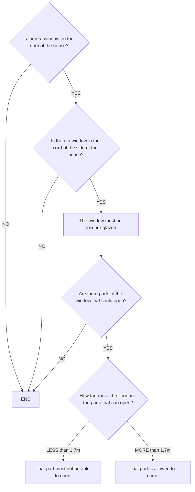
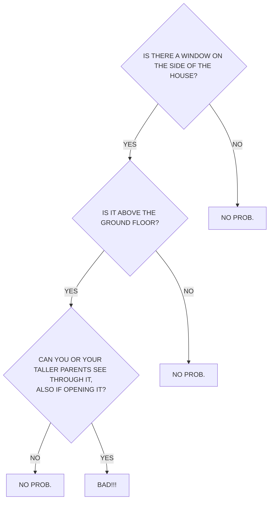
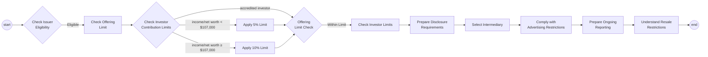

# Flowcharts, Decision Tables, and Real Logic

Why L4 is a _language_ — a specification language for **decision logic, data
modelling, and state transitions** — rather than a flowchart or decision-table
builder. And why the flowchart, the instinctive first choice, is usually the
_wrong picture_.

---

## Overview

In July 2021 [Open Systems Lab](https://twitter.com/opensystemslab/status/1410976074822004736),
a digital-planning team, posed a now-famous challenge:

> "Can you write this piece of legislation as a flowchart, in a way that can be
> understood by a 9 year old? If so, we'd like to give you a job."

The legislation was a UK planning rule about windows (below). People answered
with flowcharts — a hand-drawn one on a torn sheet of paper, a tidy
boxes-and-arrows one. We will come back to both, because they are wrong, and
because they are wrong in the two directions the notation pushes. The instinct is
universal: _turn the law into a flowchart._

With due respect, a flowchart is the wrong picture here — and not because it is
too simple. It is wrong because it commits a **category error**: it draws a
_timeless logical condition_ as if it were a _sequential process_. The law in
question is not a series of steps. It is a **material conditional** whose two
sides are **Boolean formulas**. Drawing it as flow _adds_ something the law does
not say (an order of operations) and _hides_ something the law does say (its
AND/OR structure).

That observation generalises into the design of L4. There are (at least) three
distinct concerns in computational law — **decision logic**, **data**, and
**state transitions** — each with its own appropriate formalism. A flowchart
smears the first and third together and serves neither well. L4 keeps them
distinct, gives each the right _semantics_, and _derives_ the right _view_ for
each.

> **Thesis:** a diagram is a good _view_ of legal logic and a bad _substrate_ for
> it. Pick the substrate (a language) for its semantics; pick the picture for the
> concern. Never let the picture cap the semantics.

---

## The worked example

The rule is Class A, paragraph A.3 of the General Permitted Development Order
(England) 2015:

> Development is permitted by Class A subject to the following conditions —
> any upper-floor window located in a wall or roof slope forming a side elevation
> of the dwellinghouse must be (i) obscure-glazed, and (ii) non-opening — unless
> the parts of the window which can be opened are more than 1.7 metres above the
> floor of the room in which the window is installed.

Strip the prose and the logical skeleton is a **material conditional**, `P → Q`,
where both `P` and `Q` are Boolean combinations:

```
P  =  onUpperFloor  AND  ( inWall  OR  inRoofSlope[sideElevation] )

Q  =  obscureGlazed  AND  ( nonOpening  OR  openableParts ≥ 1.7m )

rule:  P → Q          -- "every covered window must satisfy Q"
```

There is **no process** in here. Nothing happens first, then next. The order in
which you test `onUpperFloor` versus `inWall` is irrelevant to the meaning. It is
a static predicate that is simply _true or false_ of a given window.

In L4 that structure is expressed directly — and, crucially, **factored** into
named parts that can be reused and read back against the statute. Note that each
disjunction is spread over its own lines: the indentation is doing the work the
parentheses do, so the shape of the source is the shape of the logic.

```l4
GIVEN w IS A Window
`window complies with A.3` MEANS
    `A.3 covers` w  IMPLIES  `A.3 requirement met by` w

GIVEN w IS A Window
`A.3 covers` w MEANS
        w's `on an upper floor`
    AND (   w's `in a wall`
         OR w's `in a roof slope forming a side elevation`)

GIVEN w IS A Window
`A.3 requirement met by` w MEANS
        w's `obscure-glazed`
    AND (   w's `non-opening`
         OR w's `openable parts at least 1.7m above the floor`)
```

The top-level rule is one line, and it is _the material conditional itself_:
`IMPLIES` is a first-class L4 operator (symbolic alias `=>`), with the classical
truth table — `P IMPLIES Q` is TRUE unless `P` is TRUE and `Q` is FALSE. It binds
_loosest_ of all the operators, so the antecedent and consequent may be written as
bare AND/OR formulas without parenthesising them:

```l4
-- parses as  (a AND b) IMPLIES (c OR d)
a AND b IMPLIES c OR d
```

That is not a cosmetic convenience. The whole argument of this page is that the
statute's shape is `P → Q` over two Boolean trees — so the language had better be
able to _say_ `→`, rather than make you re-encode it as a branch. See
[IMPLIES](../../reference/operators/IMPLIES.md).

It also gets the boundary of the rule right for free. A ground-floor window makes
the antecedent false, so the conditional is **vacuously true** — the window
_complies_, not because it is obscure-glazed (it isn't) but because A.3 never
reached it:

```l4
#EVAL `window complies with A.3` `ground floor window`     -- TRUE: A.3 does not bite
#EVAL `window complies with A.3` `bare side window`        -- FALSE: covered, and in breach
#EVAL `window complies with A.3` `compliant side window`   -- TRUE: covered, and compliant
```

"Out of scope" and "in scope and satisfied" are _both_ compliance, and the
material conditional distinguishes them from breach without any extra machinery.
A flowchart has to represent that distinction as a dangling arrow to some
unlabelled exit — and it is precisely at such exits that real-world rules-as-code
projects lose track of whether "not covered" was supposed to mean pass, fail, or
undefined.

The full runnable encoding is in
[logic-not-flowcharts-example.l4](logic-not-flowcharts-example.l4).

---

## The category error: logic is not flow

A **flowchart is a control-flow notation**. Its defining feature is _sequence_:
START, ordered steps, branches, END. It is the right tool when the thing you are
describing genuinely _is_ a process — a recipe, an algorithm, a workflow.

A **regulatory condition is a predicate**. Its defining feature is
_truth-functional composition_: facts combined with AND, OR, NOT and evaluated
all at once, order-independent. The window rule is a material conditional over
two AND/OR trees.

Rendering a predicate as a flowchart therefore does two damaging things:

- **It says _more_ than the law.** A flowchart must pick an order —
  "first ask if there's a side window, then ask if it's above ground…" — but the
  law imposes no such order. The diagram invents sequence that isn't there.
- **It says _less_ than the law.** Once the tree is linearised you can no longer
  see, at a glance, which conditions are conjunctive and which are disjunctive,
  or what the antecedent and consequent even are. The logical shape — the thing a
  lawyer must actually verify — is gone, and shared sub-conditions get duplicated
  across branches.

Both claims are easy to make and easy to wave away. So look at what happened when
people actually tried.

### What people drew

The challenge got two serious public answers, and **both of them are wrong** — each
in one of the two directions just named.

[alby (@Alby)](https://twitter.com/opensystemslab/status/1410976074822004736)
replied with a clean, professional, carefully glossed flowchart — plain-English
explanations of "side" and "obscure-glazed", a shared `END`, the lot — and,
reasonably enough, _"When do I start?"_ Redrawn, its skeleton is:



The statute covers a window in a wall **or** a roof slope. This chart asks "is
there a window on the side?" — yes — and then "is there a window in the **roof** of
the side?" — and on _no_, exits to `END`. An ordinary **wall** window on a side
elevation, squarely covered by A.3, therefore acquires **no obligation at all**.
The disjunction has become a conjunction.

Note _which way_ it slipped. A chain of yes/no gates is natively an **AND**; to say
**OR** you must draw two arrows converging on one box, which is awkward. The
flowchart makes conjunction cheap and disjunction expensive — and the law does not
care which is cheap.

[Riccardo Fabrizio (@ArchRicFabrizio)](https://twitter.com/opensystemslab/status/1410976074822004736)
answered on a torn sheet of paper — _"I'm not sure whether it would be suitable for
a 9y.o."_ — and failed in the complementary direction:



Here the entire consequent — `obscure-glazed AND (non-opening OR openable parts
above 1.7m)` — is **fused into one question**. Three atoms and two connectives
collapse into a single unanswerable compound, and the 1.7-metre threshold is
reconstituted as _your taller parents_. `NO PROB.` is written out three times, by
hand, because a tree cannot share a leaf even when you are the one holding the pen.

_(Both diagrams above are our own redrawings, for the purpose of criticism; the
originals are in the [thread](https://twitter.com/opensystemslab/status/1410976074822004736)
and remain the work of their authors.)_

### "They were careless. Draw it properly."

That is the natural reply, and it is the one that has to be answered, because if it
is right then nothing here is a problem with flowcharts — it is a problem with two
people on the internet, and the fix is a more careful draughtsman.

So let us grant it in full. Here is A.3 as a flowchart with **no bugs in it at all**:


This one gets the OR right. It fuses nothing. Given any window, it returns the
answer A.3 returns. **It is correct** — and both failures are still there.

It **says less than the law**: six terminal boxes for a rule with two outcomes,
`permitted` four times and `BAD!!!` twice. That duplication is not sloppiness and
cannot be tidied away — a tree cannot share a subtree, so every distinct path to a
conclusion must redraw it. Nothing in the picture tells you that all four
`permitted` boxes are _the same permitted_. Fabrizio wrote `NO PROB.` three times by
hand for exactly this reason; the perfect chart does the same thing four times, and
merely looks tidier about it.

And it **says more than the law**: the staircase is not decoration. Ask why
`obscure-glazed?` is tested before `non-opening?` and there is no answer in the
statute — only in the drawing. Permute the two and you get a differently-shaped
picture of the identical rule. There is no canonical flowchart for A.3, and none of
them tells you which of its lines are the law and which are the draughtsman's
convenience.

So the objection fails. **Neither author was careless.** They were each doing
precisely what the picture asked of them, and the picture asks the same of everyone
— which is why a flowchart drawn with no mistakes in it still misrepresents the
rule. The flowchart is not merely _childish_ (the challenge's own worry); it is
_category-wrong_. It is a picture of a process, drawn over something that is not a
process.

That is the argument, and note what it does **not** rest on: it does not rest on
anyone having blundered. The blunders are how you _notice_ the problem. The correct
chart is how you know the problem is not the people.

### The flowchart vendors agree

This is not special pleading from the language camp. It is conceded, unprompted, by
the people who sell the industrial-grade flowchart. Camunda's business is BPMN. On
their own DMN page they take a decision — which dish to cook, given the season and
the number of guests — model it as a process diagram of gateways and branches, look
at what they have drawn, and write:

> **"The sorrow is obvious: It's way more verbose to express rules in BPMN,
> especially when there are several conditions to consider."**
>
> — Camunda, [DMN](https://camunda.com/dmn/)

_The sorrow is obvious_ deserves to be a term of art, and we adopt it here.

Note exactly how far the confession goes, though, because it stops short. Camunda
diagnose **verbosity**: the diagram "becomes complex and hard to maintain." That is
a _symptom_, and a symptom invites the reply _then draw a smaller one_. But the
chart above is already as small as A.3 gets. It is, as we said, entirely **correct**
— and it is still the wrong **picture**, because it still invents an evaluation
order the statute does not have and still hides the AND/OR shape it does.

Those are two different axes, and conflating them is the whole trouble. A diagram
can compute the rule perfectly and still misrepresent it. Verbosity is what you
notice first; **unfaithfulness is what bites you in court.**

Camunda's prescription, having noticed the sorrow, is the decision table. That is
the right move, and a better one than this document used to allow — see
[Decision tables](#decision-tables-the-strongest-rival-and-where-it-actually-runs-out),
below, where we correct ourselves.

---

## The same instinct, industrialised: Lexipedia and Reg CF (2026)

The window challenge was July 2021: two people, a torn sheet of paper and a tidy
boxes-and-arrows chart. The natural rejoinder — _those were amateurs; a real
practitioner with a real tool would not slip_ — deserves a real answer, and one
turned up on its own.

[**Lexipedia**](https://www.lexipedia.xyz) is an open-source project that models
"legal processes" as shareable, forkable **BPMN and DMN**. It is careful,
technically fluent, and exactly the sort of open civic-tech effort this field wants
more of. Its page for
[**Regulation Crowdfunding exemptions**](https://www.lexipedia.xyz/doku.php?id=reg_cf_exemptions)
renders the SEC's Reg CF rules — who may raise, how much, from whom, and what they
must then do — as a single BPMN process diagram. It is _drawn properly_, in the
_industrial_ notation, by people who plainly know it. And every failure this page
has been describing is sitting inside it.

Here is its skeleton, redrawn:



_(Our redrawing, for the purpose of criticism; the original BPMN is at
[lexipedia.xyz](https://www.lexipedia.xyz/doku.php?id=reg_cf_exemptions) and remains
the work of that project. The nodes and labels are theirs; only the tidying is ours.)_

Read it against the four things this page has said a flowchart does to a rule.

**It invents a sequence the law does not have.** Issuer eligibility, the offering
cap and the investor-contribution limit are three _conditions_ that must all hold;
Reg CF nowhere says to test them in an order. The diagram nonetheless marches
`eligibility → offering limit → investor limit`, left to right, as though each gated
the next. Permute the three and the statute is unchanged while the picture must be
redrawn — the tell, every time, of an order that lives in the drawing and not in the
law. _It says more than the law._

**Its gateways have a true branch and no false one.** `Check Issuer Eligibility`
emits a single arrow, `Eligible`; there is none for _not_ eligible.
`Offering Limit Check` emits `Within Limit` and nothing for _over_ it. The
non-qualifying issuer and the over-cap raise simply fall off the diagram into the
unlabelled exit this page warned about — the exact place a rules-as-code project
loses track of whether "no" meant _fail_, _stop_, or _undefined_. A material
conditional makes "does Reg CF even bite this offering?" a first-class question with
a first-class answer; here it is a missing edge.

**It draws a computation as a fork.** The investor limit is not a classification, it
is a _piecewise formula_ — broadly, a percentage of income or net worth, over a
floor, with a threshold that switches the percentage and (since the 2021 amendments)
no cap at all for accredited investors. The diagram reconstitutes that arithmetic as
three control-flow branches into tasks named `Apply 5% Limit` and `Apply 10% Limit`.
This is the "computation as branches" failure the [decision-table
section](#decision-tables-the-strongest-rival-and-where-it-actually-runs-out) returns
to: the honest home for `greater(floor, rate × base)` is a _cell_ or a _function_, not
a gateway. (Note too the `$107,000` painted into the branch labels — a hard-coded
dollar figure of the kind that silently drifts. Reg CF's thresholds have already moved
since that number was current; the diagram has not.)

**It fuses two kinds of law into one line, and serves neither.** Look where the flow
goes _after_ the limits: `Prepare Disclosure Requirements → Select Intermediary →
Comply with Advertising Restrictions → Prepare Ongoing Reporting → Understand Resale
Restrictions`. That tail is not decision logic at all — it is _obligation and
process_: some one-time, some continuing, some standing constraints on conduct with
no natural position in a queue. "Understand resale restrictions" is not step twelve
because "prepare ongoing reporting" was step eleven; they are sequenced only because
a line has to run from somewhere to somewhere. So the front half is a **predicate
mis-drawn as flow** and the back half is **genuine process flattened into a
checklist**, and the one undifferentiated diagram is right about neither. This is
precisely the split the section below on process insists on — decision logic and
process are different semantic categories — and the reason a single picture cannot
carry both.

None of this is a knock on the people. It is, once again, the notation asking the
same thing of everyone: pick an order, gate each step on the last, and terminate
every path by hand. Lexipedia did it fluently, in the standard-issue tool, and the
category error survived the competence — which is the whole argument of this page,
now with a 2026 dateline instead of a 2021 one.

And notice the one move Lexipedia gets exactly right, because it is the move worth
keeping. Their processes are **open, shareable, forkable, versioned** — law you can
send someone a pull request against. That instinct is correct, and this document
should say so plainly. What is misplaced is only the _substrate_: fork a BPMN and you
fork its ceiling with it — the invented order, the missing exits, the arithmetic you
cannot write — because the diagram _is_ the source. The answer is not to draw a better
diagram but to move the source: keep the rule in a language and let the BPMN, the DMN
table and the ladder each be a _derived view_ that cannot drift from it or from one
another. That is the [inversion](#why-this-matters-the-inversion) this page closes on
— and Reg CF is a good place to watch it bite, because a faithful account of it needs
a predicate, a function _and_ a process, and no one picture is all three.

---

## The right pictures for logic

Because the law here is set-theoretic and truth-functional, the fitting diagrams
are the ones built for sets and Booleans:

- **Venn diagrams** — the predicate as overlapping regions of cases.
- **Boolean logic / ladder-logic circuit diagrams** — the AND/OR structure laid
  out as a circuit. (Ladder logic, standardised as IEC 61131-3, descends from
  relay circuit diagrams — a Boolean-logic notation, not a flow notation.)
- **The material conditional itself** — the `→` connective, with its familiar
  truth table, making the antecedent-implies-consequent shape explicit. (L4
  spells it `IMPLIES`.)

L4's **[ladder diagram](../../reference/README.md)** is a mashup of the first two:
the Boolean AND/OR circuit structure, nested Venn-style. It **shares sub-terms** (a
DAG, not a duplicating tree), it stays **legible to a lawyer**, and its layout
**carries no semantic order** — the three things the flowchart cannot do at once.
And because it is _derived from the language_, it is a view, not the source.

Note the direction of travel, though, because we got this wrong once and the way we
got it wrong is instructive.

The ladder renders AND/OR trees natively. Implication it did not: for a long time the
`P IMPLIES Q` at the top of the rule was drawn as its classical equivalent, `NOT P OR
Q` — two parallel rungs, one of them negated. Truth-functionally that is beyond
reproach. As a picture it is a small disaster, and for a reason worth naming: it draws
the **vacuous case as a rung**. A ground-floor window satisfies `NOT P` and the current
sails through the top branch, so the diagram reports, in the same ink it uses for a
properly obscure-glazed window, that the rule is satisfied. Both are `TRUE`. Only one
of them _complies_. The other was never asked.

Anyone filling in a form would write **N/A** and move on. Our picture instead offered
"the rule never reached you" as a co-equal way of complying, sitting right beside
actually meeting the requirement. That is a category error, and it is precisely the
error this page convicts flowcharts of — a picture that _says more than its source_.

So implication is now a real node, and it is drawn as one: **one path, two sinks**. You
will see it below. The fix is worth dwelling on because of _where_ it was available.
The semantics were never wrong; `IMPLIES` had been a first-class operator in the
language all along. It was the **view** that was impoverished, and a view can be taught
to catch up in an afternoon. **Had the diagram been the substrate, the missing
connective would have been a missing _feature_, and the law would have had to be bent
around it** — drafters would have written `NOT P OR Q` because that is what the tool
could draw, and the vacuity would have been baked into the statute instead of into a
renderer.

That last claim needs care, because a careless version of it is false. The ladder
plainly _has_ an order: things are drawn left to right and top to bottom. Three
different things are being confused whenever anyone says a diagram "imposes an
order", and it is worth separating them:

- **The denotation has no order.** `AND` and `OR` commute. The rule is a Boolean
  function of the facts, and nothing in it says what is tested first.
- **The text has an order** — `(i) obscure-glazed, and (ii) non-opening` — chosen
  by the drafter, and the thing citations point at. **The ladder mirrors it, on
  purpose.** That is what makes the formalisation _isomorphic_, in the sense
  Bench-Capon & Coenen gave that word: you can hold the diagram against the statute
  and check it line for line. Permuting it would change nothing about the meaning,
  and that is precisely the test — an order you may freely permute is an order that
  carries no weight.
- **Asking questions has an order**, and a good one saves the user work. That is a
  real problem, and L4 solves it explicitly — the question-ordering wizard picks the
  next question by information gain over a binary decision diagram, which may be
  nothing like the statute's order.

The flowchart collapses all three. Its order is not the denotation (there isn't
one), is not the text's (it re-sequences freely), and is not a principled
interrogation order (it is whatever the drawer happened to pick) — and it presents
that invented order _as though it were the law_. The ladder keeps the first two
aligned and hands the third to a wizard, where it can be optimised, inspected, and
argued about in the open.

Bryant, who gave us the ordered binary decision diagram, put the underlying fact
plainly: the variable ordering you pick changes the diagram's _size_ enormously, but
has **"no effect on the correctness of the results."** Order is a property of the
evaluation, not of the function. A flowchart is a notation that cannot tell those
two apart.

And the third of these orders — asking good questions in a good sequence — is not
new, and we should say so cheerfully. **Shwayder (1974)** was already ordering
decision-table tests by information theory, in _CACM_; **Montalbano (1962)**, above,
had the same intuition twelve years before that. In our own field, **Aucher, Berbinau
& Morin (2019)**, working with the French _Cour de cassation_, compile legal rules to
a BDD **whose nodes are the questions put to the judge** — and add a second BDD to
reconcile substantive reasoning with the procedural order of the trial. What none of
them do is _optimise_ the order, which is the narrow seam L4's wizard works in. The
ingredients are old. Good.

_(Bench-Capon & Coenen, "Isomorphism and legal knowledge based systems", Artificial
Intelligence and Law 1(1), 1992; Bryant, "Graph-Based Algorithms for Boolean Function
Manipulation", IEEE Trans. Computers C-35(8), 1986; Shwayder, CACM 17(9), 1974;
Aucher, Berbinau & Morin, Journal of Applied Logics 6(5), 2019. See
[QUESTION-ORDERING-SPEC](../../../specs/todo/QUESTION-ORDERING-SPEC.md) for the full
related work.)_

Here is A.3 as a ladder. Same rule, same three definitions, **generated from the L4
above** — and drawn by the same engine that drew the flowcharts, so that the only
thing that differs between the two pictures is the notation:

```mermaid
---
config:
  railroad:
    nonTerminalFill: "#ffffff"
    nonTerminalStroke: "#2f7a3f"
    nonTerminalTextColor: "#111111"
    terminalFill: "transparent"
    terminalStroke: "transparent"
    terminalTextColor: "#888888"
    lineColor: "#8a8a8a"
    markerFill: "#222222"
    strokeWidth: 1.5
    fontSize: 15
---
railroad-beta
window_complies_with_A_3 = sequence(nonterminal("A.3 covers this window"), terminal("IMPLIES"), nonterminal("A.3 requirement met"));
A_3_covers_this_window = sequence(nonterminal("on an upper floor"), terminal("and"), sequence(terminal("in a side elevation:"), choice(nonterminal("in a wall"), nonterminal("in a roof slope"))));
A_3_requirement_met = sequence(nonterminal("obscure-glazed"), terminal("and"), sequence(terminal("either"), choice(nonterminal("non-opening"), nonterminal("openable parts ≥ 1.7m up"))));
```

Read it as a circuit. Current enters at the left terminal `●`. Elements in **series**
are conjoined; elements **stacked in parallel** are disjoined. Boxed items are the
operative atoms — the facts you must establish about a window. The unboxed grey words
are the statute's own connective prose, carried along because it is what makes the
diagram read back against the text, and carrying no current of its own. That is the
whole notation.

`IMPLIES` is the **seam**, and it is a bottleneck rather than a fork: the current must
pass through the scope to reach the requirement at all. Which is what a rule _is_. The
first question a lawyer asks is "does this bite me?", and only then "so what must be
true?" — and a disjunction of escape routes answers neither.

Three rules, because the L4 had three definitions. The picture did not have to
invent a structure; it inherited one.

Now put it beside the flowchart above and count again. The flowchart needed **six**
terminal boxes — `permitted` four times, `BAD!!!` twice — to say a two-valued thing. It
needed six because a flowchart has to re-state the verdict at the end of every path it
invents. The ladder has exactly **two sinks**, because there are exactly two verdicts,
and each is drawn once. Every atom likewise appears exactly **once**. Nothing is
duplicated, because nothing needs to be: a circuit shares by construction.

And notice what the picture does _not_ say. It does not say which contact you test
first, because a circuit has no first. The left-to-right arrangement is the order of
the **words in the statute**, not an order of operations — which is exactly why you
can lay the diagram against the text and check it clause by clause. Permute two
contacts in series and the circuit is unchanged; permute two tests in the flowchart
and you must redraw it. That is the difference between a picture that _records_ the
drafter's order and one that _invents_ an evaluator's.

<details>
<summary>The same view, in a code fence</summary>

Because the picture is _derived_ and not drawn, it can be emitted into whatever
carrier is to hand. Here is the identical rule as a monospace ladder — which renders
verbatim in a terminal, a commit message, a PR comment, or a `git diff`, and which
shows the two sinks the railroad can only gesture at:

```
                                          in a side elevation:                                                           either
                                             ┌────────────┐                                                          ┌──────────────┐
                                       ┌─────┤ in a wall  ├─────┐                                          ┌─────────┤ non-opening  ├────────┐ ┌─( )  complies
   ┌────────────────────┐              │     └────────────┘     │         ┌─────────────────┐              │         └──────────────┘        │ │
●──┤ on an upper floor  ├──── and  ────┤           or           │ IMPLIES │ obscure-glazed  ├──── and  ────┤               or                ├─┿
   └────────────────────┘              │  ┌──────────────────┐  │         └─────────────────┘              │  ┌───────────────────────────┐  │ │
                                       └──┤ in a roof slope  ├──┘                                          └──┤ openable parts ≥ 1.7m up  ├──┘ └─( )  in breach
                                          └──────────────────┘                                                └───────────────────────────┘
```

The `┿` is a **changeover** — one pole, two throws. It is what lets the requirement be
drawn _once_ instead of twice (once plain for the green lamp and once negated for the
red one), and it is what makes the vacuous case cost no ink at all: if the scope does
not conduct, nothing reaches the seam, neither lamp lights, and the reader can see
exactly where it stopped. **N/A is a state, not a path.**

Load a valuation and the picture starts reporting. Here is a real window — upper floor,
in a wall, properly obscure-glazed, but its openable parts sit below 1.7m:

```
                                          in a side elevation:                                                           either
                                             ┏━━━━━━━━━━━━┓                                                          ┌──────────────┐
                                       ┏━━━━━┫in a wall ✓ ┣━━━━━┓                                          ┏━━━━━━━━━┫non-opening ✗ ├┈┈┈┈┈┈┈┈┐ ┌┈( )  complies
   ┏━━━━━━━━━━━━━━━━━━━━┓              ┃     ┗━━━━━━━━━━━━┛     ┃         ┏━━━━━━━━━━━━━━━━━┓              ┃         └──────────────┘        ┊ ┊
●━━┫on an upper floor ✓ ┣━━━━ and  ━━━━┫           or           ┃ IMPLIES ┃obscure-glazed ✓ ┣━━━━ and  ━━━━┫               or                ├┈┿
   ┗━━━━━━━━━━━━━━━━━━━━┛              ┃  ┌──────────────────┐  ┊         ┗━━━━━━━━━━━━━━━━━┛              ┃  ┌───────────────────────────┐  ┊ ┃
                                       ┗━━┫in a roof slope ✗ ├┈┈┘                                          ┗━━┫openable parts ≥ 1.7m up ✗ ├┈┈┘ ┗━(✗)  IN BREACH
                                          └──────────────────┘                                                └───────────────────────────┘
```

Follow the heavy line. It reaches the seam — so the rule _does_ bite this window — and
enters the requirement. Then it stops: neither disjunct conducts, so **no current
leaves the requirement**, and the changeover throws to `IN BREACH`. The diagram does not
merely report a verdict; it shows you the two contacts that produced it, and the one
place a redesign could fix it.

Two carriers, one source. **This is the thesis of the page, running.** Neither
picture is the truth; the L4 is. Both are emitted from it, so neither can drift, and
if the rule changes both change with it. Had either picture been the substrate, the
other would have been impossible.

</details>

---

## But some law really _is_ process

Not everything in law is a static predicate. Obligations with deadlines,
sequencing between parties, events, penalties on breach, state that evolves over
the life of a contract — that genuinely _is_ process and state, and there
flow-like pictures are appropriate. The point is only to use the _principled_
ones, which carry real execution semantics:

- **BPMN** for business process; **DMN** for the decision points inside it.
- **State diagrams, Harel statecharts, Petri nets, finite automata** for state
  and concurrency.

This is the same distinction from the other side: **decision logic and process
are different semantic categories.** DMN itself splits them — decision tables for
the logic, BPMN for the flow. The flowchart is precisely the tool that _refuses_
to make the split, which is why it is the wrong tool for both.

L4 is deliberately a specification language for **all three** concerns, with the
right semantics for each:

- **decision logic** → Boolean/functional definitions (`GIVEN … MEANS`, `AND`/`OR`/`IMPLIES`)
- **data modelling** → types and records (`DECLARE … HAS`)
- **state transitions** → regulative rules, which are a statechart in disguise:

```l4
PARTY   insurer
MUST    `pay the claim`
WITHIN  30 days
HENCE   FULFILLED
LEST    PARTY insurer
        MUST `pay interest on the overdue amount`
```

A `PARTY / MUST / WITHIN / HENCE / LEST` block _is_ a labelled transition system
— states, events, deadlines, and reparations — the thing a flowchart only
pretends to be. See [Regulative Rules](../legal-modeling/regulative-rules.md).

---

## Decision tables: the strongest rival, and where it actually runs out

Decision tables are the serious alternative, and this section used to dismiss them
with four criticisms, three of which were simply **false**. They are worth correcting
in public, partly because getting them wrong is embarrassing, and mostly because the
truth is far more interesting than the strawman — the decision-table tradition is
one of the great underappreciated bodies of work in our field, and it got there
first.

### Give them their due

**They compute.** A DMN rule's output entry is not a constant, it is a _FEEL
expression_ — the specification says so in one line: "a rule output entry is an
expression" (§8.2.9). So a fee schedule can compute `base + excess × rate` in the
cell, and the `Collect` hit policy will sum, min, max or count across every rule that
matched. The `C+`-aggregating fee table is precisely the thing this document used to
say tables could not do.

**They factor.** The old "`n` conditions means `2ⁿ` rows" is bad arithmetic: it
ignores the `-` (don't-care) cell. A DMN rule is a **cube**, not a minterm, so
`(A ∧ B) ∨ (C ∧ D)` costs two rules, not sixteen. And DMN is not "decision tables" —
above the tables sits the **Decision Requirements Graph**, in which a shared
sub-condition becomes its own decision node feeding many others, and a **Business
Knowledge Model** is a genuine parameterised function invoked by name. The spec's own
phrase for this is "the clear semantics of **functional composition**."

**And they are checkable — and have been for sixty years.** This is the part worth
getting excited about.

- **Montalbano (1962)**, in the very first volume of the _IBM Systems Journal_,
  already had completeness and consistency checking of decision tables — **fifty-three
  years before DMN existed.** The same paper shows that one table yields a
  storage-optimal flowchart and a _different_ time-optimal one, and offers an ordering
  heuristic: "ask those questions first which will make the two differentiated groups
  of rule identifiers as similar in size as possible." That is an information-gain
  criterion — **twenty-four years before ID3.**
- **Vanthienen et al. (1998)** shipped _inter-tabular_ verification in the PROLOGA
  tool: anomalies across chains of linked tables, circular dependencies, sub-tables
  that can never fire — with the dependency structure drawn as a directed graph. A
  Decision Requirements Graph in all but name, seventeen years early.
- **Calvanese, Dumas, Laurson, Maggi, Montali & Teinemaa (2016, 2018)** gave DMN its
  modern semantics: read each rule as a **hyper-rectangle** in the input space and
  sweep for gaps and overlaps geometrically. This is not a whiteboard result — it is
  the algorithm running inside Drools and Trisotech today.
- **Vandevelde, Callewaert & Vennekens (2022)** discharge whole-graph consistency to an
  SMT solver (IDP-Z3) and find rules that are dead **only in context** — unfireable not
  because of anything in their own table, but because of what the tables upstream can
  actually produce.

Anyone who tells you decision tables cannot be verified has not looked.

And they are **order-free in the case that matters**: under the default `Unique` hit
policy a table is a truth table with actions, so it commits none of the flowchart's
invented-sequence sin. DMN _does_ also offer the order-dependent `First` and
`Rule order` hit policies — and, pleasingly for this document's argument, warns you off
them in its own voice: with those, "the meaning depends on the order of the rules …
the table is hard to validate manually and therefore has to be used with care"
(§8.2.10). The standard has independently arrived at our thesis. Order-dependence is a
validation hazard, and a notation that forces it on you is doing you harm.

So the real objection is not that DMN is weak. It is narrower, and structural.

### Where it runs out

**What you can verify is not what you are told to write.** _Every one_ of those
results — Montalbano's, Calvanese's geometry, the SMT prototype — is defined over
**S-FEEL**, DMN's restricted sub-language, with **constant** outputs and **single-hit**
policies. That puts the tables that _compute_ — the fee schedules, the payout formulas,
the `Collect`-and-sum benefit tables — outside the analysable fragment _by
construction_. Drools skips gap analysis for `Collect`; Trisotech's own manual says
that "when generalized unary tests are used, it is no longer possible to use DT
Analysis."

And then read the DMN specification's §9.1, in its own voice:

> "**Experience with DMN since its release has shown that few if any complete decision
> models can be defined using S-FEEL** … Developers and users are therefore encouraged
> to use and implement the **full FEEL** specification rather than the S-FEEL subset."

The standard tells you to write in the fragment its own verification literature cannot
check. **You can verify the DMN you would not write, and you cannot verify the DMN you
would.** (The one published system that does handle generic FEEL gives up on static
analysis altogether and falls back to guided-random testing — which is what you would
expect.)

**And in practice it is not even shipped.** A survey of fourteen DMN tools found five
supporting any verification capability at all, and called the industry's coverage
"alarmingly low." What does ship is per-table: Drools' analyser walks the model and
examines each table _in isolation_. But the interesting contradiction in a body of law
is almost never inside one table — it is _between_ provisions.

**The logic is propositional, where law is quantified.** DMN's variables are, in the
words of the researchers who set out to extend it, "constants (i.e. 0-ary functions)."
No relations, no quantifiers, no sum types. You cannot say "_every_ upper-floor window
in the side elevation", nor "_one of_ the following grounds applies, and no other" —
and nothing tells you when a case has fallen between them.

**Obligation is out of scope, and the seam is not sealed.** A table classifies; it
cannot hold "must, within 30 days, else…" as a _state_. DMN never claimed it could —
that is BPMN's job. But the standard joins the two with an _association_, not a
semantics: an implementation "MAY" validate across the two models, and the link "does
not of itself permit the decisions modeled in DMN to be executed automatically by
processes modeled in BPMN." With no shared semantics across the seam, no property can
span a decision and the obligation it triggers — which is exactly the property a lawyer
cares about. As one DMN research group puts it: "the DMN notation has no notion of time
and thus temporal properties cannot be expressed in standard DMN."

### So

None of this makes tables bad. It makes them an excellent **view** — one L4 should
import and emit. It makes them a poor **substrate**: the moment the logic gets real you
are writing FEEL, and at that point you have a language — just not one with
quantifiers, recursion, sum types, obligations, or a checker that can read it.

_Sources: OMG DMN 1.3 (§8.2.9, §8.2.10, §9.1); Montalbano, "Tables, Flow Charts, and
Program Logic", IBM Systems Journal 1(1), 1962; Vanthienen, Mues, Wets & Delaere,
"A tool-supported approach to inter-tabular verification", Expert Systems with
Applications 15(3–4), 1998; Calvanese et al., "Semantics and Analysis of DMN Decision
Tables", BPM 2016, and the extended version in Information Systems, 2018; Vandevelde,
Callewaert & Vennekens, "Context-Aware Verification of DMN", HICSS-55, 2022; Grohé,
Corea & Delfmann, "DMN 1.0 Verification Capabilities: An Analysis of Current Tool
Support", 2021; Vandevelde et al., cDMN (RuleML+RR 2020 / TPLP 2021); Callewaert &
Vennekens, TPLP 2024._

---

## Why this matters: the inversion

The recurring mistake in "rules as code" is to make the **diagram the source of
truth**. Do that and you inherit both a ceiling (whatever the notation can
express) and a category error (flowchart = process; table = flat
classification). Everything the notation cannot say — computation, deontic
lifecycles, reuse, verification — gets bolted on or dropped.

L4 inverts it. The **language is the source**, and each concern gets the _right
derived picture_:

| Concern           | Wrong single tool           | Principled formalism                                | L4 construct                          | Derived view          |
| ----------------- | --------------------------- | --------------------------------------------------- | ------------------------------------- | --------------------- |
| Decision logic    | flowchart linearises AND/OR | Venn · Boolean circuit · material cond. · DMN table | `GIVEN … MEANS`, `AND`/`OR`/`IMPLIES` | **ladder diagram**    |
| Data modelling    | (flowchart can't)           | schema / type systems                               | `DECLARE … HAS`, algebraic types      | type / schema view    |
| State transitions | flowchart _fakes_ it        | BPMN · Harel statechart · Petri net · DFA           | `PARTY/MUST/WITHIN/HENCE/LEST`        | statechart / timeline |

This is the desktop-publishing lesson. Adobe shipped **PostScript — a language**
— and let the drawing be the _output_; it did not ship a drawing tool and hope it
would grow into a language. Growing a principled language _up_ from an ad-hoc
visual substrate is far harder than deriving the visuals _down_ from a language
designed to be one.

**The one-line version:** a flowchart draws logic as if it were flow; L4 keeps
logic, data, and process as distinct semantic categories — and derives the right
picture for each.

---

## Further Reading

- [**Related Work**](related-work.md) — the reading behind this document. Decision
  tables are older, stronger, and far more checkable than most of the rules-as-code
  world believes; the argument above earns its keep only against the strongest version
  of them, so the sources are set out to be checked.
- [Design Principles](principles.md) — the five principles this decision serves
- [Linguistic Syntax](linguistic-syntax.md) — why the language reads like legal English
- [Regulative Rules](../legal-modeling/regulative-rules.md) — the state-transition semantics a flowchart only imitates
- [Reference: Regulative](../../reference/regulative/README.md) — obligations, deadlines, reparations in L4
- [Camunda, _DMN_](https://camunda.com/dmn/) — the BPMN vendor's own account of why decision logic does not belong in a process diagram ("the sorrow is obvious")
