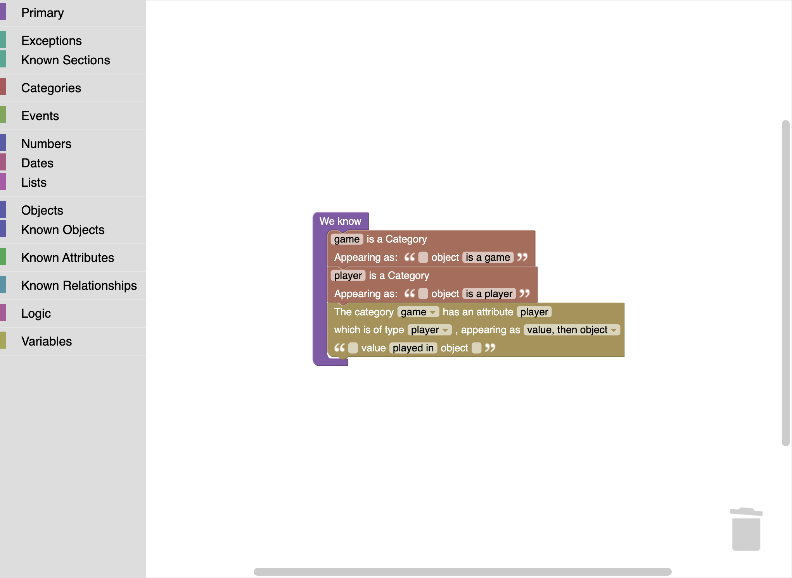
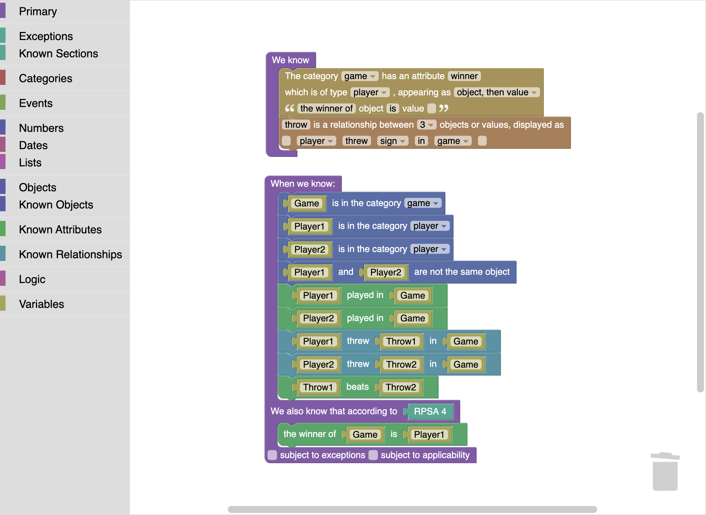
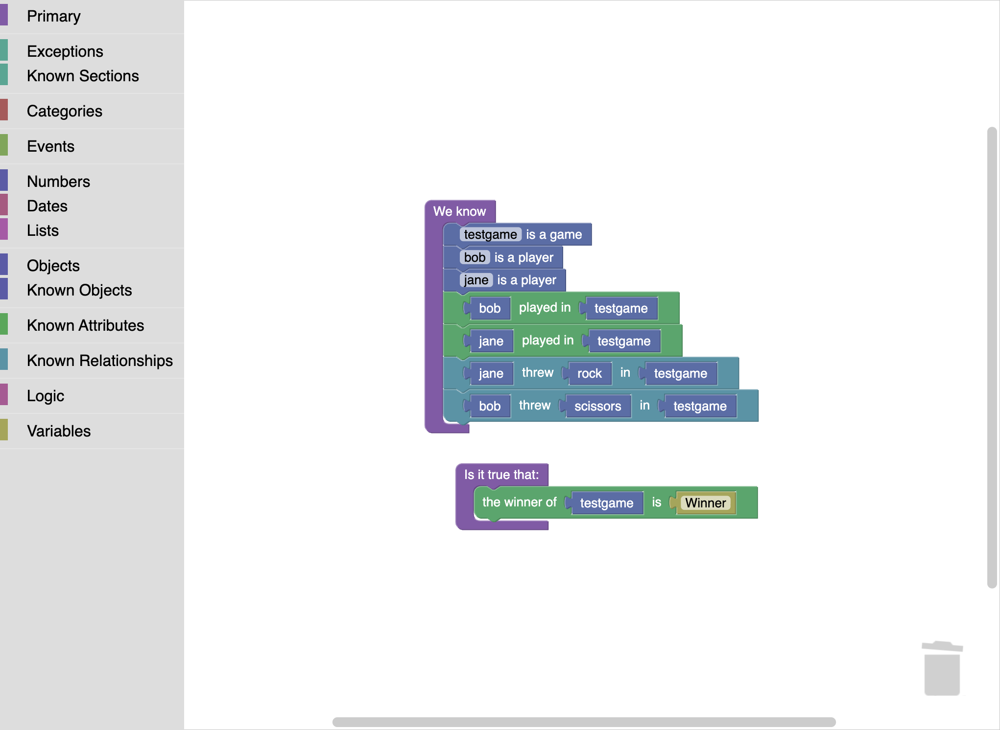
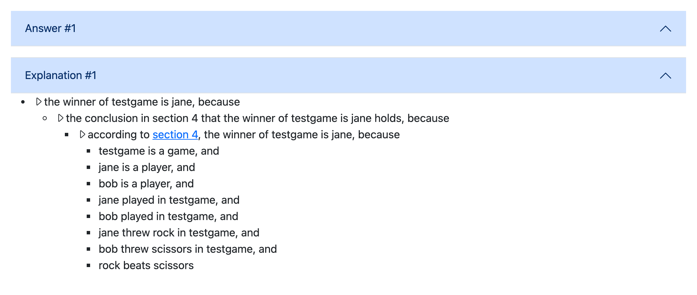
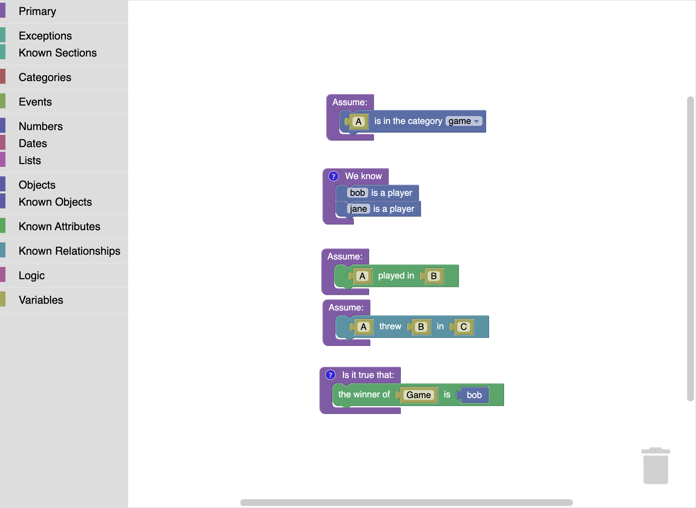
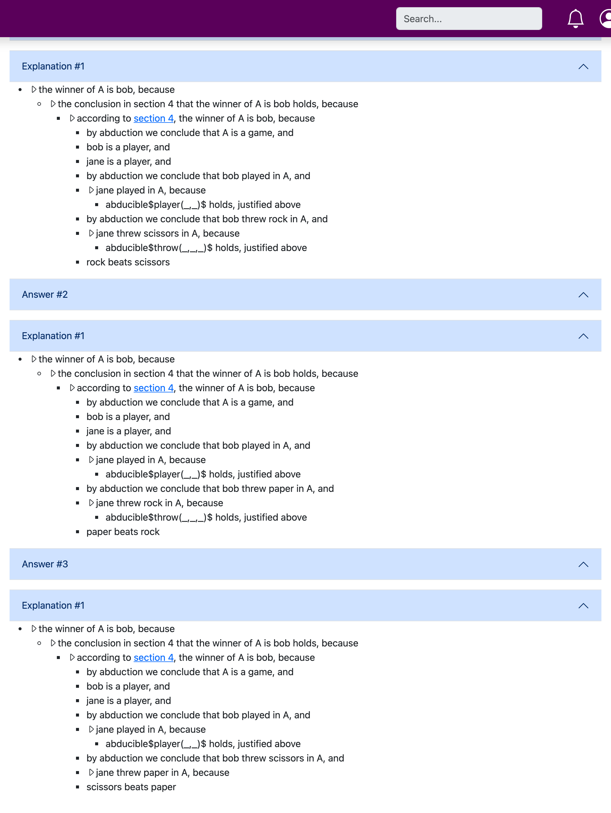

# Blawx and s(CASP): a Field Guide for L4 People

This page introduces [Blawx](https://www.blawx.com) — Jason Morris's
block-based Rules as Code tool — to a reader who already knows L4 and
computational law but has never opened Blawx. Along the way it teaches the
essentials of **s(CASP)**, the goal-directed answer set programming system
that Blawx compiles to, because s(CASP) is where Blawx's most distinctive
capabilities (justification trees, hypothetical reasoning, "why not?"
queries) actually come from.

L4 ships a two-way bridge to Blawx: `l4 blawx` compiles the decision-rule
subset of an L4 module into an importable Blawx project, and
`l4 blawx --import` lifts a Blawx project back into L4. This page is the
_explanation_ half of that story — what Blawx is and how its logic works.
The _how-to_ half, with the full export/import pipeline and a capstone
example, is the tutorial
[Exporting L4 to Blawx (and importing back)](../../tutorials/blawx/l4-to-blawx.md).

All screenshots below are real captures from a running Blawx v1.6-alpha
container, showing either Blawx's own shipped examples or the output of the
L4 transpiler. Nothing is mocked up.

## What Blawx is

Blawx is free, open-source (MIT) software by Jason Morris of Lexpedite Legal
Technology: a web application in which you encode legislation as **visual
blocks** — puzzle pieces in the [Blockly](https://developers.google.com/blockly)
style familiar from Scratch — and test the encoding against fact scenarios.
Its own documentation is candid that it is alpha software for
experimentation and teaching, not production.

Behind the blocks sits a serious logic stack. Each workspace of blocks
compiles (in the browser) to a program in **s(CASP)**, a goal-directed
constraint answer set programming system that runs on SWI-Prolog. The
server stores both the block layout and the generated code; queries run
against the generated code and come back with natural-language
justification trees.

Three design commitments will feel familiar to an L4 reader, because L4
makes the same ones:

1. **The legal text rides along.** A Blawx project starts from the text of
   the rule, parsed into an [Akoma Ntoso](https://www.oasis-open.org/committees/legaldocml/)
   document by Blawx's CLEAN parser (CLEAN is Blawx's plain-text convention
   for legislative structure — numbered sections, lettered paragraphs).
   Every section of the text gets its own
   code workspace, so the structure of the encoding matches the structure
   of the law — Blawx's version of the isomorphism L4 pursues with `§`
   headings and `@ref` annotations.
2. **Answers come with reasons.** Ask Blawx a question and it answers with
   an English explanation tree whose steps cite the sections of the source
   text they came from — the same explainability goal as L4's `#EVALTRACE`
   and reasoner API, reached through s(CASP)'s justification machinery.
3. **Tests are first-class.** A Blawx project carries named tests — fact
   scenarios plus questions — exactly where an L4 module carries `#EVAL`
   and `#ASSERT` directives.

The canonical Blawx example, from its Beginner's Guide, is an imaginary
statute called the **Rock Paper Scissors Act**:

```
Rock Paper Scissors Act

Players
1. A game of rock paper scissors has two players.
2. There are three signs:
  (a) Rock,
  (b) Paper, and
  (c) Scissors.

Defeating Relationships
3. The signs are related in the following ways:
  (a) Rock beats Scissors,
  (b) Scissors beats Paper, and
  (c) Paper beats Rock.

Winner
4. The winner of a game is the player who throws
a sign that beats the sign of the other player.
```

We will use it throughout, alongside its L4 equivalent in
[`rps.l4`](rps.l4).

## Reading Blawx code: categories, attributes, objects

Blawx's data model is a flat universe of named **objects**, sorted into
**categories**, connected by **attributes** (each hangs off exactly one
category-sorted subject and carries at most one value — so a boolean
attribute is a unary predicate, a valued one binary) and **relationships**
(three or more positions). Values can be objects, numbers, dates, durations
or lists, but there are no algebraic types, no records, and no user-defined
functions: everything is a predicate.
Declaring vocabulary and declaring its English rendering are the same act —
each category and attribute carries a template that tells Blawx how to
display it in blocks, in questions, and in explanations.

Here is the shipped RPS project's encoding of section 1 ("a game of rock
paper scissors has two players"), viewed in the code editor. One purple
`We know` fact block declares two categories and one attribute, with their
NLG templates:



The drawer list on the left is the toolbox: `Primary` holds fact, rule, and
question blocks; `Categories` the vocabulary machinery; `Known Sections`,
`Known Objects`, `Known Attributes` and `Known Relationships` fill up with
your own declarations as you save. Note the declaration reads "the category **game** has an attribute
**player** which is of type **player**, appearing as _value played in
object_" — vocabulary, typing, and English in one block.

Section 4, the heart of the Act, is one rule block:



An L4 reader can gloss this immediately: the `When we know:` limb is the
rule body, the `We also know that according to RPSA 4` limb is the head,
and the head is wrapped in an **according to** block naming the section —
that is where explanation citations come from. Two things deserve a closer
look:

- **Explicitness.** The legal text never says the two players played _in
  the game that was won_, or that the winner is not compared against their
  own throw. The encoding must say both (`Player1 played in Game`,
  `Player1 and Player2 are not the same object`). Blawx's guide makes the
  same point L4's documentation makes: formalization forces out what
  natural language leaves to inference.
- **The two checkboxes.** `subject to exceptions` and `subject to
applicability` at the bottom of the rule block are Blawx's defeasibility
  hooks. Both are off here, so section 4 is indefeasible. We return to them
  below, because they are the most legally interesting part of the system.

### The same Act in L4

[`rps.l4`](rps.l4) encodes the same statute in idiomatic L4 — and lands in
a different place, because the two languages sit on different substrates:

```l4
DECLARE Sign IS ONE OF
    rock
    paper
    scissors

DECLARE Player HAS
    name    IS A STRING
    threw   IS A Sign

DECLARE Game HAS
    player1 IS A Player
    player2 IS A Player

GIVEN a IS A Sign
      b IS A Sign
GIVETH A BOOLEAN
DECIDE a beats b IF
       ( a EQUALS rock     AND b EQUALS scissors )   -- 3(a)
    OR ( a EQUALS scissors AND b EQUALS paper )      -- 3(b)
    OR ( a EQUALS paper    AND b EQUALS rock )       -- 3(c)

GIVEN g IS A Game
GIVETH A MAYBE Player
`the winner of` g MEANS
    IF g's player1's threw beats g's player2's threw
    THEN JUST (g's player1)
    ELSE IF g's player2's threw beats g's player1's threw
         THEN JUST (g's player2)
         ELSE NOTHING
```

The contrast is the instructive part:

| the Act says            | Blawx models it as                                            | L4 models it as                                        |
| ----------------------- | ------------------------------------------------------------- | ------------------------------------------------------ |
| "there are three signs" | a category `sign` and three declared objects                  | `DECLARE Sign IS ONE OF …` — a closed enum             |
| "two players"           | a category `player`; games and players linked by an attribute | record fields `player1`, `player2` — arity in the type |
| "beats"                 | a sign-to-sign attribute, three asserted facts                | a two-place BOOLEAN function over `Sign`               |
| "the winner"            | a defeasible-capable rule concluding a `winner` attribute     | a total function returning `MAYBE Player`              |
| a drawn game            | the query has **no model**                                    | the value is **NOTHING**                               |

Neither column is "more correct" — they make different things easy. L4's
closed `Sign` type makes non-exhaustive matches a compile-time error and a
drawn game an ordinary value; nothing in the Blawx encoding stops you
asserting a fourth sign, and a draw is the _absence of an answer_. In the
other direction, Blawx's open, relational world is exactly what lets it
answer questions L4's evaluator does not ask, as the next section shows.
(This typed, functional spelling is also deliberately _outside_ the L4→Blawx
bridge's export fragment — `l4 blawx doc/concepts/neighbours/rps.l4` refuses
with `no @export-annotated DECIDE found to lower` rather than guessing. The
[tutorial](../../tutorials/blawx/l4-to-blawx.md) shows the input-record
idiom the bridge does export.)

## s(CASP) in five ideas

Blawx queries are answered by [s(CASP)](https://github.com/SWI-Prolog/sCASP)
(Arias, Carro, Salazar, Marple & Gupta, _Constraint Answer Set Programming
without Grounding_, TPLP 2018; the link is the SWI-Prolog port Blawx runs
on). If you know Prolog,
s(CASP) is best understood as Prolog's execution style applied to answer
set programming, with constraints. Five ideas carry the whole system.

**1. Goal-directed, without grounding.** Classical ASP solvers ground the
whole program (instantiate every variable over every constant) and then
search for stable models. s(CASP) instead starts from your query and works
top-down like Prolog, building only the fragment of a stable model needed
to support the answer. Two consequences matter for legal work: variables
can range over _unbounded_ domains (numbers, dates — no grounding
explosion), and the proof of the answer is constructed as a byproduct —
which is what becomes the justification tree.

**2. Two negations.** s(CASP) distinguishes:

- `not p` — **negation as failure** (NAF): _there is no evidence of p_.
  The default, closed-world reading.
- `-p` — **classical negation**: _there is evidence that p is false_.
  An explicit, first-class negative fact.

Law needs both, and the difference is load-bearing: "the register does not
show a conviction" (`not convicted(X)`) is not the same claim as "the
register shows an acquittal" (`-convicted(X)`). The L4→Blawx bridge leans
on exactly this distinction: a user _denying_ an input becomes a classical
`-p` fact, while a _computed_ predicate that simply fails to fire is `not p`
(spec R5). L4's own analogue of the closed-world default is documented in
the [`negation-as-failure` library](../../reference/libraries/negation-as-failure.md).

**3. Duals: "why not" is a real proof.** For every rule defining `p`,
s(CASP) mechanically derives rules for `not p` (its _dual_): `not p` holds
when every way of deriving `p` fails, and the dual records _which_ premise
failed. So a query about a negation is not an error or a shrug — it is a
theorem with its own justification tree. Blawx exposes this directly: ask
`not winner(testgame, bob)` and you get an English explanation of why bob
did not win — there is no way but section 4, and section 4 fails because
scissors does not beat rock. Anyone who has been asked "why did the system
refuse my application?" will recognise what this is worth.

**4. Global constraints.** A rule concluding falsity — written `:- body.`
in classical ASP, and `false :- body.` in the code Blawx emits — forbids any
model where `body` holds. This is the integrity-constraint idiom, and it is
what L4's `#ASSERT` directives compile to when exported (`ruling R11`): an
assertion is a constraint that the counterexample must not be a model.

**5. Abducibles: let the reasoner guess.** Declaring a predicate
`#abducible` licenses s(CASP) to _assume_ it (or its negation) if doing so
completes a model. This turns the reasoner around: instead of "given these
facts, what follows?", you can ask "what facts would make this conclusion
true?" — hypothetical reasoning, and the engine of Blawx's fact-gathering
interviews (each unknown input is abduced until the user pins it down).

### Watching the machinery work

The shipped RPS project carries a test named `bobjane`: a concrete fact
scenario (bob threw scissors, jane threw rock) and the question "who won?":



Running it produces one answer with one explanation — the justification
tree, rendered in English from the NLG templates, with the load-bearing
step hyperlinked to section 4 of the Act (hovering shows the statutory
text):



That tree is idea 1 made visible: the top-down proof, verbatim, in
English. L4's equivalent artifact is the evaluation trace behind `#EVAL`
(and, one level up, the reasoner API's audit trail); the difference in
flavour — proof tree versus evaluation trace — is exactly the difference
between resolution and reduction.

The `hypothetical` test shows idea 5. Its canvas asserts only that bob and
jane are players; that a game exists, that anyone played in it, and what
anyone threw are all wrapped in `Assume:` blocks — abducibles:



Asked "is bob the winner of some game?", s(CASP) answers _yes, three ways_
— one model per sign bob could have thrown, each with the assumed facts
spelled out in its explanation:



There is no direct L4 equivalent of this query mode: L4's evaluator
computes values from given inputs, and its decision-support tooling
(question ordering, the web wizard) reaches "what would it take?" by
analysis rather than by abduction. When the bridge exports an L4 module,
it emits one `interview` test per project with every input predicate
declared `#abducible` — so the L4-authored rules gain this query mode on
arrival in Blawx.

## Defeasibility: the according_to / holds / defeated triple

The most legally distinctive part of Blawx is its treatment of exceptions,
and it is worth understanding precisely, because it is a second
independently-designed implementation of the general-rule-plus-exception
pattern that L4 today spells `UNLESS` (see
[default reasoning and exceptions](../legal-modeling/default-reasoning.md))
and that a proposed richer L4 surface would spell `SUBJECT TO` /
`NOTWITHSTANDING` — proposed, not implemented; the design and the
cross-system comparison, with Catala's exception machinery as the first
prior implementation, live in
[`specs/todo/SUBJECT-TO-NOTWITHSTANDING-SPEC.md`](../../../specs/todo/SUBJECT-TO-NOTWITHSTANDING-SPEC.md).

Every rule conclusion in Blawx passes through three predicates:

1. `according_to(Section, Conclusion)` — the rule in `Section` _fires_: its
   body is satisfied.
2. `holds(Section, Conclusion)` — the conclusion _survives_. For an
   indefeasible rule this is just `according_to`. If the rule is marked
   **subject to exceptions**, it becomes
   `according_to … AND not blawx_defeated(Section, Conclusion)` — the
   conclusion holds _unless defeated_, a NAF default.
3. the bare predicate — `Conclusion` is true _simpliciter_ if it holds via
   _some_ section.

Defeat is then declared, not computed: an **overrules** block states that
the conclusion of one section, when it holds, defeats the conclusion of
another. Blawx's shipped **New Bird Act** example is the classic penguin
chain — birds fly; despite that, penguins don't; despite _that_, penguins
on planes do — and its section 3 workspace shows the pattern:


Read the top block aloud and it is almost statutory drafting: _the
conclusion in NBA 3 that it is false that A can fly overrules the
conclusion in NBA 2 that A can fly_. The second checkbox, `subject to
applicability`, adds a fourth predicate — `blawx_applies(Section, X)`, an
extra conjunct in the rule's own firing condition (step 1's body) — with a
closed-world default (a section applies unless some rule concludes it
doesn't), which is how carve-outs like "this section does not apply to
cartoon characters with jetpacks" enter.

Two things are worth noticing from the L4 side:

- The defeat layer is _named logic_, not control flow. `according_to`,
  `holds`, `blawx_defeated`, and `blawx_applies` are ordinary predicates in
  the emitted s(CASP), which is why justification trees can narrate defeat
  ("…would defeat it, but section 4 defeats section 3") and why
  `l4 blawx --import` can lift the whole arrangement into explicit L4
  decisions — one per (section, conclusion) pair. The defeat _relation_
  survives that lift as ordinary boolean logic; the priority _structure_
  survives as `@ref` provenance comments rather than as structure, because
  L4 has no native override construct yet. The tutorial walks that import.
- The pattern composes with everything else: a defeasible rule's body can
  use NAF, classical negation, constraints, and abducibles freely, because
  defeat is just three more predicates in the same stable-model semantics.

## What to take away

For an L4 practitioner, Blawx repays study on three fronts. It is an
independent confirmation of a design thesis L4 shares — encode the text
isomorphically, cite sections in explanations, treat tests as part of the
encoding. It is the most accessible live demonstration of s(CASP)'s
justification trees, duals, and abducibles, which are capabilities worth
knowing exist even when your daily tool reaches explanation differently.
And since `l4 blawx` ships, it is a _deployment target_: an L4 module can
become a Blawx project whose interviews, hypotheticals, and English
explanations run against rules that L4's own evaluator has already tested
— the same two-engine discipline the bridge itself is validated by.

Continue with the tutorial:
[Exporting L4 to Blawx (and importing back)](../../tutorials/blawx/l4-to-blawx.md).

## Sources and further reading

- Blawx: [blawx.com](https://www.blawx.com) ·
  [github.com/Lexpedite/blawx](https://github.com/Lexpedite/blawx) (MIT).
  The Rock Paper Scissors Act, the New Bird Act, and the four-step
  Beginner's Guide arc are Blawx's own shipped documentation and examples;
  the screenshots above were taken in a locally-running container
  (`lexpedite/blawx:latest`, v1.6-alpha).
- s(CASP): J. Arias, M. Carro, E. Salazar, K. Marple, G. Gupta,
  ["Constraint Answer Set Programming without Grounding"](https://arxiv.org/abs/1804.11162),
  _Theory and Practice of Logic Programming_ 18(3-4), 2018. The
  justification-tree machinery is described in J. Arias, M. Carro,
  Z. Chen, G. Gupta,
  ["Justifications for Goal-Directed Constraint Answer Set Programming"](https://arxiv.org/abs/2009.10238),
  ICLP 2020.
- The L4↔Blawx bridge's design record, including the expressive-domain
  comparison this page summarises, is
  [`specs/todo/BLAWX-EXPORT-SPEC.md`](../../../specs/todo/BLAWX-EXPORT-SPEC.md)
  in this repository.
- Blawx's place among L4's neighbour systems is tabulated in
  [Reviewing Encoded Law](../reviewing/reviewing-encoded-law.md).
