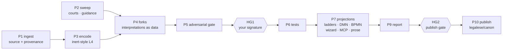

# “⟨law⟩: go” — the machine that encodes law, and the seat that only a person can fill

This is a briefing for a **domain expert willing to review an encoding of law and put their name to it** — a lawyer, a legal engineer, a legislative drafter, a rules-as-code practitioner. It explains the pipeline end to end: what it produces, what it refuses to decide for itself, and why the most important gate in the whole system is a signature that no software is permitted to make.

You do not need to be a programmer. The encoding style exists so that the artifact you review reads as law with structure attached, rather than as code with law attached — which is the whole argument, and § 2 is where you should test it against your own eye.

---

**What this is, and how to keep it honest.** This page is the markdown edition of a
briefing written for domain experts joining the review seat. It lives in the tree so it
can be read, corrected and extended like any other file here, and its three figures are
committed beside it as SVG.

It states measurements — test counts, engine-agreement figures, build times, dates. Each
was measured when the sentence around it was written, and **nothing re-measures them when
you read this**. If you find one that has drifted, fix it here in the same PR as the work
that revealed it: a number in this file that is quietly wrong is worse than one that is
missing, because a reader believes it. Where a claim is a judgement rather than a
measurement, the text says so.

## 1 · Your seat: HG1, the human in the loop

The pipeline runs almost entirely by machine: it ingests a regulation, encodes it, tests it, projects it into industry-standard artifacts, and writes a report on itself. But it was designed around a rule that no machine may cross: **whether an encoding faithfully says what the law says is a judgement, and only a named human expert may make it.** That judgement is called **HG1** — human gate one — and it blocks everything downstream of it: no projection ships as “reviewed” without it.

Concretely, HG1 is not a checkbox. It is a **detached SSH signature over a digest of the files you reviewed**. Anyone in the world can verify your signature against the published corpus; no agent, however clever, can manufacture it — the design maxim is _agents can verify signatures and cannot make them_. If anyone edits the encoding after you sign, your signature visibly stops verifying: sign-off binds to content, not to a moment.

### Why a practice might want this seat

There is a plausible future in which this is not a job but a **side practice**. A small firm commissions an encoding of the law it already knows best — a niche of landlord-tenant, a state's licensing regime, a corner of financial regulation — reviews it, signs it, and puts its name on the public record beside it. The signature is a credential that cannot be manufactured, attached to a document the public actually needs, in the firm's own market. That is lead generation of an unusually honest kind: not an advertisement, but a durable, checkable claim of expertise, doing something useful for people who are not yet clients.

We are not there yet, and we are not pretending otherwise. But the design decision that makes it possible has already been taken: signatures are detached, verifiable by anyone, and bound to content rather than to us. **Nothing about the gate requires the signer to work here.**

> **Your mandate, in one sentence:** choose interpretations where the law under-determines them, and improve encodings until a section-by-section reading against the source satisfies you — then sign.

## 2 · Inert style — why the encoding _is_ the review artifact

This is not a programming tutorial, and reviewing does not require you to write a line. It is about the one convention the whole seat rests on. The house style — **inert style** — is built so that the encoding is the review artifact: the drafter’s own words are kept verbatim inside the source, and the logic hangs off them. If that works, you can read an encoding the way you read a statute, and the structure is simply made visible. Here is a fragment of our encoding of SEC Regulation Crowdfunding’s resale restriction (17 CFR § 227.501), shown in current house style:

```l4
`transfer falls within an exception in Rule 501(a)` transfer MEANS
      "unless such securities are transferred:"
  ..  "(1)" ... transfer's `to the issuer of the securities`
  ..  "(2)" ... transfer's `to an accredited investor`
  ..  "(3)" ... transfer's `as part of an offering registered with the Commission`

@ref 17 CFR 227.501(a)
`resale restriction` transfer MEANS
  IF   `transfer falls within an exception in Rule 501(a)` transfer
  THEN FULFILLED
  ELSE PARTY Purchaser
       SHANT `transfer the securities`
       WITHIN `days in the resale restricted period`
```

One stylistic detail worth absorbing immediately, because you will enforce it: the possessive clitic does the verb's work. `` transfer's `to the issuer of the securities` `` already reads as “the transfer _is_ to the issuer” — and in other contexts as “has” — so field names drop the leading verb rather than saying it twice. (An earlier drafting style wrote `` `is to the issuer…` ``; the ruling that retired it is a good first example of how house style evolves here: argued, recorded, then applied corpus-wide.) A second example, same week: inert strings never _shadow_ the active layer. An earlier draft carried the full text of each numbered item as an inert line above its node — two copies of one text, which is how drift starts. The ruling: keep the chapeau, keep the statutory label as a truncated inert string joined to its node by the `...` continuation token (`` .. "(1)" ... transfer's `…` ``) — the `...` matters: bare juxtaposition parses as function application and fails to check. Both facts measured, not assumed, with a truth-table probe — a label is a citation fragment, not part of what the thing _is_ — and delete the duplicate. A warning-level check watches that consecutive labels stay in the statute's own order (warning, not error: real legislation goes wobbly — repeals leave gaps, insertions mint "(1A)").

Five things to notice, because they organise everything else:

- **Constitutive vs regulative.** The first definition is a pure decision (“does an exception apply?”); the second is a norm with a bearer, a prohibition and a deadline (`PARTY … SHANT … WITHIN`). Statutes interleave both; L4 keeps both and keeps them connected. Decisions project to DMN; norms project to BPMN.
- **Citations are code.** `@ref` ties every provision — and every _dated_ arm — back to its source. Answers arrive with their citation trail.
- **Time is an axis, not a fork.** Amended law lives as dated arms in one artifact. `EVAL UNDER RULES EFFECTIVE AT (Date …)` asks the same question under the rules of a different day — our Reg CF encoding answers correctly across four regimes, 2016 to today, including the 2017 and 2022 inflation adjustments.
- **Tests ride with the law.** `#ASSERT` scenarios are committed beside the provisions they exercise — the Reg CF corpus carries **70**, our Housing Act corpus **1,500**.
- **Everything is plain text in git.** Reviews are diffs; history is history; nothing lives inside a binary document.

## 3 · The “⟨law⟩: go” pipeline

One instruction — _“SEC Regulation Crowdfunding: go”_, _“British Nationality Act: go”_ — names a body of law, and the pipeline takes it from source text to every artifact we can honestly produce:



Two facts make this more than a diagram. First, **it runs**: the replay milestone is measured, and the flagship corpus executes — **1,340/1,340** expected values across **20** dated test cases, answered identically by two independent DMN engines. Second, **every stage writes receipts**: statuses come from scripts with exit codes, a report is generated from the journal (never typed), and each projection ships with a _fidelity report_ that declares what the target notation could not carry. We would rather say “lossy, and here is exactly what was lost” than pretend.

The pipeline’s output lands in [**legalese/canon**](https://github.com/legalese/canon) — a public corpus where each subject carries its encoding, tests, projections, registers, conversion report, and the gate signatures. Yours will be the signature that upgrades a subject from `adversarially-reviewed` to `reviewed`.

### Two commands you will use directly

`l4 verify FILE` compiles each boolean rule through the ladder into a decision diagram and reports four families of defect: an **unsatisfiable** conjunction, a **dead branch** that can never be taken where it sits, a **vacuous guard** that its siblings already entail, and an **unreachable outcome** — a verdict the rule can never deliver. If OPA’s rule-completeness warnings are your reference point, this is the same instinct with a stricter engine behind it.

What it is _not_, stated plainly because the tool says so itself: the analysis is propositional. Every leaf is opaque, so `x > 5 AND x < 3` is invisible to it — no numeric, date or string contradiction is in range — and each rule is read on its own without unfolding the rules it calls. **Findings are sound; silence is not a consistency proof.** On the Reg CF corpus it reports zero findings, and three numbers bound what that is worth: 25 of 42 analysed rules have exactly one condition, 111 of 154 are outside the analysis entirely for not returning a boolean, and 7 more are nested where the analysis does not reach. Those are counted and named on the receipt rather than folded into the word “clean”. You will meet this style everywhere here — a green result that tells you what it did not look at.

`l4 nlg FILE` regenerates legislative prose from the encoding. Useful in review: read the generated prose beside the source section and the difference in emphasis often shows you where the encoding has quietly changed the subject.

## 4 · Your two jobs: interpretation & isomorphism

### Job one — choose interpretations

Real law under-determines. When our encoders meet an ambiguity they are instructed _not_ to guess silently — the opposite of most automation practice. Instead they record a **fork**: the site, the plausible readings, which was taken provisionally, and why. Two live examples from our British Nationality Act encoding:

- **“after commencement”** — does a person born _on_ 1 January 1983 count? (We read commencement as an instant at the day’s start, so yes; the strictly-after-the-day reading was recorded and rejected, with reasons.)
- **“each of the first ten years of that person’s life”** — life-years anchored to birthdays, or calendar years? (We took life-years.)

Mechanically, forks become data: each fork point is an enumeration, all fork points in a corpus form one `Interpretation` record, and the public decision takes it as a parameter and delegates to a private implementation per reading. The favoured reading is a `TYPICALLY` default. This buys three things a footnote never could: the type system proves every reading is handled everywhere; the test suite can sweep _all_ readings and report exactly where and how much they diverge; and when an authority settles a fork — a regulator’s guidance, a court — the settling instrument is cited at the default and the superseded reading is **demoted, never deleted**.

> **This is your judgement, made durable.** Disposing forks — choosing readings, citing the argument or authority, deciding what a court would say — is the heart of the knowledge-engineering role here. The register exists so your choices are inspectable and reversible, not buried in an implementation.

### Job two — accuracy and isomorphism

Isomorphism means a domain expert can review the encoding against the regulation _section by section_ — same order, same words, same structure — and satisfy herself it says what the law says. The inert style exists for this reading; you are the reader. When the encoding is wrong, or right-but-unfaithful (correct answers from restructured logic), your revisions carry the same weight as the original encoding — more, in fact, because they’re the reviewed layer. When you are satisfied, the signature:

```bash
# once: generate a signing key, and we enrol its public half
ssh-keygen -t ed25519 -f ~/.ssh/hg1_reviewer

# per review: the pipeline prints the payload digesting what you reviewed
etc/go/gate-request.sh HG1 --run <rundir>
ssh-keygen -Y sign -f ~/.ssh/hg1_reviewer -n l4-go-gate HG1.payload.txt

# anyone, forever after, can check it:
ssh-keygen -Y verify -f gates/allowed_signers -I reviewer@… -n l4-go-gate \
  -s HG1.payload.sig < HG1.payload.txt
```

Your signature never claims the law is good, or that the encoding is bug-free — machine gates own mechanical correctness. It claims one precise thing: _a named expert read this against its source and stands behind the correspondence._

## 5 · Coming from OPA / OIA — a translation table

Reviewers arrive from several directions, and each brings a different half of the job already solved. A **practising lawyer** brings the reading — the instinct for where a provision is load-bearing and where it is boilerplate. A **legislative drafter** brings the awareness that ambiguity is sometimes deliberate and must be preserved rather than resolved. Someone who has built **guided interviews** or legal knowledge bases brings the lay reader's questions. None of these is a prerequisite; all of them transfer.

One background transfers so directly it deserves its own table. **If you come from Oracle Policy Automation / Intelligent Advisor**, this system maps onto your practice more closely than anything else in the field — OPA’s methodology of writing rules in the source document’s own words _is_ our isomorphism discipline, twenty years early. The table below is the fast path; the differences after it are where those instincts need a small recalibration. If OPA means nothing to you, skip to § 6 — nothing later depends on it.

| In OPA / OIA you…                                     | Here you…                                                                                                                                       |
| ----------------------------------------------------- | ----------------------------------------------------------------------------------------------------------------------------------------------- |
| author natural-language rules in Word/Excel rulebases | read/write inert-style `.l4` text files, versioned in git — diffs, blame, and history come free                                                 |
| define attributes, entities and relationships         | use terms, `GIVEN` parameters and `DECLARE`d record types (with lists)                                                                          |
| validate/compile the rulebase in Policy Modeling      | run `l4 check` — a real type system, plus an exhaustiveness oracle that proves every enumeration case is handled                                |
| build interviews (screens, goals)                     | get a generated wizard whose question order is computed by information gain — and your interview-design instincts are wanted (see § 9)          |
| read decision reports for the “because” chain         | read evaluation traces with statutory citations attached (`#TRACE`, and the reasoner API)                                                       |
| handle change with temporal reasoning / change points | use dated arms + `EVAL UNDER RULES EFFECTIVE AT` — the rule date is a first-class input everywhere, and dated regimes are engine-tested         |
| maintain What-If Analysis workbooks                   | maintain `#ASSERT` scenarios in-source plus dated case files whose expected values are machine-evaluated, then run on _two independent engines_ |
| deploy policy models to a proprietary runtime         | project to open standards (DMN/BPMN) executed on KIE and Camunda, plus wizards, APIs, MCP tools — and the L4 itself stays the source of truth   |
| version rulebases                                     | semver the encoding, separately from law-time — version 2.1.0 still answers 2016 questions correctly                                            |

**What has no OPA analogue** — the three things to lean into: the **fork register** (OPA makes you pick one reading and the alternatives vanish; here they are first-class and swept by tests); the **adversarial gate** (independent agents attack every encoding before it reaches you — expect to receive their findings, and to overrule them); and the **fidelity reports** (every projection declares its losses, so “the DMN says so” is never the end of an argument — the L4 is).

## 6 · The pictures: ladder diagrams

A **ladder diagram** is our visualization of Boolean decision structure — imagine the rule as an electrical circuit: conditions in _series_ must all hold (AND); parallel rungs offer alternatives (OR); current flowing from left to right means the rule fires. The four Rule 501(a) exceptions render as four parallel rungs between two rails — any one path conducting means the transfer is exempt. Ladders are generated from the L4 (so they cannot drift from it), keep the statute’s own words as labels, interleave the chapeau text in italics, and — in the interactive form — let you toggle facts and watch which paths light up. For review, they are often the fastest way to see that an encoded condition’s _shape_ is wrong even when its words are right.

A detail worth having in mind when you review figures: until this weekend each rung also carried an inert line repeating its own text underneath it, and the diagram read as cluttered without anyone being able to say why. The ruling was to keep the enumeration and delete the repetition — the label `(1)` earns its place because the regulation numbers the limb; a restatement of the words already in the box does not. Expect to make that call yourself.



**Reading it:** current enters at the left rail; any one conducting path to the right rail makes the exception apply — four parallel rungs, a four-way OR. Conditions in _series_ along one rung would all have to hold (AND). The italic line above is the regulation's own chapeau; the italic `(1)`–`(4)` are the CFR's enumeration, and each box is the corpus's field name in current house style. This is verbatim tool output, regenerated 2026-08-03 — the figure is generated from the L4, so it cannot drift from the law.

## 7 · DMN, and our two engines

**DMN (Decision Model and Notation)** is the OMG’s open standard for decision logic — think of it as the standardised, executable descendant of the decision tables you have been building your whole career. Two ideas carry most of it: **decision tables** (rows of conditions → outcomes, with an explicit “hit policy” saying how overlapping rows resolve) and the **DRG** (decision requirements graph: which decisions feed which). A five-minute skim of [Camunda’s DMN primer](https://camunda.com/dmn/) will feel like home; the [OMG spec](https://www.omg.org/spec/DMN/) is the reference.

| F   | offering_amount | first_time_issuer | financial statements required                  |
| --- | --------------- | ----------------- | ---------------------------------------------- |
| 1   | \<= 107000      | –                 | "certified by the principal executive officer" |
| 2   | \<= 535000      | –                 | "reviewed by an independent public accountant" |
| 3   | \<= 1070000     | true              | "reviewed by an independent public accountant" |
| 4   | –               | –                 | "audited by an independent public accountant"  |


**A real emitted decision table** (transcribed cell-for-cell from our exported Reg CF model; both engines execute it). The `F` in the corner is the **hit policy** — FIRST — meaning row order is load-bearing and row 4 is the fallthrough. Your decision-table instincts apply directly; the hit policy is the concept OPA's rule tables kept implicit that DMN makes you declare.

**Schematic DRG** (decision requirements graph): ovals are inputs, boxes are decisions, and decisions feed other decisions — a DMN model is a directed graph of tables like the one above. Our Reg CF export carries 67 decisions in one such graph.

Our exporter compiles L4 decisions into DMN 1.3, and — this is the part that matters — **we execute the result on two independent engines and require them to agree**:

- [KIE / Drools](https://www.drools.org) — the Red Hat lineage engine (8.44);
- [Camunda](https://camunda.com) — the Zeebe DMN engine (8.7).

Agreement across engines is our portability oracle: the Reg CF model’s **67** decisions answer **1,072/1,072** expected values identically on both. Where DMN cannot carry something L4 says, the export does not silently drop it — the fidelity report names each loss, classified by severity. Reading a fidelity report is part of reviewing a subject.

> **Keep the frame straight: DMN and BPMN are projections, not our runtime.** We emit them for standards compatibility and interop — so the BPM world's engines, modelers and wikis can consume the law in their own notations, and so two independent engines agreeing can serve as our portability oracle. But _running_ a computation needs none of that: every `jl4-service` deployment embeds L4's own decision engine with full trace capability — every answer carries its reasoning tree and citations natively. The wizard, the MCP tools, the APIs all execute on it directly. The projections exist so _their_ tools can check _our_ answers; they are never a prerequisite for having answers.

## 8 · BPMN, and the wiring between them

**BPMN (Business Process Model and Notation)** is the OMG’s standard for processes — who does what, in what order, with what deadlines. It is where L4’s _regulative_ layer goes: a `PARTY … MUST … WITHIN` becomes a task on a party’s lane, a deadline becomes a boundary event, the lawful and breach outcomes become end states. [Camunda’s BPMN primer](https://camunda.com/bpmn/) is the tutorial; [bpmn.io](https://bpmn.io) is the open toolkit both we and lexipedia embed for rendering.

The two notations are wired together: where a process forks on a decision, our emitted BPMN carries a **businessRuleTask** that references the emitted DMN decision by name — in pure standard BPMN 2.0, no vendor extensions — and a resolver check guarantees no reference dangles. This decision/process split is not a tooling artifact; it is jurisprudence (constitutive vs regulative rules) showing up as architecture, and you will find it matches how statutes are actually drafted.


**The resale restriction as emitted BPMN** — every coordinate is read off the diagram-interchange section our exporter writes, so this is the layout Camunda Modeler opens. Read it: start event → exclusive gateway; if a Rule 501(a) exception applies, the process ends **Fulfilled**; otherwise the Purchaser holds the prohibition-task (`SHANT transfer`) whose attached boundary event is the deadline — surviving the restricted period exits lawfully; transferring inside it ends in **Breach**. The gateway is where the businessRuleTask wiring attaches: the process _asks_ the emitted DMN decision rather than restating it.

## 9 · Interviews, deployments, and MCP

**The wizard is OPA interviews, regenerated.** From any encoding we generate a citizen-facing web interview: it asks only the questions that still matter given the answers so far, ordered by expected information gain (a model-counting engine under the hood, with `TYPICALLY` defaults as priors), and it explains its conclusions with citations. It also carries a **law-time control** — the user can ask under the rules effective on any date. You have designed more interviews than anyone on this team: your judgement on question wording, ordering and screen flow is explicitly invited, not just tolerated.

**MCP** ([Model Context Protocol](https://modelcontextprotocol.io)) is how AI assistants consume the corpus. Each deployed encoding exposes its exported decisions as tools that assistants like Claude call _instead of guessing_: the AI does the conversation, the reasoner does the law, and every answer carries its trace and citations. This is our answer to hallucination — the assistant’s fluency, guard-railed by an engine whose every step is auditable. Dozens of encodings already run this way on our `jl4-service`, from tenancy agreements to WTO subsidy rules.

## 10 · The rules-as-code neighbourhood

You know this field from the OPA side; here is where we sit among the neighbours, and why we transpile _to_ several of them rather than compete head-on:

| system                                                              | what it is                                                                                      | our relationship                                                                                                                                                                      |
| ------------------------------------------------------------------- | ----------------------------------------------------------------------------------------------- | ------------------------------------------------------------------------------------------------------------------------------------------------------------------------------------- |
| [OPA / OIA](https://www.oracle.com/cx/service/intelligent-advisor/) | commercial natural-language rules + interviews; the strongest isomorphism tradition in industry | your expertise transfers near-verbatim; we add forks, formal checks, open standards, git                                                                                              |
| [OpenFisca](https://openfisca.org)                                  | open-source Python microsimulation; runs national benefit systems (France, NZ…)                 | **a compile target**: `l4 openfisca` emits it. Our NZ benefits pilot imported an OpenFisca rulebase and swept it with property tests — finding what a handful of hand tests could not |
| [Blawx](https://www.blawx.com)                                      | visual, block-based rules-as-code over stable-model semantics (Jason Morris)                    | fellow traveller; a future export target for meeting that community in its own format                                                                                                 |
| [Catala](https://catala-lang.org)                                   | a French academic language pairing source text with default logic, aimed at tax code            | closest in spirit on literate isomorphism; we differ on deontics, projections and the review pipeline                                                                                 |
| [docassemble](https://docassemble.org)                              | open-source guided interviews and document assembly                                             | delivery-layer neighbour of the wizard leg                                                                                                                                            |

The positioning in one line: **L4 is the reviewed source of truth; everything else is a projection.** One encoding, checked once, signed once — then DMN for the BPM shops, OpenFisca for the benefits modellers, wizards for citizens, MCP for the AIs.

## 11 · Lexipedia, and `canon`

[Lexipedia](https://www.lexipedia.xyz/doku.php?id=reg_cf_exemptions) is a public wiki of law summaries with embedded BPMN/DMN diagrams — same OMG standards, same bpmn.io renderer, complementary emphasis (their strength is process description; ours is executable, versioned, tested logic). Its content is CC BY-SA; we cooperate rather than correct, and our comparison work is written in our own words.

There is an instructive contrast here, and it is _not_ a criticism of anyone’s care. When a statutory threshold changes, a prose-first page has to be corrected everywhere it appears. On one public page covering the same regulation we counted a superseded figure in **four** places — two of them inside diagram labels, where a prose editor would never think to look. That is a property of the medium, not of the authors, and **our own documents have exactly the same disease** wherever a number is typed by hand instead of derived. It is precisely why the pipeline’s audit report forbids typed numbers outright, and why the figures in it are resolved from a run journal rather than transcribed. Single-sourcing from one encoding is the cure; the diagram labels are the reason it matters.

[**legalese/canon**](https://github.com/legalese/canon) is where reviewed subjects live: public from day one, Apache-2.0, each subject carrying its encoding, tests, projections, registers, report — and the gate signatures, verifiable by anyone. Your name, your key, your judgement, on the record. From the canons of construction to the construction of canon.

## 12 · The conversion report, and its two jobs

Every `go` run ends by writing a report. There are two of them, deliberately, and the difference between them is worth understanding before you review either.

The **audit report** is austere on purpose. Its template **contains no typed numbers at all** — every figure is a placeholder resolved from the run's journal, and an unresolved placeholder is a hard error that refuses the render. That rule exists because a projections document in this repo once stated three fidelity counts that its own artifacts contradicted; the numbers had been transcribed once and never re-measured. A claim with no journal row cannot be printed. If you ever want to know whether a figure in any of our documents is real, that report is the thing to check it against, and `go.sh verify --gates` re-derives it without trusting it.

The **explainer** is its reader-facing sibling, and it carries a dual brief: explain the law, _and_ explain the L4 treatment of the formalization — interleaved, not in two halves. Alongside what the regulation requires sits what happened when somebody tried to make it executable:

- where the prose was vague and the code could not be;
- where `CONSIDER` exhaustiveness forced an answer the statute left open;
- what the type system refused to let us write;
- where an ambiguity had to fork into competing readings — _your_ dispositions, once you start making them;
- what each projection makes visible that the others hide;
- and, from the fidelity reports and the defect register, **what the encoding honestly failed to capture**.

That last one is the point. A reader should finish knowing the boundary of the claim. A document that only shows wins is the genre we are trying to displace, and the easiest way for this project to lose its credibility is to publish a confident sentence that nothing licenses. Which is exactly why the narrative is checked in and gated rather than regenerated fresh each run: **prose that asserts something about the law is reviewed by a person before it can be published without a draft marking**, and that person is you.

Status, honestly: **this is being built, not built.** The spec and the machinery exist on a branch and the Reg CF narrative has a first draft; three adversarial reviews are queued behind it. Reg CF is the first subject because every projection leg runs green against it; the British Nationality Act is the planned second, and is where the case-law and practice-direction sections finally get real material — SEC rules attract staff guidance and no-action letters rather than judgments.

## 13 · Taking up the seat — suggestions, not homework

The register is the thing to notice. Reading an encoding to understand it and reading one you are about to put your name to are different activities, and the second is the one that finds things. Everything below assumes the second.

1.  **Read `regcf.l4` against 17 CFR Part 227**, section by section — as the reading HG1 formalizes rather than as a worked example. Note every place the encoding surprised you; each note is either a defect we fix or a review-experience improvement we owe you.
2.  **Dispose the BNA’s twelve recorded ambiguities.** Our British Nationality Act s. 1 encoding carries twelve open interpretive choices, each with both readings and the provisional argument. Agree, overrule, or escalate — your first fork dispositions, on the field’s most storied benchmark statute (encoded by the logic-programming pioneers in 1986; we found and fixed an error in their own worked example on the way).
3.  **Drive the wizard** and mark up everything you would change about question order, wording, and flow.
4.  **Review the conversion report's narrative.** A new pipeline stage writes a reader-facing report to sit beside the strict audit one, and its prose is _agent-drafted and checked in, pending your HG1 review_ — unreviewed sections render visibly marked as draft until somebody signs. Reviewing that narrative is HG1 work in its most direct form, and it is where your OPA/OIA instinct for what a lay reader actually needs will bite hardest. See § 12.
5.  **Generate your signing key** (§ 4) and we enrol it — the day you first sign, the `gate-allowed-signers` file stops being deliberately empty, which is a small ceremony we have been looking forward to.

## 14 · Issuing a `go` yourself

The instruction is one line. Everything below is what has to be true before that line works. Until recently that meant a full Haskell toolchain and no way around it; since **5 August 2026** a compiled `l4` ships in Releases, so the slow half is now optional. What remains is still a developer setup, and pretending otherwise would waste your afternoon.

### Once: the machine

**Node.js 20 or later, GraphViz, and an `l4` binary.** GraphViz is not optional decoration: the state-machine leg emits GraphViz DOT, and without `dot` on your `PATH` that whole section of the report renders ABSENT with the reason stated.

There are two ways to get the third, and **only one of them involves Haskell**. Either way you need the repository, because the driver, the corpus and the subject sidecars live in it and are not part of the binary:

```bash
# the fork where the work happens; `unstable` is the integration branch,
# `main` is the stable line and will be behind it
git clone https://github.com/legalese/l4-ide.git
cd l4-ide
git checkout unstable
```

**Route one — download it.** Pick your platform from the [Releases](https://github.com/legalese/l4-ide/releases) page. The archives are named `l4-unstable-<date>-<commit>-<platform>.tar.gz`, one each for `darwin-arm64`, `linux-x64` and `win32-x64`:

```bash
gh release download unstable-20260805-c873bb5 --repo legalese/l4-ide \
  --pattern 'l4-*darwin-arm64.tar.gz' --pattern 'SHA256SUMS'

# the release ships checksums; there is no reason not to use them
shasum -a 256 -c SHA256SUMS
tar -xzf l4-unstable-20260805-c873bb5-darwin-arm64.tar.gz

export L4=$PWD/l4-unstable-20260805-c873bb5-darwin-arm64/l4
```

Each archive carries `l4`, `jl4-lsp`, the standard `libraries/`, and a `BUILD-INFO.txt` naming the exact commit it was built from — **36–53 MB** compressed depending on platform. These are **prereleases cut from `unstable`**, not from the stable line, and they say so on the Releases page and again in `BUILD-INFO.txt`. The tag names the commit, so an old one stays downloadable after a newer is cut. Fetched with `gh` or `curl` the binary is not quarantined; a macOS _browser_ download normally is, and the fix is `xattr -d com.apple.quarantine l4`.

**Route two — build it.** Additionally needs **GHC 9.10.2 and Cabal 3.10+**; Nix users get those from `nix-shell nix/shell.nix`. Slower, and the right choice when you want a commit no release covers:

```bash
# the driver NEVER builds -- it refuses rather than silently compile something
# you did not ask for -- so the binary has to exist first. This is the slow step.
cabal build all

export L4=$(cabal list-bin l4)
```

### Then: the one line

Launch Claude Code in that directory and say the name of the law, followed by `go`:

```bash
claude

> SEC Regulation Crowdfunding: go
```

That phrasing is the trigger, not decoration. A skill in the repository (`.claude/skills/running-the-l4-pipeline`) matches on it and dispatches `etc/go/go.sh`, then supplies the judgements the script cannot make for itself. Any subject named the same way counts — the pipeline is subject-generic, and what is specific to one body of law lives in a sidecar under `etc/go/subjects/<subject>/`.

If you would rather see the machinery than talk to it, the driver is usable directly, and `plan` is the honest first command — it prints which stages will run and which are scaffolded entry points that refuse:

```bash
# $L4 is already set, from whichever of the two routes above you took;
# go.sh refuses outright if it does not point at something executable
etc/go/go.sh plan --milestone g1
etc/go/go.sh run  --milestone g1 --subject regcf
```

### If your machine is not set up for Haskell — four routes

Only route two above needs GHC, and on Windows a native GHC install is the least pleasant version of that. **None of these four requires it.** Pick whichever fits.

| route                                                                                    | what it costs                                                                                                   | what it gets you                                                                                                                                                                                                                                                                                                                                            |
| ---------------------------------------------------------------------------------------- | --------------------------------------------------------------------------------------------------------------- | ----------------------------------------------------------------------------------------------------------------------------------------------------------------------------------------------------------------------------------------------------------------------------------------------------------------------------------------------------------- |
| **The standalone `l4`** — from [Releases](https://github.com/legalese/l4-ide/releases)   | A download and a `tar -xzf`. No GHC, no Cabal, no compile. You still need the repository, Node.js and GraphViz. | **Running a `go` on your own machine.** Point `$L4` at the extracted binary and the driver takes it. **The shortest local route**, and a new one — the first such release was cut on **5 August 2026**.                                                                                                                                                     |
| **Claude Code on the web** — [claude.ai/code](https://claude.ai/code)                    | Nothing to install at all. Runs in a Linux sandbox in the cloud; your laptop only needs a browser.              | **Everything.** Point it at the repository, let it check out `unstable`, and issue the `go` there. It can take either route above — download the `linux-x64` archive, or compile, which is slow but happens once per sandbox and not on your machine. **The best route if your local setup is unhappy** — with one caveat below about where your key lives. |
| **WSL2** — (Windows Subsystem for Linux)                                                 | One-time install of WSL2, plus Node.js, GraphViz and an `l4` inside it.                                         | A normal Linux development environment on the Windows box — and the `linux-x64` archive to put in it. There is a native `win32-x64` build too, so this is now a preference rather than a necessity.                                                                                                                                                         |
| **The VS Code extension** — from [Releases](https://github.com/legalese/l4-ide/releases) | Download `l4-vscode-win32-x64-*.vsix` and install it. No build, no toolchain.                                   | **Reading and editing L4, with the ladder diagrams live.** Enough for a great deal of the review job — but _not_ enough on its own to run a `go`, which also wants the repository and an `l4`. Pair it with the first route and you have both.                                                                                                              |

> **Worth separating the two jobs.** **Reviewing** an encoding — reading it against the statute, disposing forks, signing — needs the editor, the repository and your judgement. It does _not_ need the pipeline. **Running a `go`** additionally needs an `l4`, Node.js and GraphViz. If you are doing the first and not yet the second, the last route above is sufficient and costs you nothing. (An earlier version of this briefing said the Releases page shipped no standalone `l4`, and predicted that two of the routes would collapse into “download it and go” if one ever appeared. One appeared, and they did.)

> **Where you run it is free. Where you sign is not.** Running the pipeline on a cloud sandbox, a colleague's laptop or a build server changes nothing about the result — the run is reproducible and its journal says what happened. **Signing is a different act.** The private half of the key in § 4 is what binds _your name_ to a digest, and `gate-request.sh` is explicit that the signature is made “out of band, with a key that never enters the worktree”. So generate it on a machine you control, keep it there, and sign there: the gate prints a short payload file, and you can carry that to the key rather than the key to the payload. A signing key sitting in a disposable sandbox would still verify — it would simply stop meaning the thing the gate exists to mean.

**Which of this was measured, and on what.** On `darwin-arm64`, on **5 August 2026**, against release `unstable-20260805-c873bb5`: the archive's checksum matched the published `SHA256SUMS`; the extracted `l4` evaluated a file importing a bundled library from an unrelated working directory with `JL4_LIBRARY_PATH` unset; `go.sh` refused a bogus `$L4` by name; and `L4=<extracted>/l4 etc/go/go.sh run --milestone g1 --subject regcf --through p3-check` reached `p0-preflight: PASS` with `l4 check` exiting 0 on both corpus files. The `linux-x64` and `win32-x64` archives were smoke-tested on their own build runners, and _not_ by anyone running a `go` on that platform.

### Where you come in, and how to get past yourself

The run will stop at **HG1** and ask for your signature, because everything from P6 onward is gated on it. That is the whole design and not an obstacle to route around.

But while you are still finding your feet, stopping at a gate every time is friction with no review value, so the gate is _waivable_ — on the record, never silently:

```bash
etc/go/go.sh run --milestone g1 --subject regcf \
  --waive HG1="learning the pipeline; not a review of the encoding"
```

A waiver is recorded **as a verdict, not as an absence**, and it is bound to the digest of the corpus it was granted over — so it cannot quietly cover a later edit, and the report says in its header that the gate was waived and by what reason. **HG2 is not waivable**: `--waive HG2` exits with an error. HG2 guards anything outward-facing, and that one opens on a signature or not at all.

### What you get

Two documents in the run directory. `report.md` is the strict audit report — no prose, every figure resolved from the run journal. `explainer.md` and `explainer.html` are the reader-facing sibling described in § 12. And you can re-derive the whole thing without trusting it:

```bash
etc/go/go.sh verify --run-id <ID> --gates
```

That re-reads the journal, re-hashes every artifact a receipt names, checks each granted gate was recorded _before_ the first stage it gates began, and recomputes the verdict. It runs no build, calls no model, and makes no network request.

> **One honest limit, so you do not discover it the hard way.** A `go` on a subject that already has a corpus — Reg CF is the worked case — replays it through every projection and writes the report. A `go` on a body of law _nobody has encoded yet_ is **not push-button**. The de novo stages currently _validate_ an encoding deposited by an agent; producing that deposit is still agent work, with you judging it. So for a new statute, expect a conversation with Claude Code rather than a single command — and expect your part to be the interesting half.

## 15 · Reading list

- **DMN:** [Camunda’s DMN tutorial](https://camunda.com/dmn/) · [OMG DMN specification](https://www.omg.org/spec/DMN/) · [Drools/KIE](https://www.drools.org)
- **BPMN:** [Camunda’s BPMN tutorial](https://camunda.com/bpmn/) · [OMG BPMN 2.0 specification](https://www.omg.org/spec/BPMN/2.0/) · [bpmn.io](https://bpmn.io)
- **Repositories:** [legalese/l4-ide](https://github.com/legalese/l4-ide) (the language, IDE, and pipeline) · [legalese/canon](https://github.com/legalese/canon) (the corpus)
- **Neighbours:** [OpenFisca](https://openfisca.org) · [Blawx](https://www.blawx.com) · [Catala](https://catala-lang.org) · [docassemble](https://docassemble.org) · [Model Context Protocol](https://modelcontextprotocol.io)
- **Lexipedia:** [their Reg CF page](https://www.lexipedia.xyz/doku.php?id=reg_cf_exemptions) — read it before and after `regcf.l4`; the comparison teaches the whole thesis.

Prepared August 2026. Figures in this document are measured, not aspirational: engine counts come from CI banners, corpus sizes from the tree, and every claim about what runs today has a receipt in the repository. Where something is not yet true, this document says so — a habit you will find enforced everywhere here, and one we would like you to hold us to.
