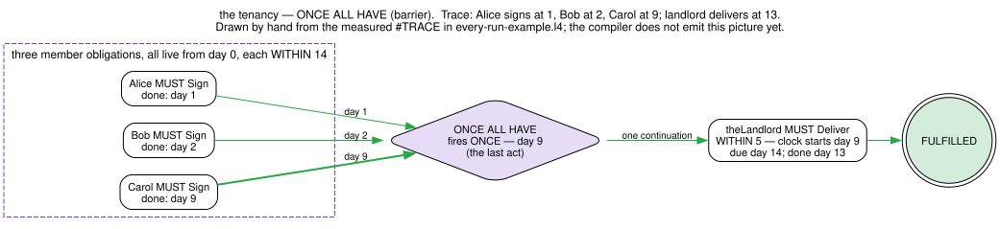
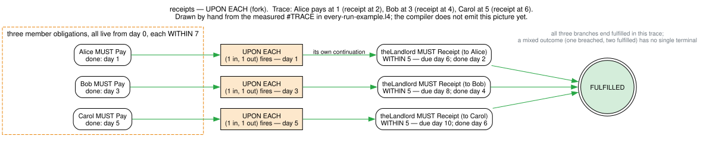

# EVERY

Binds an obligation, permission or prohibition to **every member of a group at once**, instead of to one named party. `EVERY Tenant t MUST sign` reads "every tenant, call them t, must sign": one obligation per tenant, all live at the same time, and one place to say what happens when they have acted.

**Status (2026-09-08): `EVERY` runs, and the group is written with `IN`.** A rule written with `EVERY` is parsed, its names and types are checked, it is printed back, it appears in the state graph, and — new on this date — it can be **run** against a stream of events with `#TRACE`, exactly as a `PARTY` rule can. The barrier fires once at the last act, the fork fires once per act, and a failure produces a breach. **Since 2026-09-15 the state graph and the BPMN export can tell the two joins apart** — `l4 state-graph` writes the join line on the edge, and `l4 export --to bpmn` draws each join as a different diagram — a barrier as a multi-instance task, and, since 2026-09-19, a fork as a multi-instance sub-process enclosing the member's whole continuation; see [Seen as a diagram](#seen-as-a-diagram) and [What runs today](#what-runs-today-and-what-does-not). Also new on this date: `IN` says which group the rule is about — `EVERY Tenant t IN tenants` — replacing an older spelling that had to smuggle the same list into the `WHO` condition. **That older spelling is deprecated** as of the same date: it still runs, nothing already written stops working, and nothing warns you — but `IN` is the one to write, and everything we ship has been moved across. See [The older spelling, now deprecated](#the-older-spelling-now-deprecated-a-roll-read-out-of-the-who-condition) for the two-line rewrite.

Two things about running it are worth knowing before you write one, and both have sections of their own below: the group has to be given as a **list**, which is what `IN` is for — `EVERY Tenant t IN tenants` ([Where the group comes from](#where-the-group-comes-from-the-roll)) — and a few parts of the design are still not built
([What runs today, and what does not](#what-runs-today-and-what-does-not)). The design, its rulings and the parts still open are in `specs/todo/EVERY-EACH-QUANTIFIER-SPEC.md`.

## Syntax

```l4
EVERY Cast v                   -- every value built by the constructor Cast
EVERY v                        -- every value of the party type
EVERY Cast v IN list           -- only those on the list (see "Where the group comes from")
EVERY Cast v WHO condition     -- only those for which the condition holds

EVERY Cast v [IN list] [WHO condition]
    MUST/MAY/SHANT/DO action
    [WITHIN deadline [OF anchor]]  -- bounds each act
    [ONCE ALL HAVE [WITHIN deadline [OF anchor]]]   -- the barrier: once, when ALL of them have acted
     -- or --                                       -- (pick one; this WITHIN bounds the whole)
    [UPON EACH     [WITHIN deadline [OF anchor]]]   -- the fork: once PER member who acts
    [HENCE consequent]
    [LEST alternative]
```

The join line is optional in the grammar and **required whenever the rule has a `HENCE` or a `LEST`** — that is a check, not a parse rule, so the error you get names both spellings.

Everything after the first line is the same as after [PARTY](PARTY.md): the same modals, the same `WITHIN`, `HENCE`, `LEST` and `PROVIDED`. The one new thing is the **join line**, `ONCE ALL HAVE` or `UPON EACH`.

`IN` comes before `WHO`, in the order you would say them: _every tenant t in tenants who is not Carol_. A rule you intend to **run** has to be given the group as a list somewhere, and `IN` is where to give it; see [Where the group comes from](#where-the-group-comes-from-the-roll), which also covers the older, now deprecated spelling that put the same list inside the `WHO` condition.

Write each clause indented past the `EVERY`, as the examples below do. What the compiler actually enforces is narrower than that convention: for `WITHIN`, `HENCE` and `LEST` it is the clause's **body** that must sit past the `EVERY`, not the keyword. The join line is the exception, because a bare `ONCE ALL HAVE` or `UPON EACH` has no body to check and a misplaced one would otherwise attach silently to a different rule — so its head keyword and its marker words are themselves column-checked. Its `WITHIN` keyword is not; only that `WITHIN`'s body is, like every other clause.

## The first line: who is in the group

**Example file:** [every-example.l4](every-example.l4)

The word after `EVERY` names the kind of party, and it is a **constructor** of the party type, not a type of its own. This is the value-actor encoding described in [Actors, Actions, and Agreement](../../concepts/legal-modeling/actors-and-actions.md): actors are values of one type, and the constructors of that type are the kinds of actor.

This is the cast every example on this page uses, and it is the preamble of [every-example.l4](every-example.l4). Read the later examples as sitting under it.

```l4
IMPORT prelude

DECLARE Actor IS ONE OF
    Landlord HAS name IS A STRING
    Tenant   HAS name IS A STRING

DECLARE Action IS ONE OF
    Sign    HAS signer IS AN Actor
    Deliver HAS who    IS AN Actor, what   IS A STRING
    Pay     HAS payer  IS AN Actor, payee  IS AN Actor, amount IS A NUMBER
    Receipt HAS issuer IS AN Actor, to     IS AN Actor, amount IS A NUMBER

theLandlord MEANS Landlord OF "Ms Ng"

GIVETH A DEONTIC Actor Action
`the tenancy begins` MEANS
    PARTY theLandlord MUST Deliver theLandlord what WITHIN 5
```

With those declarations:

- `EVERY Tenant t` ranges over the tenants and not the landlord. `Tenant` selects the cast; `t` is the name each member goes by inside the rule.
- `EVERY a` with no kind word ranges over **every value of the party type**, landlord included. It is the unfiltered case.
- The variable is always last. `EVERY t Tenant` is a mistake, and it is reported as one: `t` would be read as the cast, and there is no constructor called `t`.
- Because the variable is last, **a single name after `EVERY` is always the variable, never a cast.** `EVERY Tenant` — the variable forgotten — is accepted, and it does not mean what it looks like: `Tenant` becomes the bound variable and the rule ranges over every value of the party type, landlords included. The shadowing is partial: inside the rule a bare `Tenant` is the member, while `Tenant OF "Alice"` still resolves to the constructor, so the mistake can go unnoticed for a long time. Write `EVERY Tenant t`. This is a known sharp edge, not a designed behaviour.

The variable has the party type, the one named in the rule's `GIVETH A DEONTIC Actor Action`, and it is in scope in the `WHO` condition, the action, the act's `WITHIN`, and — under a fork — the `HENCE` and the `LEST`. Under a barrier the continuation belongs to the join rather than to any member, so naming the variable there is refused when the rule is run; see [the join line](#the-join-line-once-or-once-per-member).

There are two places it is **not** in scope, and they are the same kind of place: what is read **once, for the whole group**, before there is any member to speak of. Those are the `IN` list — see [Where the group comes from](#where-the-group-comes-from-the-roll) — and the `WITHIN` on a join line, whether that line is `ONCE ALL HAVE` or `UPON EACH`. Neither may depend on which member you are looking at: a group's list cannot be worked out from a member of it, and a deadline on the whole group is not a deadline if it is different for each person. Naming the variable in either is rejected, but with a poorly worded message, and with one sharp edge if some _other_ thing in your file happens to have the same name — both described in the roll section.

## WHO: only some of them

`WHO` takes a condition, a `BOOLEAN` expression in which the variable is in scope. It narrows the cast to the members for which the condition is true.

```l4
IMPORT prelude

tenants MEANS LIST (Tenant OF "Alice"), (Tenant OF "Bob"), (Tenant OF "Carol")

GIVETH A DEONTIC Actor Action
`the tenants who are not Carol sign` MEANS
    EVERY Tenant t IN tenants
        WHO    NOT (t EQUALS (Tenant OF "Carol"))
        MUST   Sign t
        WITHIN 14
```

The condition names the variable itself — `t` is in scope inside `WHO`, which is the whole point of it. A condition that is not a `BOOLEAN` is a type error.

`IN tenants`, on the first line, is doing something different: it says where the group comes from in the first place, and `WHO` then narrows what it produced. The next section but one is about that.

`WHO` is the only filter word. `WHERE` after a rule keeps its usual meaning, a block of local definitions, so this still works and means what it always meant:

```l4
GIVETH A DEONTIC Actor Action
`sign by the due date` MEANS
    EVERY Tenant t MUST Sign t WITHIN due
    WHERE
        due MEANS 14
```

There is one more thing to say about `WHO` before leaving it: in rules written before `IN` existed, the `WHO` condition also carried the list the group is drawn from, and you will still meet those. That is the next section.

## Where the group comes from: the roll

Read this before writing a rule you intend to run.

`EVERY Tenant t` says the rule is about tenants. It does not say **which** tenants, and the computer has no way to work that out on its own. `Tenant HAS name IS A STRING` says a tenant is anything with a name, and there is no end to the names one could write down — `Tenant OF "Alice"`, `Tenant OF "Alice "`, `Tenant OF "Aloysius"`, forever. There is no list of all tenants to go through, so there is no way to know when "all of them have signed".

So you have to hand the rule a list. The list is called the **"roll"**, in the sense of a roll of members that gets called out at a meeting, and you write it with `IN`:

```l4
IMPORT prelude

tenants MEANS LIST (Tenant OF "Alice"), (Tenant OF "Bob"), (Tenant OF "Carol")

GIVETH A DEONTIC Actor Action
`all tenants sign` MEANS
    EVERY Tenant t IN tenants      -- the roll: these three, and nobody else
        MUST   Sign t
        WITHIN 14
        ONCE   ALL HAVE
        HENCE  FULFILLED
        LEST   BREACH
```

Read it aloud and it says what it does: _every tenant t in tenants must sign, within fourteen days; once all of them have, the rule is fulfilled, and otherwise it is breached._

`IN` may also go on a line of its own, like the other clauses, when the list is long enough that the first line gets crowded:

```l4
EVERY Tenant t
    IN     tenants
    WHO    NOT (t EQUALS (Tenant OF "Carol"))
    MUST   Sign t
    WITHIN 14
```

The `WHO` condition still narrows the group as you would expect, and so does the kind word after `EVERY`. All three work together, in this order:

1. the **roll** — the list after `IN` — gives the starting list;
2. the kind word (`Tenant`) drops anyone not of that kind, so a roll that also names the landlord still produces a group of tenants only;
3. the `WHO` condition drops anyone it says `FALSE` for.

```l4
EVERY Tenant t IN tenants
    WHO NOT (t EQUALS (Tenant OF "Carol"))
```

reads the roll of three, keeps the tenants, and drops Carol: a group of two.

**Without a roll, a rule with `EVERY` will not run.** It still parses and type-checks — writing one is not an error — but running it stops with a message that says what to add:

> EVERY has nothing to draw its cast from. Running a quantified obligation needs a list of the parties it ranges over, because a party type is normally open… Name the list with IN, as `EVERY Tenant t IN tenants MUST ...`, with `tenants` a LIST of the party type.

This is the same habit the language has elsewhere: where two readings are possible and neither is obviously right, it declines to guess and tells you which words to write.

Four details worth knowing:

- **The roll is read once**, when the rule meets its event stream, and the group is fixed from then on. Somebody who joins the list later does not join a group that is already running, and somebody who leaves it is still counted and still blamed. That is deliberate: a group that quietly changed size would quietly change what the rule means. (The design calls this "the cast is evaluated once at arming"; changing a running group is meant to need an explicit act, which is not built.)
- **An empty roll means an empty group**, and an empty group has nothing outstanding. A barrier over nobody is achieved immediately — "all of them have acted" is true when there are none of them — and its `HENCE` fires at once, with one exception: the `ONCE` line's `WITHIN` still applies to the empty group as to any join, so if that `WITHIN` is anchored to an instant already past when the rule is entered (`ONCE ALL HAVE WITHIN 5 OF 0`, entered at 10), the deadline has been missed by nobody in particular and the `LEST` fires instead. If either is not what you want, guard the rule with an `IF`. One trap follows from it: an empty group whose `HENCE` leads back to the same rule never consumes an event, so it goes round forever and the run ends with a recursion-depth message rather than an answer.
- **The roll cannot mention the member.** `EVERY Tenant t IN (peersOf t)` asks the list to know its own answer: the list is read once, before there is anybody to be a member, so there is no `t` for it to mean yet. The checker rejects it, and — because the member's name is simply not in scope there — the message you get is the general one, _"I could not find a definition for the identifier t"_. That wording is poorer than the mistake deserves and we know it; the same is true of a join line's `WITHIN`, for the same reason, and the two are meant to get a better message together. To narrow the group by something about each member, put that in the `WHO` condition, where the member **is** in scope: `EVERY Tenant t IN tenants WHO isAdult t`.

  **One sharp edge in that, worth knowing.** What the checker actually rejects is a name it cannot find. If your file happens to define something _else_ called `t` at the top level, then the `t` inside `IN` quietly means **that** one, and nothing is reported — so the same letter would mean the top-level thing in the roll and the member everywhere else. This is the ordinary rule that an inner name only hides an outer one where the inner name is in scope, and the join line's deadline has the same edge. The way to stay clear of it is the way you would anyway: give the member a name nothing else in the file uses.

- **A name listed twice is counted twice.** A roll of `LIST alice, alice, bob` produces three obligations, two of them Alice's. Under a barrier one signature from Alice settles both and nothing worse happens than the group not being the size it looks. Under a fork it is worse: the continuation fires once per copy, so a single payment earns two receipts. Keep the roll free of repeats.

### The older spelling, now deprecated: a roll read out of the WHO condition

Before `IN` existed, the roll had to be smuggled into the `WHO` condition using `elem`, which asks "is this one of those?":

```l4
EVERY Tenant t
    WHO elem t tenants          -- the older spelling: DEPRECATED, still runs
```

**This spelling is deprecated.** That was decided on 8 September 2026, for a plain reason: it and `IN` say the same thing two different ways, and a language whose whole pitch is that there is one obvious way to write a rule should not carry two.

Deprecated here means something narrow and worth stating exactly, because the word gets used loosely:

- **It still runs.** Nothing you have already written has stopped working, and nothing in this release makes it stop. When a rule writes no `IN`, the machine still looks through the `WHO` condition for a condition of the form `elem t <some list>` and takes that list as the roll.
- **Nothing warns you.** There is no message, no note in the trace, no mark in the editor. If you write the old spelling today, the only thing that will tell you is this page. That is a deliberate choice and its cost is on us, not on you: the recognition lives in the part of the compiler that _runs_ a rule rather than the part that _checks_ it, and moving it would have cost more than the warning was worth while the corpus was being migrated anyway.
- **Removal is not scheduled.** No date has been set and no removal is planned. If one is ever proposed, a warning would have to come first.
- **What has actually changed is what the language teaches.** Every example we ship writes `IN`, this page recommends `IN`, and the one place the compiler used to offer `elem` as an alternative now names it as the older spelling.

**How to move existing rules across.** The rewrite is mechanical, and there are only two shapes:

| what you have                   | what to write           |
| ------------------------------- | ----------------------- |
| `WHO elem t tenants`            | `IN tenants`            |
| `WHO elem t tenants AND <rest>` | `IN tenants WHO <rest>` |

Read that second row as splitting one condition into its two jobs. `elem t tenants` was never really a condition — it was the roll wearing a condition's clothes — and `<rest>` is the actual narrowing. `IN` takes the first job, `WHO` keeps the second.

There is **one shape that does not rewrite**, and it is a good thing rather than a bad one: `WHO elem t (peersOf t)`, a roll that asks the list to know its own answer. Under the old spelling that is refused when the rule is _run_; under `IN` the same mistake is caught when the rule is _checked_, which is earlier and better, but it is a different moment, so a rule that used to fail late will now fail early. If you were relying on it reaching run time — and the only reason to be is that you are testing the refusal itself — that is the one case to look at by hand.

**Why it is deprecated, and not merely out of fashion.** Three rough edges belong to the older spelling and not to `IN`:

- **It is found by the word `elem`, not by meaning.** A two-argument function of your own called `elem` would be taken for it. In practice `elem` is the one from the standard library, which is why examples using this spelling start `IMPORT prelude`.
- **It has to sit in a plain chain of `AND`s.** `WHO elem t tenants AND …` works, at any depth of `AND`. `WHO elem t tenants OR elem t others` does not, and neither does `WHO NOT (elem t tenants)`: the first offers two lists and the second names who is _out_ rather than who is in, and the search simply does not look inside an `OR` or a `NOT`. What you get in both cases is the same message as for no roll at all — "EVERY has nothing to draw its cast from" — which is accurate but does not point at the `OR`. If you want the members of two lists, join the lists first: `IN (append tenants others)`.
- **A circular roll is caught later**, as described just above.

One thing deprecating it does **not** fix, so that you do not expect it to: a roll with a name in it twice still produces that member twice. That belongs to the list, not to the spelling, and `IN` has it too.

**Where you will still meet it.** In existing material, which is the point of keeping it alive. Inside this repository it survives in exactly two places, both on purpose: [every-example.l4](every-example.l4) shows one labelled specimen beside its `IN` equivalent, so that you can recognise the shape; and `jl4/examples/ok/every/run-roll.l4` in the corpus is the file devoted to the older spelling, because a feature that still runs still needs tests. Everything else has been migrated.

**If you write both**, the `IN` list is the roll and the `elem` condition goes on doing what any other condition does: narrowing. So

```l4
EVERY Tenant t IN tenants
    WHO elem t (LIST alice, bob)
```

draws the three from `tenants`, then keeps the two the condition allows. Nothing is ambiguous and nothing is silently dropped — and note that this is **not** the deprecated spelling, because the roll is written outright. An `elem` condition beside an `IN` roll is an ordinary condition, and there is nothing wrong with it. Worked examples of both spellings side by side are in `jl4/examples/ok/every/run-in.l4`.

## The action: the member's own name means the member

The action after `MUST` is a **pattern**, exactly as it is after `PARTY` (see
[Action Patterns: Reference or Wildcard](README.md#action-patterns-reference-or-wildcard)).
`t` is the quantifier's own variable, so it is a name already in scope — and a
name in an action that is already in scope requires that value:

```l4
EVERY Tenant t MUST Sign t WITHIN 14  -- t is the quantifier's own variable: the member signs
```

`MUST Sign someoneElse`, with a name that is not the quantifier's variable and
names nothing else either, is a different case: it introduces a fresh
placeholder that matches any signer, and a stranger's signature would
discharge the tenant's duty. The rule is the same one that holds everywhere
else in an action: a name that refers to something requires it, and a name
that refers to nothing is a wildcard. (Before this rule shipped, `t` had to be
written `EXACTLY t` to make this reference explicit, and writing the bare
`t` was refused outright, naming `EXACTLY t` as the fix. `EXACTLY` still
parses and still works; it just is not needed here any more.)

The same lookup applies at any nesting depth: an inner `EVERY`'s action
referring to an **outer** quantifier's variable resolves to that outer
member, not to a fresh name of its own, so a nested rule may refer to an
enclosing member's variable the same way a flat one refers to its own.

Other arguments of the action are read the same way. `MUST Pay t theLandlord amount`
requires the payer to be the member and the payee to be `theLandlord` (a
top-level name), and binds `amount` — which names nothing here — to whatever
was paid; `amount` is then in scope in `PROVIDED`, in `HENCE` and in `LEST`,
as it is for a `PARTY` rule.

## The join line: once, or once per member

This is the part `PARTY` cannot say, and the reason `EVERY` exists. (The rules in this section leave out the `IN …` list, to keep the join in view; add one before running them, as [every-run-example.l4](every-run-example.l4) does.)
Under an `EVERY`, a `HENCE` or a `LEST` needs a line saying **when it fires**, and there are two answers. They use different keywords because they are triggered differently: a barrier waits for a condition to become true and then fires once, while a fork fires on each completion as it happens.

**`ONCE ALL HAVE`** is the **barrier**. The `HENCE` fires **once**, when the last member has acted. Three tenants must sign; the tenancy begins when the third signature arrives, not three times.

```l4
GIVETH A DEONTIC Actor Action
`all tenants sign` MEANS
    EVERY Tenant t
        MUST   Sign t
        WITHIN 14
        ONCE   ALL HAVE
        HENCE  `the tenancy begins`
        LEST   BREACH
```

**`UPON EACH`** is the **fork**. The `HENCE` fires **once per member** who acts, independently, and the member's variable is in scope inside it. Three tenants pay; three receipts follow, each after its own payment.

```l4
GIVETH A DEONTIC Actor Action
`each payment gets a receipt` MEANS
    EVERY Tenant t
        MUST   Pay t theLandlord amount
        WITHIN 7
        UPON   EACH
        HENCE  (PARTY theLandlord
                    MUST   Receipt theLandlord t amount
                    WITHIN 5)
        LEST   BREACH BY t
```

The inner obligation is in parentheses, as every nested obligation is: it has no closing token, so its own optional `HENCE`/`LEST` would otherwise swallow the outer `LEST`. This is the same rule as for a `PARTY` rule nested in a `HENCE` (see [HENCE](README.md#hence-fulfillment-consequence)).

### Seen as a diagram

Two kinds of picture, and they answer different questions. The first two are **what the compiler draws**: `l4 state-graph every-run-example.l4`, rendered with Graphviz, one per rule. A state graph is the rule's shape — its states, and the obligation on each edge — and since 2026-09-15 the join line is written on the edge under the obligation, so the two rules are no longer the same picture. What a state graph does **not** show is the cast: the `EVERY` is one edge, because who is in the group is only known when the rule runs.


The second two are **what a run does**, and they are drawn by hand from the first `#TRACE` of each rule in [every-run-example.l4](every-run-example.l4) — the compiler does not emit this picture yet (the token-game view is designed, not built: `specs/todo/lexipedia-superset/LTS-VISUALISER.md`; what it does emit, since 2026-09-15, is the same position as a **list** — `l4 lts every-run-example.l4 --steps`, see [What is owed now](lts-list.md)). Read them against the trace output, which is the thing that was measured.



Under the barrier the landlord's five days run from **day 9**, the last signature, and from nothing earlier; the second trace in the example file, where the delivery lands on day 15, breaches for exactly that reason.



Under the fork there is no single moment: each payment starts its own five days, and a receipt to Alice on day 2 discharges Alice's branch while Bob's is still waiting. The `.dot` sources sit beside the `.svg`s in `figures/` — [every-barrier.dot](figures/every-barrier.dot) is the emitted one for the barrier; regenerate the first two with `l4 state-graph` and `dot -Tsvg` after any change to the example.

**There is no default.** An `EVERY` with a `HENCE` or a `LEST` and no join line is a type error, and the message names both spellings. The two readings differ, and picking one silently would change a rule's meaning; in particular, a barrier default would reverse what a single party's `MAY … HENCE` means today. An `EVERY` with no `HENCE` and no `LEST` needs no join line: it is one obligation per member and nothing waiting at the end, and the barrier and the fork are then the same thing.

A join line under a `PARTY` rule is a type error: one party is not a group. `EACH` on its own is not a keyword, so a program may still use it as a name — including as the quantifier's own variable, which type-checks and is very confusing to read. `UPON` **is** a reserved word everywhere, not only here; the join line is simply the only place the language uses it today. `UPON <event>` as a rule head is a separate, unbuilt design.

**`WITHIN` on a join line** is a deadline on the **whole**. `WITHIN 14` on the act says each tenant has fourteen days from the obligation arising; `ONCE ALL HAVE WITHIN 30` says the group has thirty days for all of them to be done, one clock that no single signature restarts. `UPON EACH WITHIN 30` says the same of the fork: each continuation fires on its own member's act, and the whole thing must be finished by day thirty.

When it is the **only** deadline in the rule it also becomes each member's, because otherwise nothing would ever expire and the rule could never fail. When both are written, the act's is each member's, and a barrier additionally fails if the last act lands after the join's.

```l4
GIVETH A DEONTIC Actor Action
`sign, and be done by day 30` MEANS
    EVERY Tenant t
        MUST   Sign t
        WITHIN 14
        ONCE   ALL HAVE WITHIN 30
        HENCE  FULFILLED
        LEST   BREACH
```

### Anchored deadlines under a join

Either `WITHIN` may be anchored with `OF`, as described under [WITHIN](README.md#within-temporal-deadline): the deadline is then the anchor's instant plus the duration, whatever the clock read when the obligation arose.

**On the act's `WITHIN`**, the three lifecycle anchors name positions in the life of the obligation the `EVERY` is nested under — `THE JOIN` its completion, `THE DEADLINE` its deadline, `THE ARMING` when it was entered — exactly as they would on a `PARTY` rule in the same place. An `EVERY` at the top level has no enclosing obligation, so `THE JOIN` and `THE DEADLINE` are refused there and `THE ARMING` is the `EVERY`'s own arming, which is the default.

**On a join line's `WITHIN`**, only two anchors make sense, and only two are accepted: `THE ARMING` — the `EVERY`'s own arming, which is also what it counts from unanchored — and an instant, `OF closingDate` or `OF (YMD 2026 6 30)`. `THE JOIN` and `THE DEADLINE` are refused, because the join line's `WITHIN` _is_ the group's deadline and its join has not fired when it is read.

Note that the same words mean different instants on the two lines of a **nested** `EVERY`. On the act line, `WITHIN 14 OF THE ARMING` counts from the arming of the obligation the `EVERY` sits under, which is _earlier_ than the `EVERY`'s own arming — so naming the anchor there moves the deadline earlier than leaving it off; on the join line, `ONCE ALL HAVE WITHIN 14 OF THE ARMING` counts from the `EVERY`'s own arming, exactly as it would unanchored. Leave the act line unanchored if the `EVERY`'s arming is what you mean. A join line's `OF expression` is read when the join fires, after the last member has acted, not when the `EVERY` is armed; when the join line's `WITHIN` also serves as each member's deadline (no act `WITHIN`), each member reads it again at that member's first event.

```l4
GIVETH A DEONTIC Actor Action
`everyone by instant 105` MEANS
    EVERY Tenant t IN tenants
        MUST   Sign t
        ONCE   ALL HAVE WITHIN 5 OF 100
        HENCE  FULFILLED
        LEST   BREACH
```

**Inside the continuation**, `THE DEADLINE` and the others name the `EVERY`'s own lifecycle, and which deadline that is depends on the join:

- under a **barrier**, `THE JOIN` is the last completion and `THE ARMING` is the `EVERY`'s. `THE DEADLINE` depends on the slot. Under `HENCE` it is the `ONCE` line's `WITHIN` when one is written (the deadline on the whole), and otherwise the _latest_ of the members' act deadlines — the instant by which all performance had fallen due, which does not depend on who acted last or on the order the roll names them. Under `LEST` it is the deadline that was actually missed: when members expired, the act deadline of the member whose failure the `LEST` is anchored at — the **earliest** failure, wherever that member stands on the roll; when two failures land at the same stamp, the one the stream reached first (two `SHANT` violations at one stamp are two events, and the `LEST` sees what followed the first of them); and when two misses come to light at the same event, the one with the earlier deadline — or the `ONCE` line's when everyone acted but the last act landed after it. A barrier over an empty group is joined at its arming and then goes through the `ONCE` line's `WITHIN` like any other join: its `HENCE` fires, and `THE DEADLINE` there is the `ONCE` line's `WITHIN` when written — unless that `WITHIN` is anchored to an instant so early that the deadline lies before the arming, in which case the `LEST` fires and `THE DEADLINE` there is that missed state deadline. With only an act `WITHIN` there is no deadline at all — nobody had one — so the run refuses and says so;
- under a **fork**, each member's continuation is its own, so all three name that member's: its completion, its deadline, the `EVERY`'s arming.

So the cure period in the example below runs from day 14, when every tenant's signature fell due, and not from the day the last of them finally signed:

```l4
GIVETH A DEONTIC Actor Action
`cure from the deadline` MEANS
    EVERY Tenant t IN tenants
        MUST   Sign t
        WITHIN 14
        ONCE   ALL HAVE
        HENCE  (PARTY theLandlord MUST Deliver theLandlord what WITHIN 5 OF THE DEADLINE)
        LEST   BREACH
```

Both rules are in [every-example.l4](every-example.l4), and every case in this section has a worked trace in `jl4/examples/ok/every/run-anchors.l4` — except the barrier-`LEST` tie cases (the earliest failure wherever it stands on the roll, two failures at one stamp, two misses one event revealed), whose traces are in `jl4/examples/ok/every/run-stack.l4`.

**A barrier's `HENCE` and `LEST` cannot name the member.** They belong to the join, which fires once after everybody has acted, so there is nobody for the variable to stand for — the design writes them "shared". Under a fork they can and routinely do, because each member has a copy of its own. Writing `EVERY Tenant t … ONCE ALL HAVE … LEST BREACH BY t` is accepted by the type checker and refused when the rule is run, with a message that says to drop the name or to use the fork. (The type checker keeping the variable in scope there is a rough edge, not a design: see the limits below.)

**`LEST`** fires when the group's obligation fails: under a barrier, when the group can no longer all be done in time; under a fork, when the member it belongs to fails. A barrier's `LEST` runs once, and it is anchored at the **earliest** failure — for `MUST`, `DO` and `MAY` the member whose deadline was missed first, for `SHANT` the member whose violation came first, wherever that member stood on the roll; two failures at the same stamp are ordered by the stream, then by the deadline missed, and the roll decides only when nothing else does. A reparation's own `WITHIN` counts from that failure — from the member's **missed deadline** for `MUST`, `DO` and `MAY`, from the **violation itself** for `SHANT` — not from the later event that brought it to light; the `LEST` sees the events that followed the failure; and `WITHIN d OF THE DEADLINE` inside it counts from that member's deadline, which for a missed `MUST`, `DO` or `MAY` is the same instant the plain `WITHIN d` counts from (`jl4/examples/ok/every/run-stack.l4` pins the anchored form on both rolls: `MUST` in §1–3, `MAY` in §3b, `DO` in §3c, `SHANT` in §4–4b; `jl4/examples/ok/every/run-lest.l4` pins the plain form beside it). When the group as a whole was late — everyone acted, but the last act landed after the `ONCE … WITHIN` deadline — the `LEST` counts from that group deadline and sees only the events after it, so a reparation performed before anyone was late does not count.

**Who is blamed.** A barrier with **no** `LEST` answers with one breach that names **every** member who did not act, in the order the roll named them, each with the deadline they missed. A barrier's own `LEST BREACH` names whom you name: a party, or several with `BREACH BY LIST a, b`, or nobody if you write no `BY` — it cannot name the members who failed, because it belongs to the join and not to any member. See [What runs today](#what-runs-today-and-what-does-not) for the shape of the answer.

## Combining with RAND and ROR, and nesting

An `EVERY` may appear wherever a `PARTY` rule may: as an operand of `RAND` or `ROR`, and inside another rule's `HENCE` or `LEST`. Parenthesise each operand, as the corpus does for `PARTY` rules.

```l4
GIVETH A DEONTIC Actor Action
`sign and deliver` MEANS
    (EVERY Tenant t MUST Sign t WITHIN 14 ONCE ALL HAVE HENCE FULFILLED LEST BREACH)
    RAND
    (PARTY theLandlord MUST Deliver theLandlord what WITHIN 14 HENCE FULFILLED LEST BREACH)
```

`RAND` asks for both sides: every tenant signs, and the landlord delivers. `ROR` asks for either. The `EVERY` on one side is a single operand, whatever its cast turns out to hold.

An inner `EVERY` may refer to an outer one's variable, which is how "every other partner" is written. This example has a cast of its own, so it brings its own declarations:

```l4
DECLARE Actor IS ONE OF
    Partner HAS name IS A STRING

DECLARE Action IS ONE OF
    Terminate HAS who IS AN Actor
    Settle    HAS who IS AN Actor, with IS AN Actor

GIVETH A DEONTIC Actor Action
`mutual termination` MEANS
    EVERY Partner x
        MAY    Terminate x
        WITHIN 365
        UPON   EACH
        HENCE  EVERY Partner y
                   WHO    NOT (y EQUALS x)
                   MUST   Settle y x
                   WITHIN 30
                   ONCE   ALL HAVE
                   HENCE  FULFILLED
```

## Running one

**Example file:** [every-run-example.l4](every-run-example.l4)

A rule with `EVERY` is run the same way a `PARTY` rule is: `#TRACE` it against a list of events. Each member of the group gets an obligation of their own, all of them live at the same time, and every member sees the whole event stream — so the acts may arrive in any order.

```l4
#TRACE `all tenants sign` AT 0 WITH
  PARTY (Tenant OF "Bob")   DOES Sign (Tenant OF "Bob")   AT 2
  PARTY (Tenant OF "Alice") DOES Sign (Tenant OF "Alice") AT 5
  PARTY (Tenant OF "Carol") DOES Sign (Tenant OF "Carol") AT 9
```

**Under a barrier**, the `HENCE` fires once, when the last member has acted — here at day 9 — and two consequences follow that a drafter has to have in mind:

- **The clock starts at the join.** If the `HENCE` is itself an obligation with a `WITHIN 5`, the five days run from day 9, not from day 0. So the landlord's delivery is due on day 14. To count from somewhere else, anchor it: `WITHIN 5 OF THE DEADLINE` runs from day 14, when the signatures fell due, and `WITHIN 5 OF THE ARMING` from day 0 — see [Anchored deadlines under a join](#anchored-deadlines-under-a-join).
- **The `HENCE` only sees what happened after the join.** A delivery on day 3 does not discharge an obligation that only arose on day 9. This is the same rule as for a `PARTY` rule's `HENCE`, and it is what stops a rule from being satisfied by an act that came too early to count.

**Under a fork**, the `HENCE` fires once per member as that member acts, and the member's variable is bound to that member inside it — so three payments produce three receipt obligations, each with its own clock and each naming its own tenant. A `LEST` under a fork blames the member it belongs to, so `LEST BREACH BY t` names exactly the tenant who did not pay.

**When the stream runs out** with the group's work unfinished, what comes back is the work that is left: the obligations of the members who have not yet acted. Nothing is breached — the deadline has not been reached, only the list of events has.

Worked traces for all of this are in the corpus: `jl4/examples/ok/every/run-in.l4` (the `IN` roll, eleven worked cases), `run-barrier.l4`, `run-fork.l4`, `run-roll.l4` (the older `WHO elem` spelling) and `run-modals.l4`.

### What each modal means under a join

- **`MUST`** and **`DO`**: a member who has not acted by the deadline fails, so the group fails.
- **`SHANT`**: a member keeps the prohibition by **not** acting, so a member is counted as done when their deadline passes with nothing prohibited having happened. The barrier is achieved at the deadline.
- **`MAY`**: nobody owes the act, so a member who never exercises the permission has broken nothing. Under a barrier with no `LEST`, that member simply never joins the count, the join never fires, and the run comes back with the single word `FULFILLED` — the same word a barrier that completed produces. This is right for the pattern it is meant for ("the resolution simply does not pass"), but it means **`FULFILLED` is not evidence that the `HENCE` fired**. Put a `LEST` on the join if you need to tell the two apart; with one, a member whose permission lapses does make the group fail, and you get a breach.

## What runs today, and what does not

Verified 2026-09-08 against the compiler at the head of this branch; the blame set re-verified 2026-09-15 (`jl4/examples/ok/every/run-blame.l4`); the anchored `WITHIN` added 2026-09-15; the `LEST` clock moved to the failure time 2026-09-16 (`jl4/examples/ok/every/run-lest.l4`); the window's opening edge and the absolute forms added 2026-09-16 (`jl4/examples/ok/every/run-after.l4`).

**Runs:**

- Parsing of every form above, including `ONCE ALL HAVE`, `UPON EACH`, the `WITHIN` on either join line — anchored or not — and `WHO`; on the act line also the window's opening edge, `AFTER d [OF anchor]` / `AFTER date`, and the closing edge's absolute form, `BEFORE date` (see [AFTER](AFTER.md)). **The join line takes no `AFTER`**: `ONCE ALL HAVE AFTER 3` and `UPON EACH AFTER 3` do not parse, and a `BEFORE` on a join line is refused by the checker by name (write `WITHIN 0 OF date` there).
- Name checking: the variable is bound in the condition, the action, the act's `AFTER` and `WITHIN`, `HENCE` and `LEST`; a name nothing binds is reported. (Being bound in a barrier's `HENCE`/`LEST` is a rough edge, not a capability — see below.)
- Type checking: the variable has the party type; the cast must be a constructor of that type; the condition must be a `BOOLEAN`; both `WITHIN` durations must be `NUMBER`s and an `OF` expression a `NUMBER` or a `DATE`; an `AFTER` takes a `NUMBER` (a duration) or a `DATE` (the instant, which then takes no anchor), and a `BEFORE` a `DATE` — a date after `WITHIN` or a number after `BEFORE` is refused naming the other word; a lifecycle anchor is refused where the position it names does not exist (`THE JOIN`/`THE DEADLINE` on a join line, at the top level, or — for `THE JOIN` — under `LEST`), on either edge; `AFTER d1 WITHIN d2 OF anchor` with literal `d1 > d2` is refused as a window that closes before it opens, where the `AFTER` cannot open before that anchor (a bare `AFTER` against `THE ARMING`, `THE JOIN` under `HENCE`, or `THE DEADLINE` under a `LEST` other than a `SHANT`'s, and the last two only for an obligation written as the continuation itself, not one handed to a function as an argument; an anchored `AFTER` against the same noun — see [AFTER](AFTER.md#the-two-readings-and-why-the-bare-form-re-anchors)); a second closing edge is a parse error naming the rule; a `HENCE` or `LEST` under `EVERY` without a join line is rejected, naming the two spellings; a join line under `PARTY` is rejected. (Until 2026-09-16 an action that spelled the variable again — `MUST Sign t` — was rejected as a rebinding; #407 retired that error the same day, and that spelling is now the reference to the member.)
- Printing: `l4 format` reproduces the source; the layout printer used by `l4 batch` re-emits a parseable, re-checkable rule, anchors and both edges included.
- **Running**, as described above: the roll call, the barrier, the fork, the plain distributive form with no join line, all four modals, the deadline on the act and the deadline on the join line, both of them anchored (`OF THE JOIN`, `OF THE DEADLINE`, `OF THE ARMING`, `OF` an instant) as the section above describes, and nesting one quantified rule inside another's `HENCE`. **The window's opening edge** on the members' act (`AFTER 3 WITHIN 30`: each member's window is `[3, 33]` from the `EVERY`'s arming, under a barrier or a fork), and in a barrier's `HENCE` (from the last member's act). A member who acts before the window opens has not acted — the act is a nullity and the run reports it beside the result (R-X6) — and may act again once it is open. A join line's own `WITHIN` bounds the whole from the arming and is **not** re-anchored by a member's `AFTER`: with `AFTER 3` on the act and `WITHIN 30` on the join line, each member's window is `[3, 30]`; the machine hands the demoted deadline to each member as `WITHIN 30 OF THE ARMING`. A date on either edge is refused by name on a trace that starts `AT 0` — see [the limit](AFTER.md#the-absolute-forms-after-date-before-date).
- **A failed barrier's breach names everyone who failed.** With no `LEST` on the join, the answer is one breach naming every member who did not act, in roll order, each with the action and deadline they missed. It is anchored at the member whose deadline was missed first, and dated at the event that revealed that miss (the `at` line below is the `WAIT UNTIL 20` that revealed it, not the deadline of 14; a `LEST`'s clock, by contrast, starts at the deadline — see "`LEST`" above). That member prints first, in the same words a single failure uses; the full list follows. Two of three tenants never sign:

  ```
  DEONTIC BREACHED:
    party
      NEVERMATCHESPARTY
    who did action
      NEVERMATCHESACT
    at
      20
    surpassed the deadline of party
      Tenant OF "Bob"
    who had to do obligatory action
      MUST Sign t
    before their deadline, which was at
      14
    and the breach names, in order
      Tenant OF "Bob"
        who had to do obligatory action
          MUST Sign t
        before their deadline, which was at
          14
      Tenant OF "Carol"
        who had to do obligatory action
          MUST Sign t
        before their deadline, which was at
          14
  ```

  One failure prints as it always did — `party`, singular, and one name — and a compound's first nine lines are exactly that: the event that revealed the anchoring miss, and the anchor. The list under `and the breach names, in order` is the whole answer, the anchor included, so it reads in roll order; it says nothing about _when_ each entry was revealed, because a later member's miss is revealed by a later event. The same goes for `RAND`: when both sides are lost, both sides' failures are named, left first, each with its own deadline or its own `BECAUSE`. Nothing is collapsed: a member listed twice on the roll who never acts is named twice, and `PARTY alice MUST x RAND PARTY alice MUST y` with both missed names Alice twice, once per way. And `BREACH BY` takes a list: `LEST BREACH BY LIST alice, bob BECAUSE "…"` prints one `BY … BECAUSE …` line per name, in order; a list literal with nobody in it is refused when the file is checked, and a computed one that turns out empty is refused at run time, by name. With a `LEST` on the join, the `LEST` runs once, anchored at the **earliest** failure — a member late on the roll who fails first is the one whose failure sets the clock, and whose deadline `THE DEADLINE` names inside the `LEST`; two failures at one stamp are ordered by the stream, then by the deadline — and it names whom you wrote in it, as the next section says. (Built 2026-09-15; the design calls this the set-valued breach, R-T3.)

  Because the answer lists everyone, **every member is run** before the barrier decides, even after an earlier member on the roll has already failed. Before 2026-09-15 the first failure ended the scan and the later members were never evaluated; now they are, so a later member whose `WITHIN` (or anything its run reaches) raises an error makes that error the barrier's answer, where it used to be hidden behind the earlier failure.

- The state graph shows the quantified obligation as **one** transition labelled with the quantifier, with the join line written under it (`ONCE ALL HAVE`, `UPON EACH`, and the join line's own `WITHIN` if any). The BPMN lowered from it depends on the join, and the two are different diagrams. A **barrier** marks the _task_ multi-instance: a multi-instance task takes its outgoing flow once, after the last instance, which is exactly what `ONCE ALL HAVE` means. A **fork** draws a multi-instance **sub-process** around the member's act, its deadline and everything that follows, so each member gets their own copy — which is what makes once-per-member drawable at all, and what makes an empty group draw correctly (the continuation is inside, so with nobody in the group nothing runs). Both name the group's list as a process variable called `<rule>_<member>_cast` — the member variable is in the name because a rule can hold more than one `EVERY`, and one name for two casts would arm both from one list. The notes: `P-CAST` (the file cannot say how many members there are; the note names the list the rule draws from and what narrows it), `P-FORK-JOIN` (a sub-process regroups at its end and a fork does not; the wait is right about the rule's verdict and wrong about timing, since anything after the box happens after the _last_ member), `P-FORK-LANES` (no lane bands inside the box), `P-PROHIBITION-FIRST` (a `SHANT` **barrier**'s activity completes on the first act, because one act is the breach — not filed on a `SHANT` fork, whose activity is the box and carries no such condition) and `P-PROHIBITION-EMPTY` (the same condition inverts on an EMPTY cast: the activity completes at once, its completion is the breach arm, and the diagram breaches where the rule fulfils), and `P-JOIN-DEADLINE` (the join line's own `WITHIN` beside the act's is not drawn — lossy under a barrier, advisory under a fork, where the runtime does not enforce it either). A quantified `MAY`'s lapse, under either join, goes to fulfilled, not into what follows. A breach inside a fork is thrown as an escalation and caught without interrupting the other members, because BPMN's error events always interrupt — and the end event it reaches is a plain one for the same reason a step further out, since an error end terminates every thread in the process and would kill the members still running (`P-FORK-BREACH-UNMARKED` declares what that costs). The rule's own verdict — the fold over the members — is not drawn at all (`P-FORK-VERDICT`): the terminal after the box says every run has ended and says nothing about how. Under a **barrier**, whose `LEST` fires once for the group, the breach end event cannot carry the list of members the run blames, and `F6` says so; it is not filed where the group cannot breach at all (a `MAY` group with a `HENCE` and no `LEST`), nor on a fork, where each member's breach is its own event and what is lost is which member reached it. Where that breach end event is shared — a group beside another promise, or a group whose `HENCE` obliges somebody who can breach in turn, as in `jl4/examples/bpmn/tenancy.l4`'s `the tenancy` — the note names the other arms and the lane each sits in, and says what that costs: a reader cannot tell a member's shortfall from the other party's, which is a larger loss than not knowing which member. Where two group obligations converge on one end event instead, it says it cannot even tell which group; either way it is filed once per end event, because an event two arms reach is one loss with two causes. Neither join draws one element per member at rest; the multiplicity is the marker. See [DMN and BPMN](../../exports/dmn-bpmn.md). _(Before 2026-09-15 the join line reached neither; the bullet under "Runs, but not yet as the design says" records what that looked like.)_

**Does not run, and says so:**

- A rule with no roll (above) refuses, naming what to write. The message names `IN`, and mentions the older `WHO elem` spelling only to say that it is the deprecated one.

- The prose export (`l4 render`) writes the subject as "every Tenant t in tenants who …" and drops the join line
  — except when the `EVERY` is an operand of `RAND` or `ROR`, where the whole rule falls back to the layout printer and the join line is re-emitted verbatim into the prose.

**Runs, but not yet as the design says.** These are the places where a run gives an answer and the answer is coarser than the design calls for. Most are a detail of the verdict rather than the verdict itself; the one exception is the same-instant case, marked below, which can make an act count twice.

- **A barrier's own `LEST BREACH` does not say who failed.** A barrier with no `LEST` names every member who did not act (above); but once you write a `LEST` on the join, what runs is the `LEST` you wrote, and a bare `LEST BREACH` is a bare `BREACH` with **no party** — the corpus's committed output for `run-barrier.l4` shows it. The reason is structural: a barrier's `LEST` belongs to the join and not to any member, so it may not name the member — `LEST BREACH BY t` is refused when the rule is run, with a message that says so and points at the fork. You may write a **constant**, one party or several — `LEST BREACH BY LIST theLandlord, theAgent BECAUSE "not all signed"` — and that is carried through, but it is a party you chose, not the party who failed. A `BY` that names the failing members from inside a barrier's `LEST` is not designed yet. **Where the information does exist is the residual**: run the barrier without enough events and what comes back lists the outstanding members by name. If you need the breach itself to name who missed, leave the `LEST` off, or use the fork, whose `LEST` does bind the member.
  (An earlier version of this bullet said the breach named "the first non-actor in the order the roll named them", and that two failures would name one of them. That was wrong in the direction that matters — a reader would look for a name that is never there — and it is corrected here rather than quietly deleted. Before 2026-09-15 a barrier with no `LEST` named only the first non-actor on the roll; it now names all of them.)
- **A residual barrier loses its join.** If the events run out mid-way, what comes back is the outstanding members' obligations, with their deadlines correctly counted down. Their `HENCE` and `LEST` print as `` `the join` `` and `` `the join fails` `` — the machine's own markers for "report back to the group", not anything you wrote. What the residual does not carry is the join line, so feeding it more events would run the members and not the join. Run the whole stream at once.
- **A join line's `WITHIN` bounds each act; only a barrier also checks it on the whole.** Written alone, on either kind of join line, it is each member's deadline — otherwise nothing would ever expire. Written alongside an act `WITHIN`, the act's is each member's deadline, and a barrier additionally fails if the last act lands after the join's; a fork has no join to check, so there the act's is the only one enforced. Write the tighter of the two on the act.
- **When two members act at the very same instant, the continuation can see one of their acts.** The join's time is right either way, and so is `THE DEADLINE` (the latest of the members' deadlines, whichever of them acted last), but the stream handed to the continuation is the one belonging to whichever of the two the roll named first, so an event stamped exactly at the join may still reach it. It only bites if the continuation's action could be matched by a member's own act at that instant. A prohibition (`SHANT`) barrier ties by construction and is not affected, because every member finishes on the same event.
- **The type checker is looser than the run time in two places**, and both refuse rather than answer: a barrier continuation that names the member, and a roll — in the older, deprecated `WHO elem` spelling only — that names the member. Both are described above. An `IN` roll that names the member is caught earlier, at check time, which is one of the reasons the older spelling is the deprecated one.

- **Writing the member's own variable is what ties the act to the member — an unrelated name never does, automatically.** `MUST Sign t` ties the act to the member because `t` is the quantifier's variable; `MUST Sign someoneElse`, with a name that is not `t` and names nothing else, is a placeholder and is accepted. What the run checks is that the **event's** party equals whatever the action names — the member, if you wrote the member's name.
- **The count and measure joins are not built at all** — `ONCE SOME 2 OF … HAVE`, `ONCE sum OF amount AT LEAST rent`. Only `ONCE ALL HAVE` and `UPON EACH` parse.
- The WASM export refuses a rule containing `EVERY` rather than compile it wrongly.
- **FIXED 2026-09-15 — the BPMN export used to draw a barrier and a fork identically, and its fidelity report did not say so.**
  Measured 2026-09-07: the same rule with `ONCE ALL HAVE` and with `UPON EACH` produced
  **byte-identical** BPMN and a **byte-identical** fidelity report, which never mentioned the join;
  the only trace of `EVERY` in the output was the lane's label. The cause was in the state graph,
  not the exporter: the extractor never read the join line, so nothing downstream could. It now
  does, and the two rules export differently, with `jl4/examples/bpmn/tenancy.l4` and its two
  goldens as the witness. At first the difference was a marker plus two notes saying what could not
  be drawn (`P-FORK`, `P-FORK-CANCEL`); **since 2026-09-19 the fork is drawn**, as a multi-instance
  sub-process, and both notes are discharged. A `.bpmn` of a quantified rule exported before
  2026-09-15 carries no join at all, and one exported before 2026-09-19 draws a fork as a marked
  task; re-export either.

**Sharp edges, all measured 2026-09-07.** Each of these is a case where the compiler does something defensible but says it badly, or accepts something it arguably should not. They are listed so you recognise them rather than debug them.

- **Naming the member in a join line's `WITHIN`** is rejected, correctly, but the message is the generic `could not find a definition for the identifier t` — and it then prints the type it inferred for `t`, which reads as a contradiction. What it means is that a deadline on the whole group may not depend on one member. True of both `ONCE ALL HAVE` and `UPON EACH`.
- **Using the party _type_ as the cast** — `EVERY Actor a` where `Actor` is the type — gives `could not find a definition for the identifier Actor ... of type: Actor`, the same self-contradictory shape. The cast must be a constructor. Write `EVERY a` for the unfiltered case.
- **A join line with no `HENCE` and no `LEST` is accepted**, and since 2026-09-08 its `WITHIN` is not idle: a deadline written only on the join line bounds each act, because otherwise nothing would ever expire and the rule could never fail. What is still true is that there is no continuation for it to fire, so what you get at the deadline is a breach rather than anything you wrote.
- **Clause order decides which `WITHIN` you wrote, silently.** A `WITHIN` before the join line bounds each act; the same `WITHIN` after it bounds the whole group. Both orders parse, both check, and `l4 format` prints either back unchanged, so nothing tells you which one you got. Write the act's `WITHIN` first, as every example here does.
- **A misplaced join line does not say "indentation".** If its head keyword (`ONCE` or `UPON`) is too far left, the join simply does not match, and the leftover keyword is reported against the expression that precedes it — a long `expecting %, &&, *, …` list. Only a misplaced _second_ word (`ALL`, `HAVE`, `EACH`) produces the `incorrect indentation` message. If you get operator soup after a rule that looks right, check the join line's column first.
- **A join line under a `PARTY` rule can report two errors** — that the join line needs an `EVERY`, and separately anything wrong inside the line itself, such as a non-`NUMBER` deadline. A plain `ONCE ALL HAVE` under a `PARTY` reports just the one. Where the second appears it is noise: fixing it does not help, because the line has to go.

**Decided 2026-09-07:** the fork is spelled `UPON EACH`. The candidate `ONCE EACH HAS` was dropped because "once each has signed" reads in ordinary English as the barrier — the very reading the line exists to exclude — and because a distinct keyword puts the trigger in the word: every `ONCE` form waits for a condition and fires once, the fork fires on each completion. `ONCE EACH HAS` no longer parses.

**Still to come, and not on this page:** `NO Tenant t MAY …` as the negative form, and the count and measure joins of the design (`ONCE SOME 2 OF … HAVE`, `ONCE sum OF amount AT LEAST rent`), which are all `ONCE` forms because they are all conditions waited on. `UPON ANY` is deliberately not a form: that case is `ONCE ANY HAS`.

## Related Keywords

- **[PARTY](PARTY.md)** - one named party
- **[MUST](MUST.md)**, **[MAY](MAY.md)**, **[SHANT](SHANT.md)** - the modals
- **[REGULATIVE](README.md)** - `WITHIN`, `HENCE`, `LEST`, `PROVIDED`, `EXACTLY`, `RAND`, `ROR`

## See Also

- **[Actors, Actions, and Agreement](../../concepts/legal-modeling/actors-and-actions.md)** - why `Tenant` is a constructor, and what a name in an action means
- **[Regulative Rules](../../concepts/legal-modeling/regulative-rules.md)** - the five slots of a rule
- `specs/todo/EVERY-EACH-QUANTIFIER-SPEC.md` - the design, its rulings, and the parts still open
