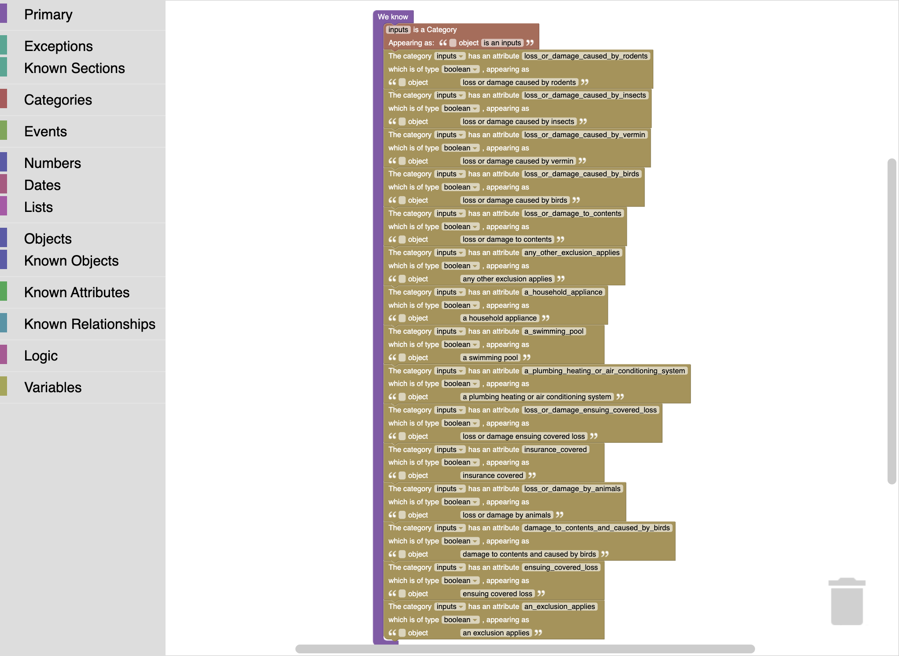
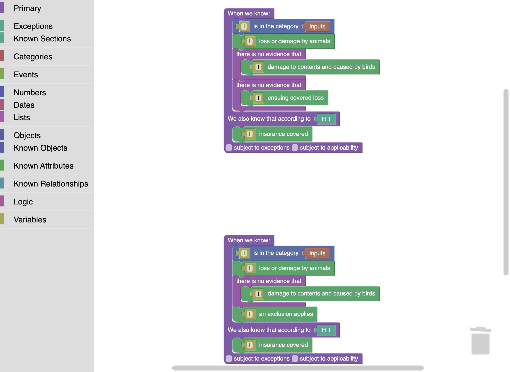
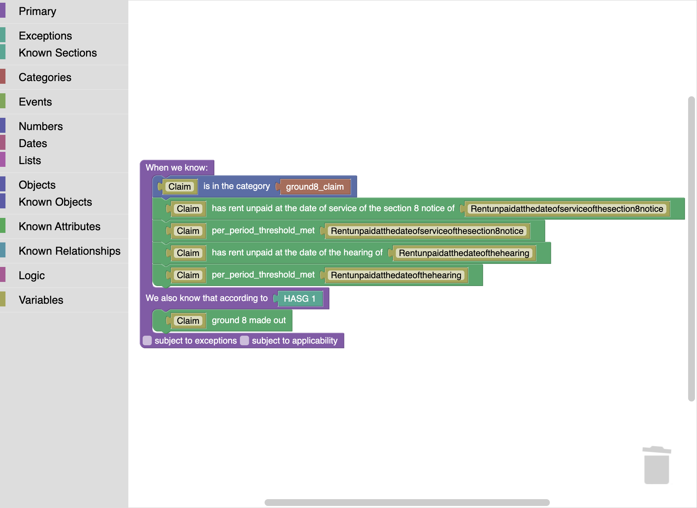
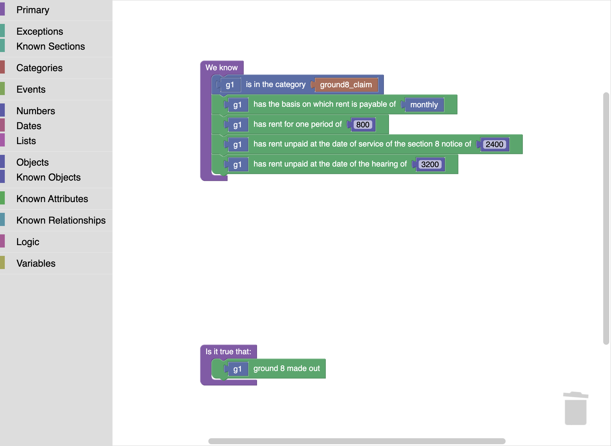
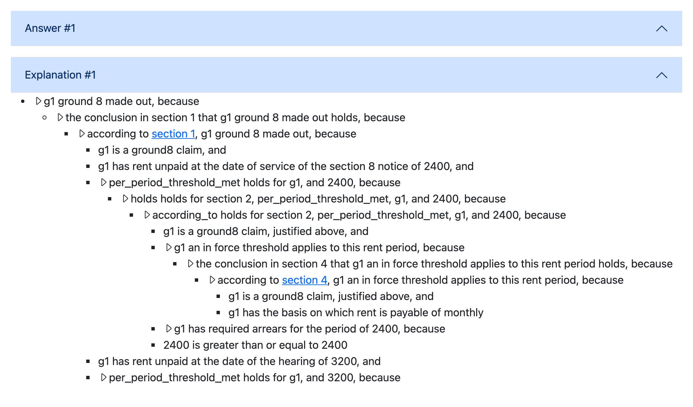

# Exporting L4 to Blawx (and Importing Back)

This tutorial walks the L4↔Blawx bridge end to end: compiling an L4 module
into a Blawx project with `l4 blawx`, loading it into a running Blawx
server, running the generated tests and interviews there, and lifting a
Blawx-authored project back into L4 with `l4 blawx --import`.

It assumes you know L4 and have read the companion explanation page,
[Blawx and s(CASP): a Field Guide for L4 People](../../concepts/neighbours/blawx-and-scasp.md),
which introduces Blawx's data model (categories, attributes, objects), the
s(CASP) reasoner, and the `according_to`/`holds`/`defeated` defeasibility
triple. Here we stay hands-on.

Every command shown was actually run, every code excerpt is quoted from a
file shipped in this repository, and every screenshot is a real capture of
the transpiled projects inside a Blawx v1.6-alpha container.

## Setup

You need the `l4` CLI and, to _run_ the exported projects, a Blawx server.
The quickest server is the published Docker image:

```bash
docker run -d --name blawx -p 8000:8000 lexpedite/blawx:latest
# first boot takes a minute or two; then:
open http://localhost:8000
```

Log in as `admin` with password `blawx2022` — the image's documented
build-time default (see Blawx's `INSTALL.md`; a private deployment should
set `--build-arg SU_PASSWORD=…` instead). Once logged in, the front page
lists projects, and `http://localhost:8000/import/` accepts `.blawx` files.

The L4 sources used below all live in this repository under
`jl4/examples/blawx/` (e.g.
[`rodents.l4`](../../../jl4/examples/blawx/rodents.l4)), together with their
committed expected outputs under `expected/` (e.g.
[`rodents.pl`](../../../jl4/examples/blawx/expected/rodents.pl)) — the
bridge is golden-tested, so what this page shows is what CI holds fixed.

## First export: an insurance exclusion

[`rodents.l4`](../../../jl4/examples/blawx/rodents.l4) encodes a home
insurance policy's animal-damage exclusion — L4's classic
rodents-and-vermin example, restyled into the bridge's conventions. The
heart of it:

```l4
DECLARE Inputs
  HAS
    `Loss or Damage.caused by rodents` IS A BOOLEAN
    `Loss or Damage.caused by insects` IS A BOOLEAN
    -- … ten boolean fields in all …

@export Home insurance policy, the animal-damage exclusion: "We do not cover any loss or damage caused by rodents, insects, vermin, or birds. However, this exclusion does not apply to: (a) loss or damage to your contents caused by birds; or (b) ensuing covered loss unless any other exclusion applies or where an animal causes water to escape from a household appliance, swimming pool or plumbing, heating or air conditioning system." TRUE here means the exclusion BITES -- the loss is NOT covered.
GIVEN i IS AN Inputs
GIVETH A BOOLEAN
DECIDE `insurance covered` IF
         `loss or damage by animals` i
     AND NOT (       `damage to contents and caused by birds` i
                 OR (`ensuing covered loss` i AND NOT `an exclusion applies` i))
```

One command compiles it:

```bash
$ l4 blawx jl4/examples/blawx/rodents.l4 -o rodents.blawx
l4 blawx: s(CASP) dump written to rodents.pl
```

Two artifacts come out:

- **`rodents.blawx`** — the primary artifact: a Blawx project in the
  fixture-YAML shape that `http://localhost:8000/import/` accepts. It
  contains the rule document, one root workspace for the ontology plus one
  code workspace per `@export`ed decision, the Blockly block layout _and_
  the generated s(CASP) for each workspace, and one Blawx test per
  `#EVAL`/`#ASSERT`.
- **`rodents.pl`** — the same s(CASP), concatenated, for running under a
  local SWI-Prolog with the s(CASP) pack (that is what the repository's
  tier-1 harness `etc/blawx-tier1-harness.py` does).

### Where each piece of L4 lands

**The `@export` prose becomes the statute.** Blawx projects start from
legal text; an L4 module has none as such, so the exporter synthesises it
(ruling R4): the module's `§` title becomes the document name and each
exported decision's `@export` prose becomes a numbered section, parsed by
Blawx's CLEAN grammar (its plain-text legislative format) into Akoma
Ntoso. The start of the generated `rule_text` for rodents:

```
Home insurance policy - the rodents, insects, vermin and birds exclusion

1. Home insurance policy, the animal-damage exclusion: "We do not cover any
loss or damage caused by rodents, insects, vermin, or birds. …
```

This is why the seeds put real policy language on the `@export` line: those
words are what the Blawx user sees as the law, what the navigation tree is
built from, and what justification trees cite. (It is also why each
decision gets its _own_ section: section anchoring is per-decision.)

**The record becomes the ontology.** `Inputs` lowers to a Blawx category;
each boolean field to an attribute with an NLG template derived from the
field name. The transpiled root workspace, in Blawx's own code editor:



(Count the rows: fifteen, not ten. The five extra attributes are the
module's five `@export`ed decisions — a decision's _result_ is also an
attribute of the category, which is what lets Blawx's scenario editor and
NLG talk about conclusions the same way they talk about inputs.)

**Decisions become defeasibility-shaped rules.** Here is the transpiled
section 1 — the headline `insurance covered` decision — as blocks:



and the corresponding generated s(CASP) (from
[`expected/rodents.pl`](../../../jl4/examples/blawx/expected/rodents.pl);
the generator's interleaved `% BLAWX CHECK DUPLICATES` marker lines are
elided here):

```prolog
according_to(sec_1_section,insurance_covered,I) :- inputs(I),
loss_or_damage_by_animals(I),
not damage_to_contents_and_caused_by_birds(I),
not ensuing_covered_loss(I).

holds(sec_1_section,insurance_covered,I) :- according_to(sec_1_section,insurance_covered,I).

  insurance_covered(I) :- holds(sec_1_section,insurance_covered,I).

according_to(sec_1_section,insurance_covered,I) :- inputs(I),
loss_or_damage_by_animals(I),
not damage_to_contents_and_caused_by_birds(I),
an_exclusion_applies(I).
```

Three transformations are visible at once, and they are the core of the
bridge:

1. **Relationalization.** L4's nested boolean expression is flattened to
   clause bodies. `AND NOT (a OR (b AND NOT c))` cannot be one Blawx rule
   (rule bodies are conjunctions), so it becomes _two_ clauses — the two
   disjuncts of the disjunctive normal form. Same truth table, relational
   shape.
2. **The negation policy** (ruling R5). `damage to contents …` and
   `ensuing covered loss` are _computed_ predicates, so their negations
   compile to negation-as-failure (`not …`, the "there is no evidence
   that" block). A negated _input_ would instead become a classical `-p`
   fact supplied by the scenario. An input that is neither asserted,
   denied, nor abducible yields **no model** — loudly unknown, never
   silently false.
3. **The defeasibility triple**, even though nothing here is defeasible:
   every conclusion still routes through
   `according_to → holds → predicate`, with both defeat checkboxes off.
   That keeps L4-exported rules fully composable with hand-authored Blawx
   defeat (and is byte-for-byte what Blawx's own generator emits — see
   "fidelity" below).

**Tests travel too.** Each of the module's `#EVAL`s becomes a Blawx test
whose canvas asserts the scenario facts and asks the directive's question;
each `#ASSERT` becomes a constraint-shaped test (a `false :- …` global
constraint, s(CASP)'s integrity-constraint idiom). The expected answers are
_not_ baked into the artifact: the L4 oracle stays outside, in comments and
in the harness, so the artifact never carries a claim it cannot check
(ruling R11). Finally the exporter emits one extra `interview` test with
every input predicate declared `#abducible` — which is what makes Blawx's
scenario editor able to _ask_ for the facts it is missing.

### Fidelity: the re-save fixpoint

The bridge's correctness contract is worth knowing because you can check
it yourself: **open any transpiled workspace in Blawx's editor, save it,
and the server-stored code is byte-identical to what the exporter wrote.**
The emitter reproduces Blawx's own browser-side generator exactly —
including its indentation quirks — so the L4 artifact is indistinguishable
from one authored in the editor. In the bridge's validation campaign the
real-UI open-and-save drive held byte-identity on all 146 workspace and
test rows of the six modules it covered (a headless harness covers all 181
rows of the shipped examples); separately, the generated programs' answers
matched the L4 evaluator on every tier-1 query
(recorded in [`specs/todo/BLAWX-EXPORT-SPEC.md`](../../../specs/todo/BLAWX-EXPORT-SPEC.md) §10).

## The mapping at a glance

| L4                             | Blawx / s(CASP)                                                         |
| ------------------------------ | ----------------------------------------------------------------------- |
| `DECLARE R HAS …` input record | category + one attribute per field                                      |
| enum (`IS ONE OF`)             | atoms; a `CONSIDER` over it becomes one clause per branch               |
| `@export` boolean decision     | attributed rule(s) concluding `according_to(sec_N, …)`                  |
| value-returning decision       | relation with an extra output argument                                  |
| arithmetic                     | `Tmp is ( X * Y )` — exact rationals (`1/3` stays `1r3`, never a float) |
| comparisons (`AT LEAST`, …)    | `blawx_comparison(…, gte, …)` — CLP, works on unbound values            |
| `NOT` on a computed predicate  | negation as failure, `not p(X)`                                         |
| a denied input                 | classical negation, `-p(x)` scenario fact                               |
| `ASSUME`d predicate            | input predicate: declaration block + `#abducible` in the interview      |
| `#EVAL` / `#ASSERT`            | one Blawx test each (assertion = global constraint)                     |
| `@export` prose                | the CLEAN legal text; section citations in every explanation            |

Two details deserve a word:

**`ASSUME` inputs.** A module whose inputs are top-level `ASSUME`d
predicates (rather than record fields) exports too —
[`antisocial.l4`](../../../jl4/examples/blawx/antisocial.l4) is the shipped
example, encoding s. 43 of the UK's Anti-social Behaviour, Crime and
Policing Act 2014 with nine `ASSUME`d predicates over five `ASSUME`d types.
Note the spelling: `ASSUME `is authorised` p IS A BOOLEAN` (a declared
parameter), not `ASSUME `is authorised` IS A FUNCTION FROM Person TO
BOOLEAN` — function-typed `ASSUME`s are rejected on the export path because
they cannot cross the web-app JSON boundary. Each shipped `ASSUME` seed has
a record-spelling twin (`antisocial-twin.l4`) that emits **byte-identical**
s(CASP) apart from the provenance header naming the source file — the two
idioms are the same program to Blawx.

**What does not map, refuses loudly — with one exception that warns.** The
regulative layer (obligations, parties, deadlines), temporal
rule-versioning (`EVAL … UNDER RULES EFFECTIVE AT`), the effects/ledger
layer, string computation, payload-carrying enums, and higher-order or
non-structural recursion are all named-fragment exclusions: the exporter
accumulates diagnostics and refuses, rather than emitting something
approximate. `TYPICALLY` defaults are the one deliberate loss that does
_not_ refuse: Blawx has no caller-overridable default machinery, so a
`TYPICALLY` on an input is dropped and a lossy `R-TYPICALLY` note is
emitted — check the notes before shipping a module that relies on its
defaults. As an example of a refusal: at total arity 2 or below, an input
must be attribute-shaped — exactly one category-sorted parameter plus at
most a result — while relationship blocks only start at total arity 3, so
a two-parameter, no-result input falls between the two shapes and is
refused by name:

```
l4 blawx: cannot compile these decisions to Blawx:
  - arity-two.l4:31:1-33:43: in `severity exceeds`: input predicate with no
    category subject (Blawx): `severity exceeds` is an input of total arity 2,
    which Blawx has no declaration block for. …
```

The refusal fixtures live in `jl4/examples/blawx/not-ok/`, one per boundary
(the message above is
[`arity-two.l4`](../../../jl4/examples/blawx/not-ok/arity-two.l4)'s).

## Capstone: Housing Act 1988, Schedule 2

[`housing-grounds.l4`](../../../jl4/examples/blawx/housing-grounds.l4)
is the bridge's full-width example: grounds 8, 13, 15 and 17 of Schedule 2
to the Housing Act 1988 (the rent-arrears and discretionary possession
grounds), 727 lines, with the Renters' Rights Act 2025 amendments and 49
test directives. It exercises, in one module, most of the mapping table:
enums, records, boolean and value-returning decisions, `CONSIDER`,
arithmetic and comparisons, verbatim statutory prose, and an arity-2
predicate that sits deliberately at the edge of Blawx's declaration model.

The core of Ground 8 in L4 — note the verbatim statutory text carried as
inert prose inside the decision bodies, and the threshold arithmetic:

```l4
GIVEN claim IS A Ground8Claim
GIVETH A BOOLEAN
`Ground 8 made out` claim MEANS
        "Both at the date of the service of the notice under section 8 of this Act relating to the proceedings for possession and at the date of the hearing—"
    ... `per-period threshold met` claim (claim's `rent unpaid at the date of service of the section 8 notice`)
    AND `per-period threshold met` claim (claim's `rent unpaid at the date of the hearing`)

GIVEN claim IS A Ground8Claim
GIVETH A NUMBER
`required arrears for the period` claim MEANS
    CONSIDER claim's `the basis on which rent is payable`
    WHEN `weekly or fortnightly` THEN 13 TIMES claim's `rent for one period`   -- thirteen weeks' rent
    WHEN `monthly`               THEN  3 TIMES claim's `rent for one period`   -- three months' rent
    WHEN `other`                 THEN -1   -- no in-force threshold engages
```

Transpiled, section 1 is the both-dates rule in blocks:



and the value function becomes a relation with an output argument, one
clause per `CONSIDER` branch (from
[`expected/housing-grounds.pl`](../../../jl4/examples/blawx/expected/housing-grounds.pl)):

```prolog
according_to(sec_2_section,per_period_threshold_met,Claim,Arrears) :- ground8_claim(Claim),
an_in_force_threshold_applies_to_this_rent_period(Claim),
required_arrears_for_the_period(Claim,Requiredarrearsfortheperiod),
blawx_comparison(Arrears,gte,Requiredarrearsfortheperiod).

according_to(sec_3_section,required_arrears_for_the_period,Claim,Tmp) :- ground8_claim(Claim),
the_basis_on_which_rent_is_payable(Claim,Thebasisonwhichrentispayable),
Thebasisonwhichrentispayable = weekly_or_fortnightly,
rent_for_one_period(Claim,Rentforoneperiod),
Tmp is ( 13 * Rentforoneperiod ).
```

Now run it where a Blawx user would: test `q6` pins Ground 8's boundary
case — monthly rent of 800, arrears of exactly 2400 (three months' rent,
`AT LEAST` satisfied at the boundary) at service and 3200 at hearing:



Pressing Run in the test editor answers _yes_, with a justification tree
that cites sections 1, 2 and 4 of the synthesised statute (the both-dates
rule, the threshold rule, and the in-force condition), and shows the
threshold arithmetic — "2400 is greater than or equal to 2400" — as a
proof step:



That screenshot is the whole pipeline in one image: statutory words
written in an `@export` line in L4, compiled to blocks and s(CASP),
reasoned over by Blawx's engine, explained in English with section
citations — and the answer agrees with `l4 run` on the same directive.
(All 49 of the module's directives are cross-checked against the L4
oracle by the repository's tier-1 s(CASP) harness; at the container level
the campaign ran spot checks like this one.)

One honest blemish is visible in the same image:
`per_period_threshold_met` renders as a raw atom rather than English —
and so do the defeasibility-triple steps that carry it ("holds holds for
section 2, …"). It is the module's one arity-2 computed predicate —
(claim, number) → boolean — and Blawx has no declaration block for that
shape, so it gets no NLG template. The bridge ships it anyway (the logic
is exact; the rendering is ugly), and the gap is pinned by CLI tests
rather than papered over.

### Capstone coverage

| feature exercised        | L4 site                               | Blawx image                                        |
| ------------------------ | ------------------------------------- | -------------------------------------------------- |
| closed enum              | `RentPeriod IS ONE OF …`              | atoms; `=` guard per `CONSIDER` branch             |
| input records            | `Ground8Claim`, `Ground13Claim`, …    | four categories with typed attributes              |
| boolean decisions        | `Ground 8 made out`, grounds 13/15/17 | attributed rules, `according_to`/`holds` triple    |
| value-returning decision | `required arrears for the period`     | relation with output argument, `Tmp is ( … )`      |
| comparison               | `AT LEAST`                            | `blawx_comparison(…, gte, …)` (CLP)                |
| verbatim statutory prose | quoted strings + `...` continuation   | inert; the words live in `rule_text` and citations |
| statute synthesis        | 14 `@export` citations                | 14 CLEAN sections, eIds `sec_1`…`sec_14`           |
| tests                    | 49 `#EVAL`/`#ASSERT` directives       | 49 Blawx tests + 1 abducible interview             |
| edge of the fragment     | arity-2 `per-period threshold met`    | rules and queries emit; no declaration, raw NLG    |

## Importing from Blawx

The bridge runs backwards too: `l4 blawx --import` parses a `.blawx`
project — the Blockly XML is treated as canonical — and lifts the
stratified ground fragment into an L4 module. The shipped worked example
is Blawx's own **New Bird Act** (penguins, planes, jetpacks: the defeat
example from the concepts page). Reproduce it from the container image:

```bash
docker cp blawx:/app/blawx/blawx/static/blawx/examples/bird.yaml .
l4 blawx --import bird.yaml -o bird.l4
```

The import prints WARNING lines noting that the example's _stored_ s(CASP)
is stale against the current generator — informational; the XML is what is
lifted — and writes an L4 module that this repository commits verbatim as
[`jl4/examples/blawx/imported/bird.l4`](../../../jl4/examples/blawx/imported/bird.l4)
(the command above reproduces it byte-for-byte apart from the source-path
line in the header).

The lift makes Blawx's implicit machinery explicit rather than pretending
Blawx wrote idiomatic L4. Blawx's flat universe becomes one `Object`
record with a `MAYBE BOOLEAN` fact-channel per predicate; the defeat
triple unfolds into one named decision per (section, conclusion) pair,
with `@ref` comments recording exactly which block each came from:

```l4
@ref NBA 2 — defeasible: `not blawx_defeated(sec_2_section, flies, x)`
GIVEN x IS AN Object
GIVETH A BOOLEAN
DECIDE `the conclusion in NBA 2 that x can fly holds` x
    IF      `according to NBA 2, x can fly` x
    AND NOT `the conclusion in NBA 2 that x can fly is defeated` x

@ref NBA 3 — sec_3_section overrules: NBA 3 (-flies) defeats NBA 2 (flies)
GIVEN x IS AN Object
GIVETH A BOOLEAN
DECIDE `the conclusion in NBA 2 that x can fly is defeated` x
    IF `the conclusion in NBA 3 that it is not the case that x can fly holds` x
```

Blawx's four bird tests become `#EVAL`s, and both engines agree on all
four — pingu is a bird; pingu can't fly; pingu on a plane can fly; pingu
with a cartoon jetpack still can't fly. (One caveat recorded in the module
itself: the shipped Blawx generator has no consumer for a `holds` block
naming section applicability, so _stock_ Blawx answers the jetpack test
"no model" — an upstream defect the lift corrects by implementing the
intended semantics, verified against a bridged s(CASP) program. The fix is
one clause, open as
[legalese/blawx#2](https://github.com/legalese/blawx/pull/2).)

Companion flags: `--parse-only` checks a `.blawx` without lifting;
`--reemit` re-renders the parsed project through the exporter's own
renderers (useful for fixpoint experiments); `--roundtrip` does
import-then-export and compares.

Not everything lifts: imports outside the stratified ground fragment —
unstratified negation loops, events/fluents, unpinned abductive tests —
are refused by name, in the same accumulate-and-refuse style as the export
direction.

## Caveats when driving Blawx itself

Two upstream Blawx limitations are worth knowing when you demo an exported
project (both reproduced against stock Blawx and pinned in the bridge's
spec; the crash fix is open as
[legalese/blawx#3](https://github.com/legalese/blawx/pull/3) on the fork,
alongside fixes for a data-corrupting category-dropdown race,
[#4](https://github.com/legalese/blawx/pull/4), and an NLG asymmetry,
[#5](https://github.com/legalese/blawx/pull/5)):

- **Use the test editor's Run, not the scenario editor, for projects with
  classical negation.** The scenario/interview endpoint crashes on
  classically-negated literals in the answer tree (`reasoner.py`'s
  `find_assumptions`), which L4 exports produce whenever an input is
  denied. The test editor's `run/` path — everything shown above — is
  unaffected.
- **Pin your abducibles.** The interview's abductive search degrades
  sharply when many input predicates are left open at once; the shipped
  `interview` tests work best as a base for scenarios that pin most inputs
  and abduce the few genuinely unknown ones.

## Where to go next

- The design record — expressive-domain comparison, all fourteen rulings,
  and the executed validation evidence — is
  [`specs/todo/BLAWX-EXPORT-SPEC.md`](../../../specs/todo/BLAWX-EXPORT-SPEC.md).
- The concepts companion:
  [Blawx and s(CASP): a Field Guide for L4 People](../../concepts/neighbours/blawx-and-scasp.md).
- Blawx's own documentation ships inside the server (Help → Docs in the
  running container) and at [blawx.com](https://www.blawx.com).
- For the neighbouring exporters — OpenFisca, Catala, docassemble — see
  [Exporting Rules for Deployment](../deploying-rules/exporting-rules-for-deployment.md)
  and the survey table in
  [Reviewing Encoded Law](../../concepts/reviewing/reviewing-encoded-law.md).
